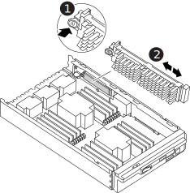

= Rimuovere il controller, sostituire il supporto di avvio e trasferire l'immagine di avvio - FAS9500
:allow-uri-read: 

[role="lead"]
È necessario rimuovere e aprire il modulo controller, individuare e sostituire il supporto di avvio nel controller, quindi trasferire l'immagine sul supporto di avvio sostitutivo.

== Fase 1: Rimuovere il modulo controller

Per accedere ai componenti all'interno del controller, rimuovere prima il modulo controller dal sistema, quindi rimuovere il coperchio sul modulo controller.

.Fasi
. Se non si è già collegati a terra, mettere a terra l'utente.
. Scollegare i cavi dal modulo controller guasto e tenere traccia del punto in cui sono stati collegati i cavi.
. Far scorrere verso il basso il pulsante terra cotta sulla maniglia della camma fino a sbloccarla.
+
.Animazione - rimuovere il modulo controller
video::5e029a19-8acc-4fa1-be5d-ae78004b365a[panopto]
+
image::../media/drw_9500_remove_PCM_source.svg[Rimuovere il controller]

+
[cols="1,2"]
|===

 a| 
image::../media/icon_round_1.png[Numero di didascalia 1]
 a| 
Pulsante di rilascio della maniglia della camma

 a| 
image::../media/icon_round_2.png[Numero di didascalia 2]
 a| 
Maniglia CAM

|===
. Ruotare la maniglia della camma in modo da disimpegnare completamente il modulo controller dal telaio, quindi estrarre il modulo controller dal telaio.
+
Assicurarsi di sostenere la parte inferiore del modulo controller mentre lo si sposta fuori dallo chassis.

. Posizionare il coperchio del modulo controller con il lato rivolto verso l'alto su una superficie stabile e piana, premere il pulsante blu sul coperchio, far scorrere il coperchio sul retro del modulo controller, quindi sollevare il coperchio ed estrarlo dal modulo controller.
+
image::../media/drw_9500_PCM_open_source.svg[Rimuovere il controller]

[cols="1,2"]
|===

 a| 
image::../media/icon_round_1.png[Numero di didascalia 1]
 a| 
Pulsante di bloccaggio del coperchio del modulo controller

|===

== Fase 2: Sostituire il supporto di avvio

Individuare il supporto di avvio nel controller e seguire le istruzioni per sostituirlo.

.Fasi
. Sollevare il condotto d'aria nero sul retro del modulo controller, quindi individuare il supporto di avvio utilizzando la seguente illustrazione o la mappa FRU sul modulo controller:
+
.Animazione - sostituire il supporto di avvio
video::16df490c-f94f-498d-bb04-ae78004b3781[panopto]
+

+
[cols="1,2"]
|===

 a| 
image:../media/icon_round_1.png["Numero di didascalia 1"]
 a| 
Premere il tasto di rilascio Tab

 a| 
image:../media/icon_round_2.png["Numero di didascalia 2"]
 a| 
Supporto di boot

|===
. Premere il pulsante blu sull'alloggiamento del supporto di avvio per rilasciare il supporto di avvio dall'alloggiamento, quindi estrarlo delicatamente dalla presa del supporto di avvio.
+

NOTE: Non attorcigliare o tirare il supporto di avvio verso l'alto, in quanto potrebbe danneggiare la presa o il supporto di avvio.

. Allineare i bordi del supporto di avvio sostitutivo con lo zoccolo del supporto di avvio, quindi spingerlo delicatamente nello zoccolo.
. Verificare che il supporto di avvio sia inserito correttamente e completamente nella presa.
+
Se necessario, rimuovere il supporto di avvio e reinserirlo nella presa.

. Premere il supporto di avvio verso il basso per inserire il pulsante di blocco sull'alloggiamento del supporto di avvio.
. Reinstallare il coperchio del modulo controller allineando i perni sul coperchio con gli slot sul supporto della scheda madre, quindi far scorrere il coperchio in posizione.

== Fase 3: Trasferire l'immagine di avvio sul supporto di avvio

È possibile installare l'immagine di sistema sul supporto di avvio sostitutivo utilizzando un'unità flash USB su cui è installata l'immagine. Tuttavia, è necessario ripristinare `var` file system durante questa procedura.

.Prima di iniziare
* È necessario disporre di un'unità flash USB, formattata con FAT32, con almeno 4 GB di capacità.
* Una copia della stessa versione dell'immagine di ONTAP utilizzata dal controller compromesso. È possibile scaricare l'immagine appropriata dalla sezione Download sul sito del supporto NetApp
+
** Se NVE è attivato, scaricare l'immagine con NetApp Volume Encryption, come indicato nel pulsante download.
** Se NVE non è attivato, scaricare l'immagine senza NetApp Volume Encryption, come indicato nel pulsante download.

* Se il sistema è autonomo, non è necessaria una connessione di rete, ma è necessario eseguire un ulteriore riavvio durante il ripristino del file system var.

.Fasi
. Allineare l'estremità del modulo controller con l'apertura dello chassis, quindi spingere delicatamente il modulo controller a metà nel sistema.
. Se necessario, è possibile ricable il modulo controller.
. Inserire l'unità flash USB nello slot USB del modulo controller.
+
Assicurarsi di installare l'unità flash USB nello slot contrassegnato per i dispositivi USB e non nella porta della console USB.

. Inserire completamente il modulo controller nel sistema, assicurandosi che la maniglia della camma si allontani dall'unità flash USB, spingere con decisione la maniglia della camma per terminare l'inserimento del modulo controller, quindi spingere la maniglia della camma in posizione chiusa.
+
Il nodo inizia ad avviarsi non appena viene completamente installato nello chassis.

. Interrompere il processo di avvio per interrompere il CARICAMENTO premendo Ctrl-C quando viene visualizzato Avvio DI AUTOBOOT premere Ctrl-C per interrompere....
+
Se non viene visualizzato questo messaggio, premere Ctrl-C, selezionare l'opzione di avvio in modalità manutenzione, quindi arrestare il nodo per avviare IL CARICATORE.

. Sebbene le variabili d'ambiente e i bootargs siano conservati, è necessario verificare che tutte le variabili d'ambiente di boot e i bootargs necessari siano impostati correttamente per il tipo di sistema e per la configurazione utilizzando il `printenv bootarg name` e correggere eventuali errori utilizzando `setenv variable-name <value>` comando.
+
.. Controllare le variabili di ambiente di boot:
+
*** bootarg.init.boot_clustered
*** partner-sysid
*** bootarg.init.flash_optimized per AFF
*** bootarg.init.san_optimized per AFF
*** bootarg.init.switchless_cluster.enable

.. Se External Key Manager (Gestore chiavi esterne) è attivato, controllare i valori di boot, elencati in `kenv` Output ASUP:
+
*** bootarg.storageencryption.support <value>
*** bootarg.keymanager.support <value>
*** kmip.init.interface <value>
*** kmip.init.ipaddr <value>
*** kmip.init.netmask <value>
*** kmip.init.gateway <value>

.. Se Onboard Key Manager è attivato, controllare i valori di boot, elencati nella `kenv` Output ASUP:
+
*** bootarg.storageencryption.support <value>
*** bootarg.keymanager.support <value>
*** bootarg.onboard_keymanager <value>

.. Salvare le variabili di ambiente modificate con `savenv` comando
.. Confermare le modifiche utilizzando `printenv variable-name` comando.

. Se il controller si trova in un MetroCluster esteso o collegato al fabric, è necessario ripristinare la configurazione dell'adattatore FC:
+
.. Avvio in modalità di manutenzione: `boot_ontap maint`
.. Impostare le porte MetroCluster come iniziatori: `ucadmin modify -m fc -t iniitator adapter_name`
.. Halt per tornare alla modalità di manutenzione: `halt`

+
Le modifiche verranno implementate all'avvio del sistema.

