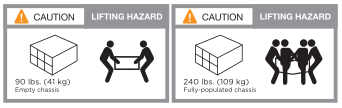
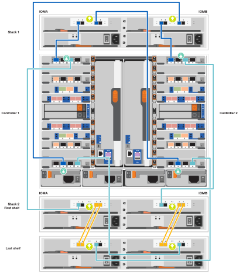
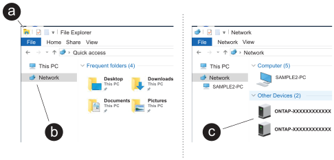

= Fasi dettagliate - FAS9500
:allow-uri-read: 
:icons: font
:imagesdir: ../media/

[role="lead"]
Questo articolo fornisce istruzioni dettagliate per l'installazione di un sistema NetApp tipico. Per istruzioni di installazione più dettagliate, consulta questo articolo.

== Fase 1: Preparazione per l'installazione

Per installare il sistema, è necessario creare un account sul NetApp Support Site, registrare il sistema e ottenere le chiavi di licenza. È inoltre necessario inventariare il numero e il tipo di cavi appropriati per il sistema e raccogliere informazioni di rete specifiche.

È necessario disporre dell'accesso a https://hwu.netapp.com["NetApp Hardware Universe"^] per informazioni sui requisiti del sito e ulteriori informazioni sul sistema configurato.

.Di cosa hai bisogno
È possibile anche avere accesso a http://mysupport.netapp.com/documentation/productlibrary/index.html?productID=62286["Note sulla versione di ONTAP 9"^] Per ulteriori informazioni su questo sistema, consultare la versione di ONTAP in uso.

Devi fornire quanto segue presso la tua sede:

* Spazio rack per il sistema storage
* Cacciavite Phillips n. 2
* Cavi di rete aggiuntivi per collegare il sistema allo switch di rete e al laptop o alla console mediante un browser Web

.Fasi
. Disimballare il contenuto di tutte le confezioni.
. Annotare il numero di serie del sistema dai controller.
+
image::../media/drw_ssn_label.svg[Esempio di numero di serie del sistema]

. Fare un inventario e prendere nota del numero e dei tipi di cavi ricevuti.
+
La seguente tabella identifica i tipi di cavi che potrebbero essere ricevuti. Se si riceve un cavo non elencato nella tabella, consultare la Hardware Universe per individuare il cavo e identificarne l'utilizzo.

+
https://hwu.netapp.com["NetApp Hardware Universe"^]

+
[cols="1,2,1,2"]
|===
| Tipo di cavo... | Codice e lunghezza del ricambio | Tipo di connettore | Per... 

 a| 
Cavo dati 25 GbE
 a| 
X66240A-05 (112-00639), 0,5 m.

X66240A-2 (112-00598), 2 m

X66240A-5 (112-00600), 5 m.
 a| 
image::../media/oie_cable_sfp_gbe_copper.png[Connettore GbE SFP in rame]
 a| 
Cavo di rete

 a| 
FC da 32 GB (SFP+ Op)
 a| 
X66250-2 (112-00342), 2 m

X66250-5 (112-00344), 5 m.

X66250-15 (112-00346), 15 m.
 a| 
image::../media/oie_cable_sfp_gbe_copper.png[Connettore GbE SFP in rame]
 a| 
Cavo di rete ottico FC

 a| 
Cavo di rete da 40 GbE
 a| 
X66100-1 (112-00542), 1 m.

X66100-3 (112-00543), 3 m.

X66100-5 (112-00544), 5 m.
 a| 
image::../media/oie_cable100_gbe_qsfp28.png[Connettore QSFP 100 GbE]
 a| 
Dati Ethernet, rete cluster

 a| 
Cavo da 100 GbE
 a| 
X66211B-1 (112-00573), 1 m.

X66211B-2 (112-00574), 2 m

X66211B-5 (112-00576), 5 m.
 a| 
image::../media/oie_cable100_gbe_qsfp28.png[Connettore QSFP 100 GbE]
 a| 
Rete,

Dati Ethernet,

rete del cluster

 a| 
Cavi ottici
 a| 
X66031A (112-00436), 1 m.

X66032A (112-00437), 2 m

X66033A (112-00438), 3 m.
 a| 
image::../media/oie_cable_fiber_lc_connector.png[Connettore ottico LC]
 a| 
Rete ottica FC

 a| 
Cat 6, RJ-45 (in base all'ordine)
 a| 
Codici X6585-R6 (112-00291), 3 m.

X6562-R6 (112-00196), 5 m.
 a| 
image::../media/oie_cable_rj45.png[Connettore RJ-45]
 a| 
Rete di gestione e dati Ethernet

 a| 
Storage
 a| 
X66031A (112-00436), 1 m.

X66032A (112-00437), 2 m

X66033A (112-00438), 3 m.
 a| 
image::../media/oie_cable_mini_sas_hd_to_mini_sas_hd.svg[Connettore mini SAS]
 a| 
Storage

 a| 
Cavo per console micro-USB
 a| 
Non applicabile
 a| 
image::../media/oie_cable_micro_usb.png[Connettore micro USB]
 a| 
Connessione della console durante la configurazione del software su computer portatili/console non Windows o Mac

 a| 
Cavi di alimentazione
 a| 
Non applicabile
 a| 
image::../media/oie_cable_power.png[Cavi di alimentazione]
 a| 
Accensione del sistema

|===
. Esaminare https://library.netapp.com/ecm/ecm_download_file/ECMLP2862613["Guida alla configurazione di ONTAP"^] e raccogliere le informazioni richieste elencate nella guida.

== Fase 2: Installare l'hardware

È necessario installare il sistema in un rack a 4 montanti o in un cabinet di sistema NetApp, a seconda dei casi.

.Fasi
. Installare i kit di guide, secondo necessità.
. Installare e fissare il sistema seguendo le istruzioni fornite con il kit di guide.
+

NOTE: È necessario essere consapevoli dei problemi di sicurezza associati al peso del sistema.

+
L'etichetta a sinistra indica uno chassis vuoto, mentre l'etichetta a destra indica un sistema completamente popolato.

+

. Collegare i dispositivi di gestione dei cavi (come illustrato).
+
image::../media/drw_9500_cable_management_arms.svg[Maniglie di sollevamento e dispositivo di gestione dei cavi]

. Posizionare il pannello anteriore del sistema.

== Fase 3: Collegare i controller alla rete

È possibile collegare i controller alla rete utilizzando il metodo cluster senza switch a due nodi o la rete di interconnessione del cluster.

[role="tabbed-block"]
====
.Opzione 1: Cluster senza switch a due nodi
--
La rete di gestione, la rete dati e le porte di gestione dei controller sono collegate agli switch. Le porte di interconnessione del cluster sono cablate su entrambi i controller.

.Prima di iniziare
Per informazioni sulla connessione del sistema agli switch, contattare l'amministratore di rete.

Verificare la direzione delle linguette dei cavi quando si inseriscono i cavi nelle porte. Le linguette di estrazione dei cavi sono rivolte verso l'alto per tutte le porte dei moduli di rete.

image::../media/oie_cable_pull_tab_up.png[Direzione della linguetta di estrazione del cavo]

NOTE: Quando si inserisce il connettore, si dovrebbe avvertire uno scatto in posizione; se non si sente uno scatto, rimuoverlo, capovolgere e riprovare.

.Fasi
. Utilizzare l'animazione o l'illustrazione per completare il cablaggio tra i controller e gli switch:
+
.Animazione Cablaggio cluster senza switch a due nodi
video::da08295f-ba8c-4de7-88c3-ae7c0170408d[panopto]
+
image::../media/drw_9500_tnsc_network_cabling.svg[Schema del cablaggio di rete TNSC]

+
[cols="20%,80%"]
|===
| Fase | Eseguire su ciascun controller 

 a| 
image::../media/icon_square_1_green.png[Icona didascalia 1]
 a| 
Porte di interconnessione del cluster di cavi:

** Slot A4 e B4 (e4a)
** Slot A8 e B8 (e8a)

image::../media/oie_cable100_gbe_qsfp28.png[Connettore QSFP 100 GbE]

 a| 
image::../media/icon_square_2_purple.png[Icona didascalia 2]
 a| 
Porte per la gestione del controller dei cavi (chiave).

image::../media/oie_cable_rj45.png[Connettore RJ-45]

 a| 
image::../media/icon_square_3_orange.png[Icona didascalia 3]
 a| 
Switch di rete FC da 32 GB via cavo:

Porte negli slot A3 e B3 (e3a e e3c) e negli slot A9 e B9 (e9a e e9c) verso gli switch di rete FC da 32 GB.

image::../media/oie_cable_sfp_gbe_copper.png[Connettore GbE SFP in rame]

Switch di rete host 40 GbE:

Collegare le porte host‐lato b dello slot A4 e B4 (e4b) e gli slot A8 e B8 (e8b) allo switch host.

image::../media/oie_cable100_gbe_qsfp28.png[Connettore QSFP 100 GbE]

 a| 
image::../media/icon_square_4_red.png[Icona didascalia 4]
 a| 
Connessioni via cavo da 25 GbE:

Porta dei cavi negli slot A5 e B5 (5a, 5b, 5c e 5d) e A7 e B7 (7a, 7b, 7c e 7d) per gli switch di rete 25 GbE.

image::../media/oie_cable_sfp_gbe_copper.png[Connettore GbE SFP in rame]

 a| 
image::../media/icon_square_5_grey.png[Icona didascalia 4]
 a| 
** Fissare i cavi ai bracci di gestione dei cavi (non mostrati).
** Collegare i cavi di alimentazione alle PSU e a diverse fonti di alimentazione (non mostrate). Gli alimentatori 1 e 3 forniscono alimentazione a tutti i componenti lato A, mentre gli alimentatori PSU2 e PSU4 forniscono alimentazione a tutti i componenti lato B.

image::../media/oie_cable_power.png[Cavi di alimentazione]

image::../media/drw_a900fas9500_power_icon_IEOPS-1142.svg[Fonti di alimentazione]

|===

--
.Opzione 2: Cluster con switch
--
La rete di gestione, la rete dati e le porte di gestione dei controller sono collegate agli switch. L'interconnessione del cluster e le porte ha sono cablate al cluster/switch ha.

.Prima di iniziare
Per informazioni sulla connessione del sistema agli switch, contattare l'amministratore di rete.

Verificare la direzione delle linguette dei cavi quando si inseriscono i cavi nelle porte. Le linguette di estrazione dei cavi sono rivolte verso l'alto per tutte le porte dei moduli di rete.

image::../media/oie_cable_pull_tab_up.png[Direzione della linguetta di estrazione del cavo]

NOTE: Quando si inserisce il connettore, si dovrebbe avvertire uno scatto in posizione; se non si sente uno scatto, rimuoverlo, capovolgere e riprovare.

.Fasi
. Utilizzare l'animazione o l'illustrazione per completare il cablaggio tra i controller e gli switch:
+
.Animazione Cablaggio cluster commutato
video::3ad3f118-8339-4683-865f-ae7c0170400c[panopto]
+
image::../media/drw_9500_switched_network_cabling.svg[Cablaggio di rete cluster commutato]

+
[cols="20%,80%"]
|===
| Fase | Eseguire su ciascun controller 

 a| 
image::../media/icon_square_1_green.png[Numero di didascalia 1]
 a| 
Porte a di interconnessione del cluster di cavi:

** Slot A4 e B4 (e4a) per lo switch di rete del cluster.
** Slot A8 e B8 (e8a) per lo switch di rete del cluster.

image::../media/oie_cable100_gbe_qsfp28.png[Connettore QSFP 100 GbE]

 a| 
image::../media/icon_square_2_purple.png[Icona didascalia 2]
 a| 
Porte per la gestione del controller dei cavi (chiave).

image::../media/oie_cable_rj45.png[Connettore RJ-45]

 a| 
image::../media/icon_square_3_orange.png[Icona didascalia 3]
 a| 
Switch di rete FC da 32 GB via cavo:

Porte negli slot A3 e B3 (e3a e e3c) e negli slot A9 e B9 (e9a e e9c) verso gli switch di rete FC da 32 GB.

image::../media/oie_cable_sfp_gbe_copper.png[Connettore GbE SFP in rame]

Switch di rete host 40 GbE:

Collegare le porte host‐lato b dello slot A4 e B4 (e4b) e gli slot A8 e B8 (e8b) allo switch host.

image::../media/oie_cable100_gbe_qsfp28.png[Connettore QSFP 100 GbE]

 a| 
image::../media/icon_square_4_red.png[Icona didascalia 4]
 a| 
Connessioni via cavo da 25 GbE:

Porta dei cavi negli slot A5 e B5 (5a, 5b, 5c e 5d) e A7 e B7 (7a, 7b, 7c e 7d) per gli switch di rete 25 GbE.

image::../media/oie_cable_sfp_gbe_copper.png[Connettore 100 GbE in rame]

 a| 
image::../media/icon_square_4_red.png[Icona didascalia 4]
 a| 
** Fissare i cavi ai bracci di gestione dei cavi (non mostrati).
** Collegare i cavi di alimentazione alle PSU e a diverse fonti di alimentazione (non mostrate). Gli alimentatori 1 e 3 forniscono alimentazione a tutti i componenti lato A, mentre gli alimentatori PSU2 e PSU4 forniscono alimentazione a tutti i componenti lato B.

image::../media/oie_cable_power.png[Cavi di alimentazione]

image::../media/drw_a900fas9500_power_icon_IEOPS-1142.svg[Fonti di alimentazione]

|===

--
====

== Fase 4: Collegare i controller dei cavi agli shelf di dischi

Collegare gli shelf di dischi DS212C o DS224C ai controller.

NOTE: Per ulteriori informazioni sul cablaggio SAS e fogli di lavoro, vedere link:../sas3/overview-cabling-rules-examples.html["Panoramica su regole di cablaggio SAS, fogli di lavoro ed esempi: Shelf con moduli IOM12"]

.Prima di iniziare
* Completare la scheda di lavoro relativa al cablaggio SAS del sistema. Vedere link:../sas3/overview-cabling-rules-examples.html["Panoramica su regole di cablaggio SAS, fogli di lavoro ed esempi: Shelf con moduli IOM12"].
* Verificare che la freccia dell'illustrazione sia orientata correttamente con la linguetta di estrazione del connettore del cavo. La linguetta di estrazione dei cavi per i moduli di storage è rivolta verso l'alto, mentre le linguette di estrazione sugli scaffali sono rivolte verso il basso.

image::../media/oie_cable_pull_tab_up.png[Direzione della linguetta di estrazione del cavo]

image::../media/oie_cable_pull_tab_down.png[Direzione della linguetta di estrazione del cavo]

NOTE: Quando si inserisce il connettore, si dovrebbe avvertire uno scatto in posizione; se non si sente uno scatto, rimuoverlo, capovolgere e riprovare.

.Fasi
. Utilizza l'animazione o i disegni seguenti per collegare i controller a tre shelf di dischi DS224C (1 stack di uno shelf di dischi e uno stack di due shelf di dischi).
+
.Animazione Collega i tuoi scaffali di unità
video::c958aae6-9d08-4d3d-a213-ae7c017040cd[panopto]
+

+
[cols="20%,80%"]
|===
| Fase | Eseguire su ciascun controller 

 a| 
image::../media/icon_square_1_blue.png[Icona didascalia 1]
 a| 
Collegare lo stack di shelf di dischi uno ai controller, utilizzando la figura come riferimento.

*Cavo Mini-SAS*

image::../media/oie_cable_mini_sas_hd_to_mini_sas_hd.svg[Cavo Mini-SAS HD]

 a| 
image::../media/icon_square_2_yellow.png[Icona didascalia 2]
 a| 
Collega gli shelf dei dischi nello stack due l'uno all'altro, utilizzando il grafico come riferimento.

*Cavo Mini-SAS*

image::../media/oie_cable_mini_sas_hd_to_mini_sas_hd.svg[Cavo Mini-SAS HD]

 a| 
image::../media/icon_square_3_tourquoise.png[Icona didascalia 3]
 a| 
Collegare lo stack di shelf due ai controller, utilizzando la figura come riferimento.

*Cavo Mini-SAS*

image::../media/oie_cable_mini_sas_hd_to_mini_sas_hd.svg[Cavo Mini-SAS HD]

|===

== Fase 5: Completare l'installazione e la configurazione del sistema

È possibile completare l'installazione e la configurazione del sistema utilizzando il rilevamento del cluster solo con una connessione allo switch e al laptop oppure collegandosi direttamente a un controller del sistema e quindi allo switch di gestione.

[role="tabbed-block"]
====
.Opzione 1: Se la funzione di rilevamento della rete è attivata
--
Se sul laptop è attivata la funzione di rilevamento della rete, è possibile completare l'installazione e la configurazione del sistema utilizzando la funzione di rilevamento automatico del cluster.

.Fasi
. Utilizzare la seguente animazione o disegno per impostare uno o più ID shelf di dischi:
+
.Animazione Imposta gli ID del tuo scaffale
video::95a29da1-faa3-4ceb-8a0b-ac7600675aa6[panopto]
+
image::../media/drw_power-on_set_shelf_ID_set.svg[Accendere e impostare l'ID dello scaffale]

+
[cols="20%,80%"]
|===

 a| 
image::../media/icon_round_1.png[Numero di didascalia 1]
 a| 
Rimuovere il cappuccio terminale.

 a| 
image::../media/icon_round_2.png[Numero di didascalia 2]
 a| 
Tenere premuto il tasto shelf ID fino a quando la prima cifra non lampeggia, quindi premere per passare a 0-9.

NOTE: La prima cifra continua a lampeggiare

 a| 
image::../media/icon_round_2.png[Numero di didascalia 2]
 a| 
Tenere premuto il tasto shelf ID fino a quando la seconda cifra non lampeggia, quindi premere per passare a 0-9.

NOTE: La prima cifra smette di lampeggiare e la seconda continua a lampeggiare.

 a| 
image::../media/icon_round_4.png[Numero di didascalia 4]
 a| 
Sostituire il cappuccio terminale.

 a| 
image::../media/icon_round_5.png[Numero di didascalia 5]
 a| 
Attendere 10 secondi per il LED ambra (!) Per visualizzare, quindi spegnere e riaccendere lo shelf di dischi per impostare l'ID dello shelf.

|===
. Accendere gli interruttori di alimentazione su entrambi i nodi.
+
.Animazione Accendi l'alimentazione ai controller
video::a905e56e-c995-4704-9673-adfa0005a891[panopto]
+
image::../media/drw_9500_power-on.svg[Accendere il sistema]

+

NOTE: L'avvio iniziale può richiedere fino a otto minuti.

. Assicurarsi che il rilevamento della rete sia attivato sul laptop.
+
Per ulteriori informazioni, consultare la guida in linea del portatile.

. Utilizzare la seguente animazione per collegare il laptop allo switch di gestione.
+
.Animazione Collega il tuo laptop allo switch di gestione
video::d61f983e-f911-4b76-8b3a-ab1b0066909b[panopto]
+
image::../media/dwr_laptop_to_switch_only.svg[Cablaggio da laptop a switch]

. Selezionare un'icona ONTAP elencata per scoprire:
+

+
.. Aprire file Explorer.
.. Fare clic su *rete* nel riquadro sinistro, fare clic con il pulsante destro del mouse e selezionare *aggiorna*.
.. Fare doppio clic sull'icona ONTAP e accettare i certificati visualizzati sullo schermo.
+

NOTE: XXXXX è il numero di serie del sistema per il nodo di destinazione.

+
Viene visualizzato Gestione sistema.

. Utilizzare la configurazione guidata di System Manager per configurare il sistema utilizzando i dati raccolti in https://library.netapp.com/ecm/ecm_download_file/ECMLP2862613["Guida alla configurazione di ONTAP"^].
. Configura il tuo account e scarica Active IQ Config Advisor:
+
.. Accedi al tuo account esistente o crea un account.
+
https://mysupport.netapp.com/eservice/public/now.do["Registrazione del supporto NetApp"^]

.. Registrare il sistema.
+
https://mysupport.netapp.com/eservice/registerSNoAction.do?moduleName=RegisterMyProduct["Registrazione del prodotto NetApp"^]

.. Scarica Active IQ Config Advisor.
+
https://mysupport.netapp.com/site/tools/tool-eula/activeiq-configadvisor["Download NetApp: Config Advisor"^]

. Verificare lo stato del sistema eseguendo Config Advisor.
. Una volta completata la configurazione iniziale, visitare il sito Web https://docs.netapp.com/us-en/ontap/index.html["Documentazione di ONTAP 9"^] per informazioni sulla configurazione di funzioni aggiuntive in ONTAP.

--
.Opzione 2: Se il rilevamento di rete non è attivato
--
Se non si utilizza un laptop o una console Windows o Mac o se la funzione di rilevamento automatico non è attivata, è necessario completare la configurazione e la configurazione utilizzando questa attività.

.Fasi
. Cablare e configurare il laptop o la console:
+
.. Impostare la porta della console del portatile o della console su 115,200 baud con N-8-1.
+

NOTE: Per informazioni su come configurare la porta della console, consultare la guida in linea del portatile o della console.

.. Collegare il cavo della console al laptop o alla console utilizzando il cavo della console fornito con il sistema, quindi collegare il laptop allo switch sulla subnet di gestione.
+
image::../media/drw_9500_cable_console_switch_controller.svg[Connessione da console a switch]

.. Assegnare un indirizzo TCP/IP al portatile o alla console, utilizzando un indirizzo presente nella subnet di gestione.

. Utilizzare la seguente animazione per impostare uno o più ID shelf di dischi:
+
.Animazione Imposta gli ID del tuo scaffale
video::95a29da1-faa3-4ceb-8a0b-ac7600675aa6[panopto]
+
image::../media/drw_power-on_set_shelf_ID_set.svg[Accendere e impostare l'ID dello scaffale]

+
[cols="20%,80%"]
|===

 a| 
image::../media/icon_round_1.png[Numero di didascalia 1]
 a| 
Rimuovere il cappuccio terminale.

 a| 
image::../media/icon_round_2.png[Numero di didascalia 2]
 a| 
Tenere premuto il tasto shelf ID fino a quando la prima cifra non lampeggia, quindi premere per passare a 0-9.

NOTE: La prima cifra continua a lampeggiare

 a| 
image::../media/icon_round_2.png[Numero di didascalia 2]
 a| 
Tenere premuto il tasto shelf ID fino a quando la seconda cifra non lampeggia, quindi premere per passare a 0-9.

NOTE: La prima cifra smette di lampeggiare e la seconda continua a lampeggiare.

 a| 
image::../media/icon_round_4.png[Numero di didascalia 4]
 a| 
Sostituire il cappuccio terminale.

 a| 
image::../media/icon_round_5.png[Numero di didascalia 5]
 a| 
Attendere 10 secondi per il LED ambra (!) Per visualizzare, quindi spegnere e riaccendere lo shelf di dischi per impostare l'ID dello shelf.

|===
. Accendere gli interruttori di alimentazione su entrambi i nodi.
+
.Animazione Accendi l'alimentazione ai controller
video::a905e56e-c995-4704-9673-adfa0005a891[panopto]
+
image::../media/drw_9500_power-on.svg[Accendere il sistema]

+

NOTE: L'avvio iniziale può richiedere fino a otto minuti.

. Assegnare un indirizzo IP di gestione del nodo iniziale a uno dei nodi.
+
[cols="1,2"]
|===
| Se la rete di gestione dispone di DHCP... | Quindi... 

 a| 
Configurato
 a| 
Registrare l'indirizzo IP assegnato ai nuovi controller.

 a| 
Non configurato
 a| 
.. Aprire una sessione della console utilizzando putty, un server terminal o un server equivalente per l'ambiente in uso.
+

NOTE: Se non si sa come configurare PuTTY, consultare la guida in linea del portatile o della console.

.. Inserire l'indirizzo IP di gestione quando richiesto dallo script.

|===
. Utilizzando System Manager sul laptop o sulla console, configurare il cluster:
+
.. Puntare il browser sull'indirizzo IP di gestione del nodo.
+

NOTE: Il formato dell'indirizzo è +https://x.x.x.x+.

.. Configurare il sistema utilizzando i dati raccolti in https://library.netapp.com/ecm/ecm_download_file/ECMLP2862613["Guida alla configurazione di ONTAP"^] .

. Configura il tuo account e scarica Active IQ Config Advisor:
+
.. Accedi al tuo account esistente o crea un account.
+
https://mysupport.netapp.com/eservice/public/now.do["Registrazione del supporto NetApp"^]

.. Registrare il sistema.
+
https://mysupport.netapp.com/eservice/registerSNoAction.do?moduleName=RegisterMyProduct["Registrazione del prodotto NetApp"^]

.. Scarica Active IQ Config Advisor.
+
https://mysupport.netapp.com/site/tools/tool-eula/activeiq-configadvisor["Download NetApp: Config Advisor"^]

. Verificare lo stato del sistema eseguendo Config Advisor.
. Una volta completata la configurazione iniziale, visitare il sito Web https://docs.netapp.com/us-en/ontap/index.html["Documentazione di ONTAP 9"^] per informazioni sulla configurazione di funzioni aggiuntive in ONTAP.

--
====