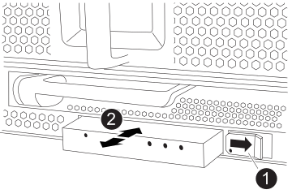

= Sostituire un modulo LED USB - FAS9500
:allow-uri-read: 
:icons: font
:imagesdir: ../media/

[role="lead"]
Il modulo LED USB fornisce connettività alle porte della console e allo stato del sistema. La sostituzione di questo modulo non richiede strumenti e non interrompe il servizio.

== Fase 1: Sostituire il modulo USB LED

.Fasi
. Rimuovere il vecchio modulo USB LED:
+
.Animazione - rimuovere/installare il modulo LED-USB
video::bc46a3e8-6541-444e-973b-ae78004bf153[panopto]
+

+
[cols="20%,80%"]
|===

 a| 
image::../media/icon_round_1.png[Numero di didascalia 1]
 a| 
Pulsante di bloccaggio

 a| 
image::../media/icon_round_2.png[Numero di didascalia 2]
 a| 
Modulo LED USB

|===
+
.. Dopo aver rimosso il pannello, individuare il modulo USB LED nella parte anteriore dello chassis, nella parte inferiore sinistra.
.. Far scorrere il fermo per espellere parzialmente il modulo.
.. Estrarre il modulo dall'alloggiamento per scollegarlo dalla scheda intermedia. Non lasciare vuoto lo slot.

. Installare il nuovo modulo USB LED:
+
.. Allineare il modulo all'alloggiamento con la tacca nell'angolo del modulo posizionato vicino al dispositivo di chiusura a scorrimento sul telaio. L'alloggiamento impedisce di installare il modulo capovolto.
.. Spingere il modulo nell'alloggiamento fino a posizionarlo completamente a filo con lo chassis.
+
Si avverte uno scatto quando il modulo è sicuro e collegato alla scheda intermedia.

== Fase 2: Restituire il componente guasto

. Restituire la parte guasta a NetApp, come descritto nelle istruzioni RMA fornite con il kit. Vedere la https://mysupport.netapp.com/site/info/rma["Restituzione e sostituzione delle parti"^] pagina per ulteriori informazioni.

