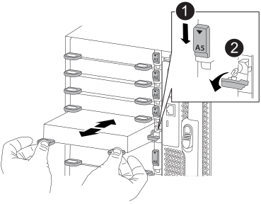

= Sostituire un modulo i/o - FAS9500
:allow-uri-read: 
:icons: font
:imagesdir: ../media/

[role="lead"]
Per sostituire un modulo i/o, è necessario eseguire una sequenza specifica di attività.

* È possibile utilizzare questa procedura con tutte le versioni di ONTAP supportate dal sistema.
* Tutti gli altri componenti del sistema devono funzionare correttamente; in caso contrario, contattare il supporto tecnico.

== Fase 1: Spegnere il nodo compromesso

Per spegnere il controller compromesso, è necessario determinare lo stato del controller e, se necessario, assumere il controllo del controller in modo che il controller integro continui a servire i dati provenienti dallo storage del controller compromesso.

.A proposito di questa attività
Se si dispone di un cluster con più di due nodi, questo deve trovarsi in quorum. Se il cluster non è in quorum o un controller integro mostra false per idoneità e salute, è necessario correggere il problema prima di spegnere il controller compromesso; vedere link:https://docs.netapp.com/us-en/ontap/system-admin/synchronize-node-cluster-task.html?q=Quorum["Sincronizzare un nodo con il cluster"^].

.Fasi
. Se AutoSupport è attivato, sospendere la creazione automatica dei casi richiamando un comando di messaggio AutoSupport: `system node autosupport invoke -node * -type all -message MAINT=number_of_hours_downh`
+
Il seguente comando AutoSupport sopprime la creazione automatica dei casi per due ore: `cluster1:*> system node autosupport invoke -node * -type all -message MAINT=2h`

. Disattivare il giveback automatico dalla console del controller integro: `storage failover modify –node local -auto-giveback false`
. Portare la centralina danneggiata al prompt DEL CARICATORE:
+
[cols="1,2"]
|===
| Se il controller non utilizzato visualizza... | Quindi... 

 a| 
Il prompt DEL CARICATORE
 a| 
Passare alla fase successiva.

 a| 
`Waiting for giveback...`
 a| 
Premere Ctrl-C, quindi rispondere `y` quando richiesto.

 a| 
Prompt di sistema o prompt della password (inserire la password di sistema)
 a| 
Arrestare o rilevare il controller danneggiato dal controller integro: `storage failover takeover -ofnode _impaired_node_name_`

Quando il controller non utilizzato visualizza Waiting for giveback... (in attesa di giveback...), premere Ctrl-C e rispondere `y`.

|===

== Fase 2: Sostituire i moduli i/O.

Per sostituire un modulo i/o, individuarlo all'interno dello chassis e seguire la sequenza specifica dei passaggi.

. Se non si è già collegati a terra, mettere a terra l'utente.
. Scollegare i cavi associati al modulo i/o di destinazione.
+
Assicurarsi di etichettare i cavi in modo da conoscerne la provenienza.

. Rimuovere il modulo i/o di destinazione dallo chassis:
+
.. Premere il tasto contrassegnato e numerato CAM.
+
Il pulsante CAM si allontana dal telaio.

.. Ruotare il fermo della camma verso il basso fino a portarlo in posizione orizzontale.
+
Il modulo i/o si disinnesta dallo chassis e si sposta di circa 1/2 pollici fuori dallo slot i/O.

.. Rimuovere il modulo i/o dallo chassis tirando le linguette sui lati del lato anteriore del modulo.
+
Assicurarsi di tenere traccia dello slot in cui si trovava il modulo i/O.

+
.Animazione - rimuovere/installare il modulo i/O.
video::0903b1f9-187b-4bb8-9548-ae9b0012bb21[panopto]
+

+
[cols="20%,80%"]
|===

 a| 
image::../media/legend_icon_01.svg[icona legenda 01]
 a| 
Latch i/o Cam intestato e numerato

 a| 
image::../media/legend_icon_02.svg[icona legenda 02]
 a| 
Fermo i/o Cam completamente sbloccato

|===

. Mettere da parte il modulo i/O.
. Installare il modulo i/o sostitutivo nello chassis facendo scorrere delicatamente il modulo i/o nello slot fino a quando il fermo della camma i/o con lettere e numeri inizia a innestarsi nel perno della camma i/o, quindi spingere il fermo della camma i/o completamente verso l'alto per bloccare il modulo in posizione.
. Ricable il modulo i/o, secondo necessità.

== Fase 3: Riavviare il controller dopo la sostituzione del modulo i/O.

Dopo aver sostituito un modulo i/o, è necessario riavviare il modulo controller.

NOTE: Se il nuovo modulo i/o non è lo stesso modello del modulo guasto, è necessario prima riavviare il BMC.

.Fasi
. Riavviare il BMC se il modulo sostitutivo non è lo stesso modello del modulo precedente:
+
.. Dal prompt DEL CARICATORE, passare alla modalità avanzata dei privilegi: `priv set advanced`
.. Riavviare BMC: `sp reboot`

. Dal prompt DEL CARICATORE, riavviare il nodo: `bye`
+

NOTE: In questo modo, le schede PCIe e gli altri componenti vengono reinizializzati e il nodo viene riavviato.

. Se il sistema è configurato per supportare connessioni dati e di interconnessione cluster a 10 GbE su NIC a 40 GbE, convertire queste porte in connessioni a 10 GbE utilizzando `nicadmin convert` Comando dalla modalità di manutenzione. Vedere https://docs.netapp.com/us-en/ontap/networking/convert_40gbe_nic_ports_into_multiple_10gbe_ports_for_10gbe_connectivity.html["Converti le porte NIC da 40 GbE in più porte da 10 GbE per la connettività da 10 GbE"^] per ulteriori informazioni.
+

NOTE: Assicurarsi di uscire dalla modalità di manutenzione dopo aver completato la conversione.

. Ripristinare il funzionamento normale del nodo: `storage failover giveback -ofnode impaired_node_name`
. Se il giveback automatico è stato disattivato, riabilitarlo: `storage failover modify -node local -auto-giveback true`

== Fase 4: Restituire la parte guasta a NetApp

Restituire la parte guasta a NetApp, come descritto nelle istruzioni RMA fornite con il kit. Vedere https://mysupport.netapp.com/site/info/rma["Parti restituita  sostituzioni"] per ulteriori informazioni.
