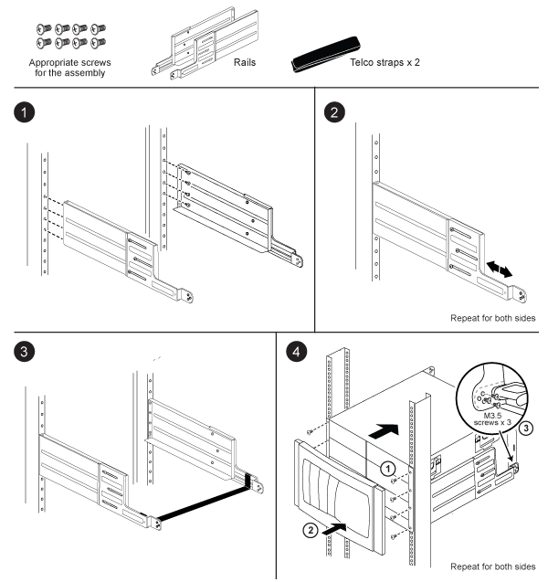

= Istruzioni per l'installazione del kit di guide di supporto a due montanti - AFF A700 e FAS9000
:allow-uri-read: 
:icons: font
:imagesdir: ../media/

[role="lead"]
Sono disponibili due kit di guide di supporto a due montanti che possono essere utilizzati con i sistemi FAS9000 e AFF A700. Un kit consente di montare il sistema nel rack a due montanti, mentre l'altro consente di montare il sistema nel rack a due montanti.

== Installare il kit di guide a due montanti per il montaggio centrale

image::../media/drw_telco_mid_mount_1.gif[drw telco montato al centro 1]

== Installare il kit di guide per il montaggio a incasso a due montanti

