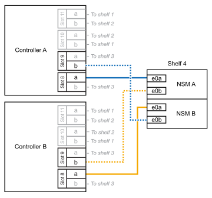

= Da shelf per cavi a sistemi ASA - NS224 ripiani
:allow-uri-read: 
:icons: font
:imagesdir: ../media/

[role="lead"]
Ciascun shelf NS224 viene collegato via cavo a caldo in modo che ogni shelf disponga di due connessioni a ciascun controller nella coppia ha.

.Ripiano per cavi a ASA A1K
[%collapsible]
====
È possibile aggiungere fino a tre shelf aggiuntivi da NS224 (per un totale di quattro shelf) a una coppia ha di ASA A1K.

.Prima di iniziare
* È necessario aver esaminato il link:requirements-hot-add-shelf.html["requisiti e best practice aggiuntivi a caldo"].
* È necessario aver completato le procedure applicabili in link:prepare-hot-add-shelf.html["Preparare l'aggiunta a caldo di uno shelf"].
* È necessario aver installato gli scaffali, acceso e impostato gli ID degli scaffali come descritto in link:prepare-hot-add-shelf.html["Installare uno shelf per un'aggiunta a caldo"].

.A proposito di questa attività
* Questa procedura presuppone che la coppia ha disponga di almeno uno shelf NS224 esistente.
* Questa procedura riguarda i seguenti scenari di aggiunta a caldo:
+
** Aggiunta a caldo di un secondo shelf a una coppia ha con due moduli i/o RoCE in ciascun controller. (È stato installato un secondo modulo i/o e il primo shelf è stato collegato a entrambi i moduli i/o oppure il primo shelf è già collegato a due moduli i/O. Collegare il secondo shelf a entrambi i moduli di i/O.
** Aggiunta a caldo di un terzo shelf a una coppia ha con tre moduli i/o RoCE in ciascun controller. (È stato installato un terzo modulo i/o e il terzo ripiano verrà collegato solo al terzo modulo i/o).
** Aggiunta a caldo di un terzo shelf a una coppia ha con quattro moduli i/o RoCE in ciascun controller. (È stato installato un terzo e quarto modulo i/o e il terzo ripiano verrà collegato al terzo e quarto modulo i/o).
** Aggiunta a caldo di un quarto shelf a una coppia ha con quattro moduli i/o RoCE in ciascun controller. (Hai installato un quarto modulo i/o e collegato il terzo shelf al terzo e quarto modulo i/o o già avevi il terzo shelf collegato al terzo e quarto modulo i/o). Collegare il quarto ripiano al terzo e al quarto modulo i/o).

.Fasi
. Se lo shelf NS224 che si sta aggiungendo a caldo sarà il secondo shelf NS224 della coppia ha, completare i seguenti passaggi secondari.
+
In caso contrario, passare alla fase successiva.

+
.. Ripiano per cavi NSM Porta A e0a per controller Slot A porta a 10 (e10a).
.. Shelf per cavi, porta NSM A e0b allo slot B del controller, porta b 11 (e11b).
.. Porta NSM B del ripiano per cavi e0a dello slot B del controller 10 porta a (e10a).
.. Porta NSM B dello shelf per cavi e0b allo slot a del controller porta b 11 (e11b).
+
L'illustrazione seguente evidenzia il cablaggio del secondo shelf nella coppia ha con due moduli i/o compatibili RoCE in ogni controller:

+
image::../media/drw_ns224_vino_m_2shelves_2cards_ieops-1642.svg[Cablaggio per ASA A1K con due shelf e due moduli io]

. Se lo shelf NS224 che stai aggiungendo a caldo sarà il terzo shelf NS224 nella coppia ha con tre moduli i/o RoCE in ciascun controller, completa i seguenti passaggi secondari. In caso contrario, passare alla fase successiva.
+
.. Shelf di cavi NSM Porta A e0a per controller Slot A porta a 9 (e9a).
.. Shelf per cavi dalla porta NSM A e0b allo slot controller B, 9 porte b (e9b).
.. Porta NSM B dello shelf per cavi e0a allo slot controller B porta a 9 (e9a).
.. Porta NSM B dello shelf per cavi e0b allo slot a del controller 9 porta b (e9b).
+
La seguente illustrazione evidenzia il cablaggio per il terzo shelf nella coppia ha con tre moduli i/o compatibili RoCE in ogni controller:

+
image::../media/drw_ns224_vino_m_3shelves_3cards_ieops-1643.svg[Cablaggio per ASA A1K con tre shelf e tre moduli io]

. Se lo shelf NS224 che stai aggiungendo a caldo sarà il terzo shelf NS224 nella coppia ha con quattro moduli i/o RoCE in ciascun controller, completa i seguenti passaggi secondari. In caso contrario, passare alla fase successiva.
+
.. Shelf di cavi NSM Porta A e0a per controller Slot A porta a 9 (e9a).
.. Shelf per cavi dalla porta NSM A e0b allo slot controller B, 8 porte b (e8b).
.. Porta NSM B dello shelf per cavi e0a allo slot controller B porta a 9 (e9a).
.. Porta NSM B dello shelf per cavi e0b allo slot a del controller 8 porta b (e8b).
+
La seguente illustrazione evidenzia il cablaggio per il terzo shelf nella coppia ha con quattro moduli i/o compatibili RoCE in ogni controller:

+
image::../media/drw_ns224_vino_m_3shelves_4cards_ieops-1644.svg[Cablaggio per ASA A1K con tre ripiani e quattro moduli io]

. Se lo shelf NS224 che stai aggiungendo a caldo sarà il quarto shelf NS224 nella coppia ha con quattro moduli i/o RoCE in ciascun controller, completa i seguenti passaggi secondari.
+
.. Shelf di cavi NSM Porta A e0a per controller Slot A porta a 8 (e8a).
.. Shelf per cavi dalla porta NSM A e0b allo slot controller B, 9 porte b (e9b).
.. Porta NSM B dello shelf per cavi e0a allo slot controller B porta a 8 (e8a).
.. Porta NSM B dello shelf per cavi e0b allo slot a del controller 9 porta b (e9b).
+
La seguente illustrazione evidenzia il cablaggio per il quarto shelf nella coppia ha con quattro moduli i/o compatibili RoCE in ogni controller:

+

. Verificare che il ripiano aggiunto a caldo sia collegato correttamente utilizzando https://mysupport.netapp.com/site/tools/tool-eula/activeiq-configadvisor["Active IQ Config Advisor"^].
+
Se vengono generati errori di cablaggio, seguire le azioni correttive fornite.

.Quali sono le prossime novità?
Se l'assegnazione automatica del disco è stata disattivata durante la preparazione di questa procedura, è necessario assegnare manualmente la proprietà del disco e, se necessario, riabilitare l'assegnazione automatica del disco. Andare a link:complete-hot-add-shelf.html["Completare l'aggiunta a caldo"].

In caso contrario, la procedura di aggiunta a caldo dello shelf è terminata.

====
.Ripiano per cavi a ASA A70 o ASA A90
[%collapsible]
====
Puoi aggiungere a caldo fino a due shelf NS224 in una coppia ha ASA A70 o ASA A90 quando è necessario ulteriore storage (nello shelf interno).

.Prima di iniziare
* È necessario aver esaminato il link:requirements-hot-add-shelf.html["requisiti e best practice aggiuntivi a caldo"].
* È necessario aver completato le procedure applicabili in link:prepare-hot-add-shelf.html["Preparare l'aggiunta a caldo di uno shelf"].
* È necessario aver installato gli scaffali, acceso e impostato gli ID degli scaffali come descritto in link:prepare-hot-add-shelf.html["Installare uno shelf per un'aggiunta a caldo"].

.A proposito di questa attività
* Questa procedura presuppone che la coppia ha disponga solo di storage interno (non di shelf esterni) e che si aggiungano a caldo fino a due shelf aggiuntivi e due moduli i/o RoCE in ciascun controller.
* Questa procedura riguarda i seguenti scenari di aggiunta a caldo:
+
** Aggiunta a caldo del primo shelf a una coppia ha con un modulo i/o compatibile RoCE in ciascun controller.
** Aggiunta a caldo del primo shelf a una coppia ha con due moduli i/o RoCE in ciascun controller.
** Aggiunta a caldo del secondo shelf a una coppia ha con due moduli i/o RoCE in ciascun controller.

.Fasi
. Se stai aggiungendo a caldo uno shelf utilizzando un set di porte compatibili RoCE (un modulo i/o compatibile RoCE) in ogni modulo controller, e questo è l'unico shelf NS224 nella coppia ha, completa i seguenti passaggi secondari.
+
In caso contrario, passare alla fase successiva.

+

NOTE: Questa fase presuppone che sia stato installato il modulo i/o compatibile con RoCE nello slot 11.

+
.. Shelf di cavi NSM Porta A e0a per il controller Uno slot 11 porta a (e11a).
.. Shelf per cavi, porta NSM A e0b allo slot B del controller, porta b 11 (e11b).
.. Porta NSM B del ripiano per cavi e0a dello slot B del controller 11 porta a (e11a).
.. Porta NSM B dello shelf per cavi e0b allo slot a del controller porta b 11 (e11b).
+
La seguente illustrazione mostra il cablaggio di uno shelf aggiunto a caldo utilizzando un modulo i/o compatibile con RoCE in ciascun modulo controller:

+
image::../media/drw_ns224_vino_i_1shelf_1card_ieops-1639.svg[Cablaggio per ASA A70 o A90 con uno shelf e un modulo io]

. Se si aggiungono a caldo uno o due shelf utilizzando due set di porte compatibili con RoCE (due moduli i/o compatibili con RoCE) in ciascun modulo controller, completare i passaggi secondari applicabili.
+

NOTE: Questa fase presuppone che siano stati installati i moduli i/o compatibili con RoCE negli slot 11 e 8.

+
[cols="1,3"]
|===
| Shelf | Cablaggio 

 a| 
Ripiano 1
 a| 
.. Cavo NSM Porta A e0a per controller slot A porta a 11 (e11a).
.. Cavo dalla porta NSM A e0b allo slot controller B 8 porta b (e8b).
.. Cavo dalla porta NSM B e0a allo slot controller B 11 porta a (e11a).
.. Cavo NSM B port e0b al controller A slot 8 port b (e8b).
.. Se si sta aggiungendo a caldo un secondo shelf, completare i passaggi secondari "`Shelf 2`"; in caso contrario, passare al punto 3.

L'illustrazione seguente mostra il cablaggio per uno shelf a caldo che utilizza due moduli i/o compatibili RoCE in ciascun modulo controller:

image::../media/drw_ns224_vino_i_1shelf_2cards_ieops-1640.svg[Cablaggio per ASA A70 o A90 con uno shelf e due moduli io]

 a| 
Shelf 2
 a| 
.. Cavo NSM Porta A e0a per controller slot A porta a 8 (e8a).
.. Cavo dalla porta NSM A e0b allo slot controller B 11 porta b (e11b).
.. Cavo dalla porta NSM B e0a allo slot controller B 8 porta a (e8a).
.. Cavo NSM B port e0b al controller A slot 11 port b (e11b).
.. Passare alla fase 3.

L'illustrazione seguente mostra il cablaggio per due shelf a caldo che utilizzano due moduli i/o compatibili RoCE in ciascun modulo controller:

image::../media/drw_ns224_vino_i_2shelves_2cards_ieops-1641.svg[Cablaggio per ASA A70 o A90 con due shelf e due moduli io]

|===
. Verificare che il ripiano aggiunto a caldo sia collegato correttamente utilizzando https://mysupport.netapp.com/site/tools/tool-eula/activeiq-configadvisor["Active IQ Config Advisor"^].
+
Se vengono generati errori di cablaggio, seguire le azioni correttive fornite.

.Quali sono le prossime novità?
Se l'assegnazione automatica del disco è stata disattivata durante la preparazione di questa procedura, è necessario assegnare manualmente la proprietà del disco e, se necessario, riabilitare l'assegnazione automatica del disco. Andare a link:complete-hot-add-shelf.html["Completare l'aggiunta a caldo"].

In caso contrario, la procedura di aggiunta a caldo dello shelf è terminata.

====
.Ripiano per cavi a ASA A250 o ASA C250
[%collapsible]
====
Per aggiungere storage, è possibile aggiungere a caldo un massimo di uno shelf da NS224 a una coppia ha AFF A250 o AFF C250.

.Prima di iniziare
* È necessario aver esaminato il link:requirements-hot-add-shelf.html["requisiti e best practice aggiuntivi a caldo"].
* È necessario aver completato le procedure applicabili in link:prepare-hot-add-shelf.html["Preparare l'aggiunta a caldo di uno shelf"].
* È necessario aver installato gli scaffali, acceso e impostato gli ID degli scaffali come descritto in link:prepare-hot-add-shelf.html["Installare uno shelf per un'aggiunta a caldo"].

.A proposito di questa attività
Vista dal retro dello chassis della piattaforma, la porta della scheda compatibile con RoCE a sinistra è la porta "a" (e1a) e la porta a destra è la porta "b" (e1b).

.Fasi
. Cablare i collegamenti dello shelf:
+
.. Shelf di cavi NSM Porta A e0a per controller Slot A porta a (e1a).
.. Porta NSM A del ripiano per cavi e0b allo slot controller B 1 porta b (e1b).
.. Porta NSM B dello shelf per cavi e0a allo slot controller B 1 porta a (e1a).
.. Porta NSM B del ripiano per cavi e0b allo slot a del controller 1 porta b (e1b). + la seguente illustrazione mostra il cablaggio dello shelf una volta completato.
+
image::../media/drw_ns224_a250_c250_f500f_1shelf_ieops-1824.svg[Cablaggio per AFF A250 C250 o FAS500f con uno shelf NS224 e un set di porte per schede PCIe]

. Verificare che il ripiano aggiunto a caldo sia collegato correttamente utilizzando https://mysupport.netapp.com/site/tools/tool-eula/activeiq-configadvisor["Active IQ Config Advisor"^].
+
Se vengono generati errori di cablaggio, seguire le azioni correttive fornite.

.Quali sono le prossime novità?
Se l'assegnazione automatica del disco è stata disattivata durante la preparazione di questa procedura, è necessario assegnare manualmente la proprietà del disco e, se necessario, riabilitare l'assegnazione automatica del disco. Andare a link:complete-hot-add-shelf.html["Completare l'aggiunta a caldo"].

In caso contrario, la procedura di aggiunta a caldo dello shelf è terminata.

====
.Ripiano per cavi a ASA A400 o ASA C400
[%collapsible]
====
La modalità di cavo di uno shelf NS224 per l'aggiunta a caldo dipende dal fatto che si disponga di una coppia ha AFF A400 o AFF C400.

.Prima di iniziare
* È necessario aver esaminato il link:requirements-hot-add-shelf.html["requisiti e best practice aggiuntivi a caldo"].
* È necessario aver completato le procedure applicabili in link:prepare-hot-add-shelf.html["Preparare l'aggiunta a caldo di uno shelf"].
* È necessario aver installato gli scaffali, acceso e impostato gli ID degli scaffali come descritto in link:prepare-hot-add-shelf.html["Installare uno shelf per un'aggiunta a caldo"].

*Da ripiano per cavi a una coppia AFF A400 ha*

Per una coppia ha di AFF A400, puoi aggiungere a caldo fino a due shelf e utilizzare le porte integrate e0c/e0d e le porte nello slot 5, in base alle esigenze.

.Fasi
. Se stai aggiungendo a caldo uno shelf utilizzando un set di porte compatibili con RoCE (porte integrate compatibili con RoCE) su ciascun controller, essendo l'unico shelf NS224 della coppia ha, completa i seguenti passaggi secondari.
+
In caso contrario, passare alla fase successiva.

+
.. Shelf di cavi NSM Porta A e0a per controller Porta A e0c.
.. Shelf per cavi dalla porta NSM A e0b alla porta controller B e0d.
.. Porta NSM B del ripiano per cavi e0a alla porta controller B e0c.
.. Porta NSM B del ripiano per cavi e0b alla porta a del controller e0d.
+
L'illustrazione seguente mostra il cablaggio di uno shelf a caldo che utilizza un set di porte compatibili RoCE su ciascun controller:

+
image::../media/drw_ns224_a400_1shelf.png[Cablaggio per AFF A400 con uno shelf NS224 e un set di porte integrate]

. Se si aggiungono a caldo uno o due shelf utilizzando due set di porte compatibili RoCE (porte compatibili RoCE e schede PCIe) su ciascun controller, completare i seguenti passaggi secondari.
+
[cols="1,3"]
|===
| Shelf | Cablaggio 

 a| 
Ripiano 1
 a| 
.. Cavo NSM Porta A e0a per controller Porta A e0c.
.. Cavo NSM Porta A e0b allo slot controller B porta 5 2 (e5b).
.. Cavo NSM B porta e0a al controller B porta e0c.
.. Cavo NSM B port e0b a controller slot A 5 port 2 (e5b).
.. Se si sta aggiungendo a caldo un secondo shelf, completare i passaggi secondari "`Shelf 2`"; in caso contrario, passare al punto 3.

 a| 
Shelf 2
 a| 
.. Cavo NSM Porta A e0a per controller slot A 5 porta 1 (e5a).
.. Cavo NSM Porta A e0b alla porta controller B e0d.
.. Cavo dalla porta NSM B e0a allo slot controller B 5 porta 1 (e5a).
.. Cavo NSM B port e0b to controller A port e0d.
.. Passare alla fase 3.

|===
+
La seguente illustrazione mostra il cablaggio per due shelf aggiunti a caldo:

+
image::../media/drw_ns224_a400_2shelves_IEOPS-983.svg[Cablaggio per un AFF A400 con due shelf NS224, un set di porte integrate e un set di porte su schede PCIe]

. Verificare che il ripiano aggiunto a caldo sia collegato correttamente utilizzando https://mysupport.netapp.com/site/tools/tool-eula/activeiq-configadvisor["Active IQ Config Advisor"^].
+
Se vengono generati errori di cablaggio, seguire le azioni correttive fornite.

. Se l'assegnazione automatica del disco è stata disattivata durante la preparazione di questa procedura, è necessario assegnare manualmente la proprietà del disco e riabilitare l'assegnazione automatica del disco, se necessario. Vedere link:complete-hot-add-shelf.html["Completare l'aggiunta a caldo"].
+
In caso contrario, la procedura viene completata.

*Da ripiano per cavi a una coppia AFF C400 ha*

Per una coppia ha di AFF C400, puoi aggiungere a caldo fino a due shelf e utilizzare le porte negli slot 4 e 5 in base alle necessità.

.Fasi
. Se stai aggiungendo a caldo uno shelf utilizzando un set di porte compatibili con RoCE su ogni controller e questo è l'unico shelf NS224 nella coppia ha, completa i seguenti passaggi secondari.
+
In caso contrario, passare alla fase successiva.

+
.. Shelf di cavi NSM Porta A e0a per controller slot A 4 porta 1 (e4a).
.. Ripiano per cavi dalla porta NSM A e0b allo slot controller B, 4 porte 2 (e4b).
.. Ripiano per cavi porta NSM B e0a a slot controller B 4 porta 1 (e4a).
.. Porta NSM B per il ripiano dei cavi e0b per lo slot a del controller 4 porta 2 (e4b).
+
L'illustrazione seguente mostra il cablaggio di uno shelf a caldo che utilizza un set di porte compatibili RoCE su ciascun controller:

+
image::../media/drw_ns224_c400_1shelf_IEOPS-985.svg[Cablaggio per AFF C400 con uno shelf NS224 e un set di porte per schede PCIe]

. Se stai aggiungendo a caldo uno o due shelf utilizzando due set di porte compatibili RoCE su ogni controller, completa i seguenti passaggi secondari.
+
[cols="1,3"]
|===
| Shelf | Cablaggio 

 a| 
Ripiano 1
 a| 
.. Cavo NSM Porta A e0a per controller slot A 4 porta 1 (e4a).
.. Cavo NSM Porta A e0b allo slot controller B porta 5 2 (e5b).
.. Cavo NSM B port e0a controller B port slot 4 port 1 (e4a).
.. Cavo NSM B port e0b a controller slot A 5 port 2 (e5b).
.. Se si sta aggiungendo a caldo un secondo shelf, completare i passaggi secondari "`Shelf 2`"; in caso contrario, passare al punto 3.

 a| 
Shelf 2
 a| 
.. Cavo NSM Porta A e0a per controller slot A 5 porta 1 (e5a).
.. Cavo dalla porta NSM A e0b allo slot controller B 4 porta 2 (e4b).
.. Cavo dalla porta NSM B e0a allo slot controller B 5 porta 1 (e5a).
.. Cavo NSM B port e0b allo slot a del controller 4 port 2 (e4b).
.. Passare alla fase 3.

|===
+
La seguente illustrazione mostra il cablaggio per due shelf aggiunti a caldo:

+
image::../media/drw_ns224_c400_2shelves_IEOPS-984.svg[Cablaggio per un AFF C400 con due shelf NS224 e due set di porte per schede PCIe]

. Verificare che il ripiano aggiunto a caldo sia collegato correttamente utilizzando https://mysupport.netapp.com/site/tools/tool-eula/activeiq-configadvisor["Active IQ Config Advisor"^].
+
Se vengono generati errori di cablaggio, seguire le azioni correttive fornite.

.Quali sono le prossime novità?
Se l'assegnazione automatica del disco è stata disattivata durante la preparazione di questa procedura, è necessario assegnare manualmente la proprietà del disco e, se necessario, riabilitare l'assegnazione automatica del disco. Andare a link:complete-hot-add-shelf.html["Completare l'aggiunta a caldo"].

In caso contrario, la procedura di aggiunta a caldo dello shelf è terminata.

====
.Ripiano per cavi a ASA A800 o ASA C800
[%collapsible]
====
La modalità di cavo di uno shelf NS224 in una coppia ha AFF A800 o AFF C800 dipende dal numero di shelf che si stanno aggiungendo a caldo e dal numero di set di porte compatibili con RoCE (uno o due) che si stanno utilizzando sui controller.

.Prima di iniziare
* È necessario aver esaminato il link:requirements-hot-add-shelf.html["requisiti e best practice aggiuntivi a caldo"].
* È necessario aver completato le procedure applicabili in link:prepare-hot-add-shelf.html["Preparare l'aggiunta a caldo di uno shelf"].
* È necessario aver installato gli scaffali, acceso e impostato gli ID degli scaffali come descritto in link:prepare-hot-add-shelf.html["Installare uno shelf per un'aggiunta a caldo"].

.Fasi
. Se stai aggiungendo a caldo uno shelf utilizzando un set di porte compatibili RoCE (una scheda PCIe compatibile RoCE) su ciascun controller, essendo l'unico shelf NS224 della coppia ha, completa i seguenti passaggi secondari.
+
In caso contrario, passare alla fase successiva.

+

NOTE: Questa fase presuppone l'installazione della scheda PCIe compatibile con RoCE nello slot 5.

+
.. Shelf di cavi NSM Porta A e0a per controller Slot A porta a 5 (e5a).
.. Shelf per cavi dalla porta NSM A e0b allo slot controller B, 5 porte b (e5b).
.. Porta NSM B dello shelf per cavi e0a allo slot controller B porta a 5 (e5a).
.. Porta NSM B dello shelf per cavi e0b allo slot a del controller 5 porta b (e5b).
+
L'illustrazione seguente mostra il cablaggio di uno shelf a caldo utilizzando una scheda PCIe compatibile RoCE su ciascun controller:

+
image::../media/drw_ns224_a800_c800_1shelf_IEOPS-964.svg[Cablaggio per AFF A800 o AFF C800 con uno shelf NS224 e una scheda PCIe]

. Se stai aggiungendo a caldo uno o due shelf utilizzando due set di porte compatibili con RoCE (due schede PCIe compatibili RoCE) su ciascun controller, completa le relative istruzioni secondarie.
+

NOTE: Questa fase presuppone l'installazione delle schede PCIe compatibili con RoCE negli slot 5 e 3.

+
[cols="1,3"]
|===
| Shelf | Cablaggio 

 a| 
Ripiano 1
 a| 

NOTE: Questi passaggi secondari presuppongono che si stia iniziando il cablaggio collegando la porta dello shelf e0a alla scheda PCIe compatibile con RoCE nello slot 5, invece dello slot 3.

.. Cavo NSM Porta A e0a per controller slot A porta a 5 (e5a).
.. Cavo dalla porta NSM A e0b allo slot controller B, 3 porta b (e3b).
.. Cavo dalla porta NSM B e0a allo slot controller B 5 porta a (e5a).
.. Cavo NSM B porta e0b allo slot a del controller 3 porta b (e3b).
.. Se si sta aggiungendo a caldo un secondo shelf, completare i passaggi secondari "`Shelf 2`"; in caso contrario, passare al punto 3.

 a| 
Shelf 2
 a| 

NOTE: Questi passaggi secondari presuppongono che si stia iniziando il cablaggio collegando la porta dello shelf e0a alla scheda PCIe compatibile con RoCE nello slot 3, invece dello slot 5 (che è correlato alle fasi secondarie del cablaggio per lo shelf 1).

.. Cavo NSM Porta A e0a per controller slot A porta a 3 (e3a).
.. Cavo dalla porta NSM A e0b allo slot controller B 5 porta b (e5b).
.. Cavo dalla porta NSM B e0a allo slot controller B 3 porta a (e3a).
.. Cavo NSM B port e0b al controller A slot 5 port b (e5b).
.. Passare alla fase 3.

|===
+
La seguente illustrazione mostra il cablaggio per due shelf aggiunti a caldo:

+
image::../media/drw_ns224_a800_c800_2shelves_IEOPS-966.svg[Drw ns224 a800 c800 2 shelf IEOPS 966]

. Verificare che il ripiano aggiunto a caldo sia collegato correttamente utilizzando https://mysupport.netapp.com/site/tools/tool-eula/activeiq-configadvisor["Active IQ Config Advisor"^].
+
Se vengono generati errori di cablaggio, seguire le azioni correttive fornite.

.Quali sono le prossime novità?
Se l'assegnazione automatica del disco è stata disattivata durante la preparazione di questa procedura, è necessario assegnare manualmente la proprietà del disco e, se necessario, riabilitare l'assegnazione automatica del disco. Andare a link:complete-hot-add-shelf.html["Completare l'aggiunta a caldo"].

In caso contrario, la procedura di aggiunta a caldo dello shelf è terminata.

====
.Ripiano per cavi a ASA A900
[%collapsible]
====
Quando è necessario uno storage aggiuntivo, è possibile aggiungere a caldo fino a tre shelf di dischi NS224 aggiuntivi (per un totale di quattro shelf) a una coppia AFF A900 ha.

.Prima di iniziare
* È necessario aver esaminato il link:requirements-hot-add-shelf.html["requisiti e best practice aggiuntivi a caldo"].
* È necessario aver completato le procedure applicabili in link:prepare-hot-add-shelf.html["Preparare l'aggiunta a caldo di uno shelf"].
* È necessario aver installato gli scaffali, acceso e impostato gli ID degli scaffali come descritto in link:prepare-hot-add-shelf.html["Installare uno shelf per un'aggiunta a caldo"].

.A proposito di questa attività
* Questa procedura presuppone che la coppia ha abbia almeno uno shelf NS224 esistente e che si stiano aggiungendo a caldo fino a tre shelf aggiuntivi.
* Se la coppia ha dispone di un solo shelf NS224, questa procedura presuppone che lo shelf sia cablato su due moduli i/o 100GbE compatibili con RoCE su ciascun controller.

.Fasi
. Se lo shelf NS224 che si sta aggiungendo a caldo sarà il secondo shelf NS224 della coppia ha, completare i seguenti passaggi secondari.
+
In caso contrario, passare alla fase successiva.

+
.. Ripiano per cavi NSM Porta A e0a per controller Slot A porta a 10 (e10a).
.. Porta NSM A del ripiano per cavi e0b allo slot B del controller 2 porta b (e2b).
.. Porta NSM B del ripiano per cavi e0a dello slot B del controller 10 porta a (e10a).
.. Porta NSM B del ripiano per cavi e0b per lo slot a del controller 2 porta b (e2b).
+
La figura seguente mostra il cablaggio del secondo shelf (e del primo shelf).

+
image::../media/drw_ns224_a900_2shelves.png[Cablaggio per un AFF A900 con due shelf NS224 e due moduli io]

. Se lo shelf NS224 che si sta aggiungendo a caldo sarà il terzo shelf NS224 della coppia ha, completare i seguenti passaggi secondari.
+
In caso contrario, passare alla fase successiva.

+
.. Shelf di cavi NSM Porta A e0a per controller Slot A porta a (e1a).
.. Shelf per cavi, porta NSM A e0b allo slot B del controller, porta b 11 (e11b).
.. Porta NSM B dello shelf per cavi e0a allo slot controller B 1 porta a (e1a).
.. Porta NSM B dello shelf per cavi e0b allo slot a del controller porta b 11 (e11b).
+
La figura seguente mostra il cablaggio del terzo shelf.

+
image::../media/drw_ns224_a900_3shelves.png[Cablaggio per un AFF A900 con tre shelf NS224 e quattro moduli io]

. Se lo shelf NS224 che si sta aggiungendo a caldo sarà il quarto shelf NS224 della coppia ha, completare i seguenti passaggi secondari.
+
In caso contrario, passare alla fase successiva.

+
.. Shelf di cavi NSM Porta A e0a per il controller Uno slot 11 porta a (e11a).
.. Porta NSM A del ripiano per cavi e0b allo slot controller B 1 porta b (e1b).
.. Porta NSM B del ripiano per cavi e0a dello slot B del controller 11 porta a (e11a).
.. Porta NSM B del ripiano per cavi e0b allo slot a del controller 1 porta b (e1b).
+
La figura seguente mostra il cablaggio del quarto shelf.

+
image::../media/drw_ns224_a900_4shelves.png[Cablaggio per un AFF A900 con quattro shelf NS224 e quattro moduli io]

. Verificare che il ripiano aggiunto a caldo sia collegato correttamente utilizzando https://mysupport.netapp.com/site/tools/tool-eula/activeiq-configadvisor["Active IQ Config Advisor"^].
+
Se vengono generati errori di cablaggio, seguire le azioni correttive fornite.

.Quali sono le prossime novità?
Se l'assegnazione automatica del disco è stata disattivata durante la preparazione di questa procedura, è necessario assegnare manualmente la proprietà del disco e, se necessario, riabilitare l'assegnazione automatica del disco. Andare a link:complete-hot-add-shelf.html["Completare l'aggiunta a caldo"].

In caso contrario, la procedura di aggiunta a caldo dello shelf è terminata.

====