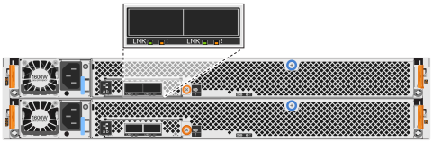

= Panoramica del cablaggio per un hot-add: NS224 shelf
:allow-uri-read: 
:icons: font
:imagesdir: ../media/

[role="lead"]
Ciascun shelf NS224 viene collegato via cavo a caldo in modo che ogni shelf disponga di due connessioni a ciascun controller nella coppia ha.

Questa sezione del cablaggio descrive come collegare lo shelf NS224 ai seguenti sistemi di storage:

* link:cable-aff-systems-hot-add-shelf.html["Collegamento dei sistemi AFF"]
* link:cable-asa-systems-hot-add-shelf.html["Collegamento dei sistemi ASA"]
* link:cable-eoa-systems-hot-add-shelf.html["Cavo per sistemi EOA"]

== A proposito di questa attività

* Questa procedura si applica solo allo storage collegato direttamente. Per visualizzare le istruzioni per lo spazio di archiviazione collegato allo switch, vedere la nostra link:cable-as-switch-attached.html["guida del cablaggio collegata allo switch"].
* Acquisire familiarità con il corretto orientamento del connettore del cavo e con l'ubicazione e l'etichettatura delle porte sui moduli a scaffale NS224 NSM100.
+
** I cavi devono essere inseriti con la linguetta di estrazione del connettore rivolta verso l'alto.
+
Quando un cavo è inserito correttamente, scatta in posizione.

+
Dopo aver collegato entrambe le estremità del cavo, i LED LNK (verde) dello shelf e della porta del controller si illuminano. Se il LED LNK della porta non si accende, ricollegare il cavo.

+
image::../media/oie_cable_pull_tab_up.png[I cavi vengono inseriti con la linguetta di estrazione del connettore rivolta verso l'alto]

** È possibile utilizzare l'illustrazione seguente per identificare fisicamente le porte NSM100 dello shelf, e0a e e0b.
+
[role="tabbed-block"]
====
.NSM100 moduli
--
*** Uno shelf NS224 contiene due moduli NSM100. Il modulo superiore va nello slot A (NSM A) e il modulo inferiore va nello slot B (NSM B).
*** Ogni modulo NSM100 include 2 porte 100GbE QSFP28 GbE: e0a e e0b.
+
image::../media/drw_ns224_back_ports.png[Posizione delle NS224 NSM100 porte del modulo e0a e e0b]

--
.NSM100B moduli
--
*** Uno shelf NS224 contiene due moduli NSM100B. Il modulo superiore va nello slot A (NSM A) e il modulo inferiore va nello slot B (NSM B).
*** Ogni modulo NSM100B include 2 porte 100GbE CX6/DX: E1a GbE e e1b GbE.
+

--
====

* Dopo aver cablato uno shelf aggiunto a caldo, ONTAP riconosce lo shelf:
+
** La proprietà del disco viene assegnata se è attivata l'assegnazione automatica del disco.
** Il firmware dello shelf NSM e del disco devono essere aggiornati automaticamente, se necessario.
+

NOTE: Gli aggiornamenti del firmware possono richiedere fino a 30 minuti.

