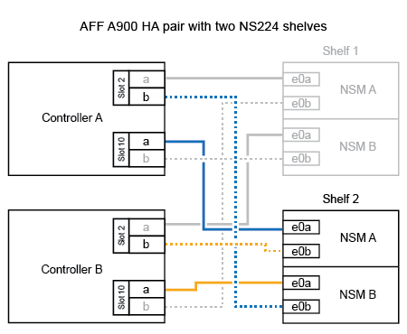
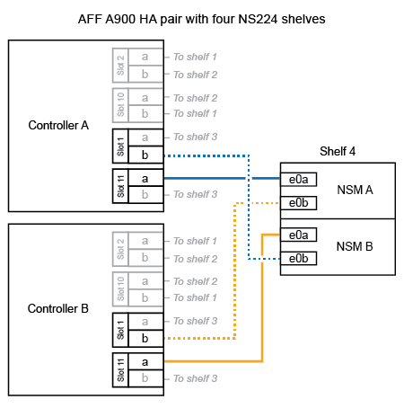

= Collega uno shelf NS224 al tuo sistema AFF A900
:allow-uri-read: 
:icons: font
:imagesdir: ../media/

[role="lead"]
Collega il tuo shelf NS224 al sistema AFF A900 in modo che ogni shelf abbia due connessioni a ciascun controller della coppia HA.

.A proposito di questa attività
* Questa procedura presuppone che la coppia ha abbia almeno uno shelf NS224 esistente e che si stiano aggiungendo a caldo fino a tre shelf aggiuntivi.
* Se la coppia ha dispone di un solo shelf NS224, questa procedura presuppone che lo shelf sia cablato su due moduli i/o 100GbE compatibili con RoCE su ciascun controller.

.Fasi
. Se lo shelf NS224 che si sta aggiungendo a caldo sarà il secondo shelf NS224 della coppia ha, completare i seguenti passaggi secondari.
+
In caso contrario, passare alla fase successiva.

+
.. Ripiano per cavi NSM Porta A e0a per controller Slot A porta a 10 (e10a).
.. Porta NSM A del ripiano per cavi e0b allo slot B del controller 2 porta b (e2b).
.. Porta NSM B del ripiano per cavi e0a dello slot B del controller 10 porta a (e10a).
.. Porta NSM B del ripiano per cavi e0b per lo slot a del controller 2 porta b (e2b).
+
La figura seguente mostra il cablaggio del secondo shelf (e del primo shelf).

+

. Se lo shelf NS224 che si sta aggiungendo a caldo sarà il terzo shelf NS224 della coppia ha, completare i seguenti passaggi secondari.
+
In caso contrario, passare alla fase successiva.

+
.. Shelf di cavi NSM Porta A e0a per controller Slot A porta a (e1a).
.. Shelf per cavi, porta NSM A e0b allo slot B del controller, porta b 11 (e11b).
.. Porta NSM B dello shelf per cavi e0a allo slot controller B 1 porta a (e1a).
.. Porta NSM B dello shelf per cavi e0b allo slot a del controller porta b 11 (e11b).
+
La figura seguente mostra il cablaggio del terzo shelf.

+
image::../media/drw_ns224_a900_3shelves.png[Cablaggio per un AFF/ASA A900 con tre shelf NS224 e quattro moduli io]

. Se lo shelf NS224 che si sta aggiungendo a caldo sarà il quarto shelf NS224 della coppia ha, completare i seguenti passaggi secondari.
+
In caso contrario, passare alla fase successiva.

+
.. Shelf di cavi NSM Porta A e0a per il controller Uno slot 11 porta a (e11a).
.. Porta NSM A del ripiano per cavi e0b allo slot controller B 1 porta b (e1b).
.. Porta NSM B del ripiano per cavi e0a dello slot B del controller 11 porta a (e11a).
.. Porta NSM B del ripiano per cavi e0b allo slot a del controller 1 porta b (e1b).
+
La figura seguente mostra il cablaggio del quarto shelf.

+

. Verificare che il ripiano aggiunto a caldo sia collegato correttamente utilizzando https://mysupport.netapp.com/site/tools/tool-eula/activeiq-configadvisor["Active IQ Config Advisor"^].
+
Se vengono generati errori di cablaggio, seguire le azioni correttive fornite.

.Cosa succederà
Se hai disabilitato l'assegnazione automatica delle unità durante la preparazione di questa procedura, devi assegnare manualmente la proprietà dell'unità e quindi riattivare l'assegnazione automatica delle unità, se necessario. Vai a link:hot-add-aff-complete.html["Completare l'aggiunta a caldo"].

In caso contrario, la procedura di aggiunta a caldo dello shelf è terminata.
