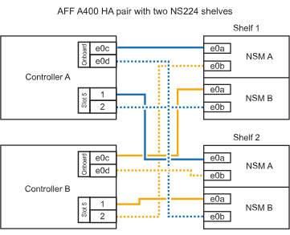

= Collega uno shelf NS224 al tuo sistema ASA A400 o ASA C400
:allow-uri-read: 
:icons: font
:imagesdir: ../media/

[role="lead"]
Collega il tuo shelf NS224 al sistema ASA A400 o ASA C400 in modo che ogni shelf abbia due connessioni a ciascun controller della coppia HA.

== Collega la shelf a una coppia HA A400

Per una coppia HA A400, è possibile aggiungere a caldo fino a due shelf e utilizzare le porte integrate e0c/e0d e le porte nello slot 5 secondo necessità.

.Fasi
. Se stai aggiungendo a caldo uno shelf utilizzando un set di porte compatibili con RoCE (porte integrate compatibili con RoCE) su ciascun controller, essendo l'unico shelf NS224 della coppia ha, completa i seguenti passaggi secondari.
+
In caso contrario, passare alla fase successiva.

+
.. Shelf di cavi NSM Porta A e0a per controller Porta A e0c.
.. Shelf per cavi dalla porta NSM A e0b alla porta controller B e0d.
.. Porta NSM B del ripiano per cavi e0a alla porta controller B e0c.
.. Porta NSM B del ripiano per cavi e0b alla porta a del controller e0d.
+
L'illustrazione seguente mostra il cablaggio di uno shelf a caldo che utilizza un set di porte compatibili RoCE su ciascun controller:

+
image::../media/drw_ns224_a400_1shelf.png[Cablaggio per AFF/ASA A400 con uno shelf NS224 e un set di porte integrate]

. Se si aggiungono a caldo uno o due shelf utilizzando due set di porte compatibili RoCE (porte compatibili RoCE e schede PCIe) su ciascun controller, completare i seguenti passaggi secondari.
+
[cols="1,3"]
|===
| Shelf | Cablaggio 

 a| 
Ripiano 1
 a| 
.. Cavo NSM Porta A e0a per controller Porta A e0c.
.. Cavo NSM Porta A e0b allo slot controller B porta 5 2 (e5b).
.. Cavo NSM B porta e0a al controller B porta e0c.
.. Cavo NSM B port e0b a controller slot A 5 port 2 (e5b).
.. Se si desidera aggiungere un secondo ripiano a caldo, completare i sotto-passaggi "`Ripiano 2`"; in caso contrario, passare al passaggio successivo.

 a| 
Shelf 2
 a| 
.. Cavo NSM Porta A e0a per controller slot A 5 porta 1 (e5a).
.. Cavo NSM Porta A e0b alla porta controller B e0d.
.. Cavo dalla porta NSM B e0a allo slot controller B 5 porta 1 (e5a).
.. Cavo NSM B port e0b to controller A port e0d.
.. Passare alla fase successiva.

|===
+
La seguente illustrazione mostra il cablaggio per due shelf aggiunti a caldo:

+

. Verificare che il ripiano aggiunto a caldo sia collegato correttamente utilizzando https://mysupport.netapp.com/site/tools/tool-eula/activeiq-configadvisor["Active IQ Config Advisor"^].
+
Se vengono generati errori di cablaggio, seguire le azioni correttive fornite.

== Collega la shelf a una coppia HA C400

Per una coppia HA C400, è possibile aggiungere a caldo fino a due shelf e utilizzare le porte negli slot 4 e 5 secondo necessità.

.Fasi
. Se stai aggiungendo a caldo uno shelf utilizzando un set di porte compatibili con RoCE su ogni controller e questo è l'unico shelf NS224 nella coppia ha, completa i seguenti passaggi secondari.
+
In caso contrario, passare alla fase successiva.

+
.. Shelf di cavi NSM Porta A e0a per controller slot A 4 porta 1 (e4a).
.. Ripiano per cavi dalla porta NSM A e0b allo slot controller B, 4 porte 2 (e4b).
.. Ripiano per cavi porta NSM B e0a a slot controller B 4 porta 1 (e4a).
.. Porta NSM B per il ripiano dei cavi e0b per lo slot a del controller 4 porta 2 (e4b).
+
L'illustrazione seguente mostra il cablaggio di uno shelf a caldo che utilizza un set di porte compatibili RoCE su ciascun controller:

+
image::../media/drw_ns224_c400_1shelf_IEOPS-985.svg[Cablaggio per AFF/ASA C400 con uno shelf NS224 e un set di porte per schede PCIe]

. Se stai aggiungendo a caldo uno o due shelf utilizzando due set di porte compatibili RoCE su ogni controller, completa i seguenti passaggi secondari.
+
[cols="1,3"]
|===
| Shelf | Cablaggio 

 a| 
Ripiano 1
 a| 
.. Cavo NSM Porta A e0a per controller slot A 4 porta 1 (e4a).
.. Cavo NSM Porta A e0b allo slot controller B porta 5 2 (e5b).
.. Cavo NSM B port e0a controller B port slot 4 port 1 (e4a).
.. Cavo NSM B port e0b a controller slot A 5 port 2 (e5b).
.. Se si desidera aggiungere un secondo ripiano a caldo, completare i sotto-passaggi "`Ripiano 2`"; in caso contrario, passare al passaggio successivo.

 a| 
Shelf 2
 a| 
.. Cavo NSM Porta A e0a per controller slot A 5 porta 1 (e5a).
.. Cavo dalla porta NSM A e0b allo slot controller B 4 porta 2 (e4b).
.. Cavo dalla porta NSM B e0a allo slot controller B 5 porta 1 (e5a).
.. Cavo NSM B port e0b allo slot a del controller 4 port 2 (e4b).
.. Passare alla fase successiva.

|===
+
La seguente illustrazione mostra il cablaggio per due shelf aggiunti a caldo:

+
image::../media/drw_ns224_c400_2shelves_IEOPS-984.svg[Cablaggio per un AFF/ASA C400 con due shelf NS224 e due set di porte per schede PCIe]

. Verificare che il ripiano aggiunto a caldo sia collegato correttamente utilizzando https://mysupport.netapp.com/site/tools/tool-eula/activeiq-configadvisor["Active IQ Config Advisor"^].
+
Se vengono generati errori di cablaggio, seguire le azioni correttive fornite.

.Cosa succederà
Se hai disabilitato l'assegnazione automatica delle unità durante la preparazione di questa procedura, devi assegnare manualmente la proprietà dell'unità e quindi riattivare l'assegnazione automatica delle unità, se necessario. Vai a link:hot-add-asa-complete.html["Completare l'aggiunta a caldo"].

In caso contrario, la procedura di aggiunta a caldo dello shelf è terminata.
