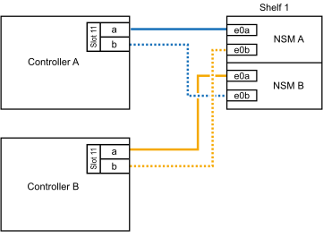
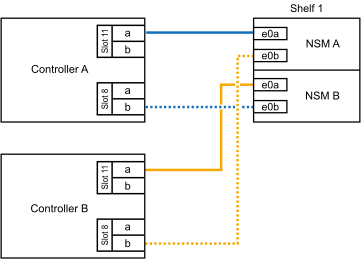
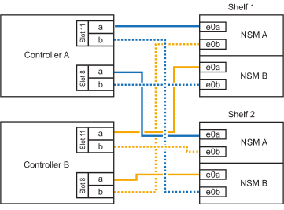

= Collega uno shelf NS224 al tuo sistema ASA A70 o ASA A90 tramite cavo
:allow-uri-read: 
:icons: font
:imagesdir: ../media/

[role="lead"]
Collega il tuo shelf NS224 al sistema ASA A70 o ASA A90 in modo che ogni shelf abbia due connessioni a ciascun controller della coppia HA.

.A proposito di questa attività
* Questa procedura presuppone che la coppia ha disponga solo di storage interno (non di shelf esterni) e che si aggiungano a caldo fino a due shelf aggiuntivi e due moduli i/o RoCE in ciascun controller.
* Questa procedura riguarda i seguenti scenari di aggiunta a caldo:
+
** Aggiunta a caldo del primo shelf a una coppia ha con un modulo i/o compatibile RoCE in ciascun controller.
** Aggiunta a caldo del primo shelf a una coppia ha con due moduli i/o RoCE in ciascun controller.
** Aggiunta a caldo del secondo shelf a una coppia ha con due moduli i/o RoCE in ciascun controller.

.Fasi
. Se stai aggiungendo a caldo uno shelf utilizzando un set di porte compatibili RoCE (un modulo i/o compatibile RoCE) in ogni modulo controller, e questo è l'unico shelf NS224 nella coppia ha, completa i seguenti passaggi secondari.
+
In caso contrario, passare alla fase successiva.

+

NOTE: Questa fase presuppone che sia stato installato il modulo i/o compatibile con RoCE nello slot 11.

+
.. Shelf di cavi NSM Porta A e0a per il controller Uno slot 11 porta a (e11a).
.. Shelf per cavi, porta NSM A e0b allo slot B del controller, porta b 11 (e11b).
.. Porta NSM B del ripiano per cavi e0a dello slot B del controller 11 porta a (e11a).
.. Porta NSM B dello shelf per cavi e0b allo slot a del controller porta b 11 (e11b).
+
La seguente illustrazione mostra il cablaggio di uno shelf aggiunto a caldo utilizzando un modulo i/o compatibile con RoCE in ciascun modulo controller:

+

. Se si aggiungono a caldo uno o due shelf utilizzando due set di porte compatibili con RoCE (due moduli i/o compatibili con RoCE) in ciascun modulo controller, completare i passaggi secondari applicabili.
+

NOTE: Questa fase presuppone che siano stati installati i moduli i/o compatibili con RoCE negli slot 11 e 8.

+
[cols="1,3"]
|===
| Shelf | Cablaggio 

 a| 
Ripiano 1
 a| 
.. Cavo NSM Porta A e0a per controller slot A porta a 11 (e11a).
.. Cavo dalla porta NSM A e0b allo slot controller B 8 porta b (e8b).
.. Cavo dalla porta NSM B e0a allo slot controller B 11 porta a (e11a).
.. Cavo NSM B port e0b al controller A slot 8 port b (e8b).
.. Se si desidera aggiungere un secondo ripiano a caldo, completare i sotto-passaggi "`Ripiano 2`"; in caso contrario, passare al passaggio successivo.

L'illustrazione seguente mostra il cablaggio per uno shelf a caldo che utilizza due moduli i/o compatibili RoCE in ciascun modulo controller:

 a| 
Shelf 2
 a| 
.. Cavo NSM Porta A e0a per controller slot A porta a 8 (e8a).
.. Cavo dalla porta NSM A e0b allo slot controller B 11 porta b (e11b).
.. Cavo dalla porta NSM B e0a allo slot controller B 8 porta a (e8a).
.. Cavo NSM B port e0b al controller A slot 11 port b (e11b).
.. Passare alla fase successiva.

L'illustrazione seguente mostra il cablaggio per due shelf a caldo che utilizzano due moduli i/o compatibili RoCE in ciascun modulo controller:

|===
. Verificare che il ripiano aggiunto a caldo sia collegato correttamente utilizzando https://mysupport.netapp.com/site/tools/tool-eula/activeiq-configadvisor["Active IQ Config Advisor"^].
+
Se vengono generati errori di cablaggio, seguire le azioni correttive fornite.

.Cosa succederà
Se hai disabilitato l'assegnazione automatica delle unità durante la preparazione di questa procedura, devi assegnare manualmente la proprietà dell'unità e quindi riattivare l'assegnazione automatica delle unità, se necessario. Vai a link:hot-add-asa-complete.html["Completare l'aggiunta a caldo"].

In caso contrario, la procedura di aggiunta a caldo dello shelf è terminata.
