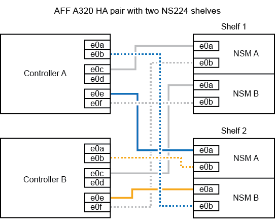

= Hot-add a shelf - Shelf NS224
:allow-uri-read: 
:icons: font
:imagesdir: ../media/

[role="lead"]
È possibile aggiungere a caldo uno shelf di dischi NS224 dopo che la coppia ha soddisfa determinati requisiti e dopo che le attività di preparazione applicabili alla coppia ha sono state completate.

== Requisiti per un hot-add

La coppia ha deve soddisfare determinati requisiti prima di aggiungere a caldo uno shelf di dischi NS224.

* Il modello di piattaforma e la versione di ONTAP devono supportare lo shelf NS224 e i dischi che si stanno aggiungendo a caldo.
+
https://hwu.netapp.com["NetApp Hardware Universe"^]

* Per collegare lo shelf, è necessario disporre del numero e del tipo di cavi corretti.
+
https://hwu.netapp.com["NetApp Hardware Universe"^]

* La coppia ha deve disporre di un numero sufficiente di porte compatibili con RoCE per supportare il numero di shelf che si stanno aggiungendo a caldo.
+
Per ogni shelf che si sta aggiungendo a caldo, sono necessarie almeno due porte compatibili con RoCE su ciascun controller. Queste porte possono essere integrate nei controller, su schede PCIe compatibili con RoCE, una combinazione di entrambi, o su moduli i/o compatibili con RoCE, come supportato dal modello di piattaforma.

+
Se la coppia ha non dispone di un numero sufficiente di porte compatibili con RoCE e il modello di piattaforma supporta l'utilizzo di schede PCIe o moduli i/o compatibili con RoCE, è necessario installare le schede o i moduli i/o aggiuntivi negli slot controller corretti, come supportato dal modello di piattaforma.

+
https://hwu.netapp.com["NetApp Hardware Universe"^]

+
[NOTE]
====
Le porte non dedicate compatibili con RoCE devono essere configurate per l'utilizzo dello storage (non per l'utilizzo in rete).

<<Preparare porte non dedicate compatibili con RoCE per un hot-add>>

====
* Se si dispone di una coppia ha AFF A700 e si sta aggiungendo a caldo lo shelf di dischi NS224 iniziale (non esiste uno shelf di dischi NS224 nella coppia ha), è necessario installare un modulo di dump core (X9170A, SSD NVMe da 1 TB) in ciascun controller per supportare i core dump (memorizzare i file core).
+
link:../fas9000/caching-module-and-core-dump-module-replace.html["Sostituire il modulo di caching o aggiungere/sostituire un modulo core dump -- AFF A700 e FAS9000"^]

* La tua coppia ha deve avere un numero inferiore al numero massimo di shelf supportati, almeno del numero di shelf che intendi aggiungere a caldo.
+
Non è possibile superare il numero massimo di shelf supportati dalla coppia ha dopo l'aggiunta a caldo degli shelf.

+
https://hwu.netapp.com["NetApp Hardware Universe"^]

* Se si aggiunge a caldo uno shelf a una coppia ha che dispone già di uno shelf NS224, la coppia ha non può visualizzare messaggi di errore relativi al cablaggio dello storage e deve essere cablata come ha multipath.
+
È possibile eseguire Active IQ Config Advisor per visualizzare eventuali messaggi di errore relativi al cablaggio dello storage e le azioni correttive da intraprendere.

+
https://mysupport.netapp.com/site/tools/tool-eula/activeiq-configadvisor["Download NetApp: Config Advisor"^]

* È necessaria una graffetta con un lato raddrizzato o una penna a sfera con punta stretta.
+
Per modificare l'ID dello shelf, utilizzare la graffetta o la penna a sfera per accedere al pulsante dell'ID dello shelf dietro il pannello ODP (Operator Display Panel).

== Considerazioni per un hot-add

Prima di aggiungere a caldo uno shelf di dischi NS224, è necessario acquisire familiarità con le Best practice e gli aspetti di questa procedura.

* Se si dispone di una coppia ASA ha che supporta gli shelf NS224, è possibile utilizzare questa procedura.
* *Best practice:* la Best practice consiste nell'installare la versione corrente del Disk Qualification Package (DQP) prima di aggiungere a caldo uno shelf.
+
L'installazione della versione corrente di DQP consente al sistema di riconoscere e utilizzare dischi appena qualificati. In questo modo si evitano messaggi di eventi di sistema relativi alla presenza di informazioni non aggiornate sui dischi e alla prevenzione della partizione dei dischi perché i dischi non vengono riconosciuti. Inoltre, il DQP notifica la presenza di firmware del disco non aggiornato.

+
https://mysupport.netapp.com/site/downloads/firmware/disk-drive-firmware/download/DISKQUAL/ALL/qual_devices.zip["Download NetApp: Pacchetto di qualificazione dei dischi"^]

* *Best practice:* la Best practice consiste nell'eseguire Active IQ Config Advisor prima e dopo l'aggiunta a caldo di uno shelf.
+
L'esecuzione di Active IQ Config Advisor prima dell'aggiunta a caldo di uno shelf fornisce un'istantanea della connettività Ethernet esistente dello shelf (ENET), verifica le versioni del firmware del modulo shelf (NSM) NVMe consente di verificare un ID shelf già in uso nella coppia ha. L'esecuzione di Active IQ Config Advisor dopo l'aggiunta a caldo di uno shelf consente di verificare che gli shelf siano cablati correttamente e che gli shelf ID siano univoci all'interno della coppia ha.

+
https://mysupport.netapp.com/site/tools/tool-eula/activeiq-configadvisor["Download NetApp: Config Advisor"^]

* *Best practice:* la Best practice consiste nel disporre delle versioni correnti del firmware NVMe shelf module (NSM) e del firmware del disco sul sistema prima di aggiungere un nuovo shelf.
+
https://mysupport.netapp.com/site/downloads/firmware/disk-shelf-firmware["Download NetApp: Firmware shelf di dischi"^]

+
https://mysupport.netapp.com/site/downloads/firmware/disk-drive-firmware["Download NetApp: Firmware del disco"^]

+

NOTE: Non riportare il firmware a una versione che non supporta lo shelf e i relativi componenti.

* Dopo aver cablato uno shelf aggiunto a caldo, ONTAP riconosce lo shelf:
+
** La proprietà del disco viene assegnata se è attivata l'assegnazione automatica del disco.
** Il firmware dello shelf NSM e del disco devono essere aggiornati automaticamente, se necessario.
+

NOTE: Gli aggiornamenti del firmware possono richiedere fino a 30 minuti.

== Preparatevi per un'aggiunta a caldo

È necessario completare le attività di preparazione applicabili alla coppia ha prima di aggiungere a caldo uno shelf di dischi NS224.

=== Preparare porte non dedicate compatibili con RoCE per un hot-add

Se la coppia ha dispone di porte non dedicate compatibili con RoCE che si stanno utilizzando per aggiungere a caldo uno shelf di dischi NS224, è necessario assicurarsi che le porte siano configurate per l'utilizzo dello storage (non per l'utilizzo in rete). A seconda del modello di piattaforma, le porte compatibili con RoCE sono integrate nei controller, su schede PCIe compatibili con RoCE, una combinazione di entrambe o su moduli i/o compatibili con RoCE.

.Prima di iniziare
È necessario aver soddisfatto i requisiti di sistema.

<<Requisiti per un hot-add>>

.A proposito di questa attività
* Per alcuni modelli di piattaforma, quando una scheda PCIe o un modulo i/o compatibile con RoCE viene installata in uno slot supportato su un controller, le porte utilizzano automaticamente lo storage (invece di essere in rete); tuttavia, si consiglia di completare questa procedura per verificare che le porte compatibili con RoCE siano configurate per l'utilizzo dello storage.
* Se si stabilisce che le porte non dedicate compatibili con RoCE nella coppia ha non sono configurate per l'utilizzo dello storage, la configurazione delle porte non comporta interruzioni.
+

NOTE: Se la coppia ha esegue una versione di ONTAP 9.6, è necessario riavviare i controller, uno alla volta.

+

NOTE: Se la coppia ha esegue ONTAP 9.7 o versione successiva, non è necessario riavviare i controller, a meno che uno o entrambi i controller non siano in modalità di manutenzione. Questa procedura presuppone che nessuno dei controller sia in modalità di manutenzione.

.Fasi
. Verificare se le porte non dedicate della coppia ha sono configurate per l'utilizzo dello storage: `storage port show`
+
È possibile immettere il comando su entrambi i moduli controller.

+
Se la coppia ha utilizza ONTAP 9.8 o versione successiva, vengono visualizzate le porte non dedicate `storage` in `Mode` colonna.

+
Se la coppia ha utilizza ONTAP 9.7 o 9.6, vengono visualizzate le porte non dedicate `false` in `Is Dedicated?` viene anche visualizzato `enabled` in `State` colonna.

. Se le porte non dedicate sono configurate per l'utilizzo dello storage, la procedura è terminata.
+
In caso contrario, è necessario configurare le porte completando i passaggi da 3 a 6.

+
[NOTE]
====
Quando le porte non dedicate non sono configurate per l'utilizzo dello storage, l'output del comando visualizza quanto segue:

Se la coppia ha utilizza ONTAP 9.8 o versione successiva, vengono visualizzate le porte non dedicate `network` in `Mode` colonna.

Se la coppia ha utilizza ONTAP 9.7 o 9.6, vengono visualizzate le porte non dedicate `false` in `Is Dedicated?`` viene anche visualizzato `disabled` in `State` colonna.

====
. Configurare le porte non dedicate per l'utilizzo dello storage su uno dei moduli controller:
+
È necessario ripetere il comando applicabile per ciascuna porta che si sta configurando.

+
[cols="1,3"]
|===
| Se la coppia ha è in esecuzione... | Quindi... 

 a| 
ONTAP 9.8 o versione successiva
 a| 
`storage port modify -node node name -port port name -mode storage`

 a| 
ONTAP 9.7 o 9.6
 a| 
`storage port enable -node node name -port port name`

|===
. Se la coppia ha esegue ONTAP 9.6, riavviare il modulo controller in modo che le modifiche alla porta abbiano effetto: `system node reboot -node node name -reason reason for the reboot`
+
In caso contrario, passare alla fase successiva.

+

NOTE: Il riavvio può richiedere fino a 15 minuti.

. Ripetere i passaggi per il secondo modulo controller:
+
[cols="1,3"]
|===
| Se la coppia ha è in esecuzione... | Quindi... 

 a| 
ONTAP 9.7 o versione successiva
 a| 
.. Ripetere il punto 3.
.. Passare alla fase 6.

 a| 
ONTAP 9.6
 a| 
.. Ripetere i passaggi 3 e 4.
+

NOTE: Il primo controller deve aver già completato il riavvio.

.. Passare alla fase 6.

|===
. Verificare che le porte non dedicate su entrambi i moduli controller siano configurate per l'utilizzo dello storage: `storage port show`
+
È possibile immettere il comando su entrambi i moduli controller.

+
Se la coppia ha utilizza ONTAP 9.8 o versione successiva, vengono visualizzate le porte non dedicate `storage` in `Mode` colonna.

+
Se la coppia ha utilizza ONTAP 9.7 o 9.6, vengono visualizzate le porte non dedicate `false` in `Is Dedicated?` viene anche visualizzato `enabled` in `State` colonna.

=== Preparare una coppia AFF A700, AFF A800, AFF C800, AFF A400 o AFF C400 ha per aggiungere a caldo un secondo shelf

Se si dispone di una coppia AFF A700, AFF A800, AFF C800, AFF A400 o AFF C400 ha con uno shelf di dischi NS224 collegato a un set di porte compatibili con RoCE su ciascun controller, è necessario rieseguire lo shelf (Dopo aver installato le schede PCIe o i moduli i/o RoCE aggiuntivi) su entrambi i set di porte di ciascun controller, prima di aggiungere a caldo il secondo shelf.

.Prima di iniziare
* È necessario aver soddisfatto i requisiti di sistema.
+
<<Requisiti per un hot-add>>

* È necessario aver attivato le porte delle schede PCIe compatibili con RoCE o dei moduli i/o installati.
+
<<Preparare porte non dedicate compatibili con RoCE per un hot-add>>

.A proposito di questa attività
* La ricablaggio delle connessioni delle porte è una procedura senza interruzioni quando lo shelf dispone di connettività multipath-ha.
+
È possibile recuperare il primo shelf su entrambi i set di porte di ciascun controller in modo che, quando si aggiunge a caldo il secondo shelf, entrambi gli shelf abbiano una connettività più resiliente.

* Spostare un cavo alla volta per mantenere sempre la connettività allo shelf durante questa procedura.

.Fasi
. Possibilità di collegare le connessioni dello shelf esistente a entrambi i set di porte su ciascun controller, in base al modello di piattaforma in uso.
+

NOTE: Lo spostamento di un cavo non richiede alcun tempo di attesa tra lo scollegamento del cavo da una porta e il collegamento a un'altra porta.

+
[cols="1,3"]
|===
| Se si dispone di un... | Quindi... 

 a| 
Coppia AFF A700 ha
 a| 

NOTE: I passaggi secondari presuppongono che lo shelf esistente sia collegato ai moduli i/o compatibili con RoCE nello slot 3 di ciascun controller.

[NOTE]
====
Se necessario, è possibile fare riferimento alle illustrazioni dei cavi che mostrano uno shelf singolo esistente e uno shelf cablato, in una configurazione a due shelf.

<<Collegare uno shelf hot-add per una coppia AFF A700 ha>>

====
.. Sul controller A, spostare il cavo dallo slot 3, porta b (e3b) allo slot 7, porta b (e7b).
.. Ripetere lo stesso cavo per spostare il controller B.

 a| 
Coppia ha AFF A800 o AFF C800
 a| 

NOTE: I passaggi secondari presuppongono che lo shelf esistente sia collegato a schede PCIe compatibili con RoCE nello slot 5 di ciascun controller.

[NOTE]
====
Se necessario, è possibile fare riferimento alle illustrazioni dei cavi che mostrano uno shelf singolo esistente e uno shelf cablato, in una configurazione a due shelf.

<<Cablare uno shelf hot-add per una coppia ha AFF A800 o AFF C800>>

====
.. Sul controller A, spostare il cavo dalla porta b (e5b) dello slot 5 alla porta b (e3b) dello slot 3.
.. Ripetere lo stesso cavo per spostare il controller B.

 a| 
Coppia AFF A400 ha
 a| 
[NOTE]
====
Se necessario, è possibile fare riferimento alle illustrazioni dei cavi che mostrano uno shelf singolo esistente e uno shelf cablato, in una configurazione a due shelf.

<<Collegare uno shelf hot-add per una coppia AFF A400 ha>>

====
.. Sul controller A, spostare il cavo dalla porta e0d allo slot 5 porta b (e5b).
.. Ripetere lo stesso cavo per spostare il controller B.

 a| 
Coppia AFF C400 ha
 a| 
[NOTE]
====
Se necessario, è possibile fare riferimento alle illustrazioni dei cavi che mostrano uno shelf singolo esistente e uno shelf cablato, in una configurazione a due shelf.

<<Collegare uno shelf hot-add per una coppia AFF C400 ha>>

====
.. Sul controller A, spostare il cavo dallo slot 4 porta a (e4a) allo slot 5 porta b (e5b).
.. Ripetere lo stesso cavo per spostare il controller B.

|===
. Verificare che lo shelf cablato sia collegato correttamente.
+
Se vengono generati errori di cablaggio, seguire le azioni correttive fornite.

+
https://mysupport.netapp.com/site/tools/tool-eula/activeiq-configadvisor["Download NetApp: Config Advisor"^]

=== Prepararsi ad assegnare manualmente la proprietà del disco per un'aggiunta a caldo

Se si assegna manualmente la proprietà del disco per lo shelf di dischi NS224 che si sta aggiungendo a caldo, è necessario disattivare l'assegnazione automatica del disco, se attivata.

.Prima di iniziare
È necessario aver soddisfatto i requisiti di sistema.

<<Requisiti per un hot-add>>

.A proposito di questa attività
È necessario assegnare manualmente la proprietà del disco se i dischi nello shelf sono di proprietà di entrambi i moduli controller della coppia ha.

.Fasi
. Verificare se l'assegnazione automatica dei dischi è abilitata: `storage disk option show`
+
È possibile immettere il comando su entrambi i moduli controller.

+
Se l'assegnazione automatica dei dischi è attivata, viene visualizzato l'output `on` in `Auto Assign` (per ciascun modulo controller).

. Se l'assegnazione automatica dei dischi è attivata, disattivarla: `storage disk option modify -node node_name -autoassign off`
+
È necessario disattivare l'assegnazione automatica dei dischi su entrambi i moduli controller.

== Installare uno shelf di dischi per un'aggiunta a caldo

L'installazione di un nuovo shelf NS224 comporta l'installazione dello shelf in un rack o cabinet, il collegamento dei cavi di alimentazione (che si accende automaticamente sullo shelf) e l'impostazione dell'ID dello shelf.

.Prima di iniziare
* È necessario aver soddisfatto i requisiti di sistema.
+
<<Requisiti per un hot-add>>

* È necessario aver completato le procedure di preparazione applicabili.
+
<<Preparatevi per un'aggiunta a caldo>>

.Fasi
. Installare il kit per il montaggio su guida fornito con lo shelf utilizzando il volantino di installazione fornito nella confezione del kit.
+

NOTE: Non montare il ripiano con flangia.

. Installare e fissare lo shelf sulle staffe di supporto e sul rack o sull'armadietto utilizzando il volantino di installazione.
+

NOTE: Un ripiano NS224 completamente carico può pesare fino a 30.29 kg (66.78 libbre) e richiede due persone per sollevare o utilizzare un sollevatore idraulico. Evitare di rimuovere i componenti dello scaffale (dalla parte anteriore o posteriore dello scaffale) per ridurre il peso dello scaffale, in quanto il peso dello scaffale diventa sbilanciato.

. Collegare i cavi di alimentazione allo shelf, fissarli in posizione con il fermo del cavo di alimentazione, se si tratta di alimentatori CA, o con le due viti a testa zigrinata, se si tratta di alimentatori CC, quindi collegare i cavi di alimentazione a diverse fonti di alimentazione per una maggiore resilienza.
+
Uno shelf si accende quando viene collegato a una fonte di alimentazione; non dispone di interruttori di alimentazione. Quando funziona correttamente, il LED bicolore di un alimentatore si illumina di verde.

. Impostare l'ID dello shelf su un numero univoco all'interno della coppia ha:
+
Sono disponibili istruzioni più dettagliate:

+
link:change-shelf-id.html["Modifica dell'ID di uno shelf - shelf NS224"^]

+
.. Rimuovere il cappuccio terminale sinistro e individuare il piccolo foro a destra dei LED.
.. Inserire l'estremità di una graffetta o di uno strumento simile nel piccolo foro per raggiungere il pulsante ID dello scaffale.
.. Tenere premuto il pulsante (fino a 15 secondi) fino a quando il primo numero sul display digitale non lampeggia, quindi rilasciare il pulsante.
+

NOTE: Se l'ID impiega più di 15 secondi per lampeggiare, tenere premuto di nuovo il pulsante, assicurandosi di premerlo completamente.

.. Premere e rilasciare il pulsante per avanzare il numero fino a raggiungere il numero desiderato da 0 a 9.
.. Ripetere i passaggi secondari 4c e 4d per impostare il secondo numero dell'ID dello shelf.
+
Il lampeggiamento del numero può richiedere fino a tre secondi (invece di 15 secondi).

.. Tenere premuto il pulsante fino a quando il secondo numero non smette di lampeggiare.
+
Dopo circa cinque secondi, entrambi i numeri iniziano a lampeggiare e il LED ambra sull'ODP si illumina.

.. Spegnere e riaccendere lo shelf per rendere effettivo l'ID dello shelf.
+
Scollegare entrambi i cavi di alimentazione dallo shelf, attendere 10 secondi, quindi ricollegarli.

+
Quando l'alimentazione viene ripristinata, i LED bicolore si illuminano di verde.

== Collegare uno shelf di dischi per un componente aggiuntivo a caldo

È possibile collegare ogni shelf di dischi NS224 che si sta aggiungendo a caldo in modo che ogni shelf abbia due connessioni a ciascun modulo controller della coppia ha. A seconda del numero di shelf che si stanno aggiungendo a caldo e del modello di piattaforma, si utilizzano porte compatibili con RoCE sui controller, su schede PCIe compatibili con RoCE, una combinazione di entrambi o su moduli i/o compatibili con RoCE.

=== Considerazioni sul cablaggio di un componente aggiuntivo a caldo

Prima di collegare lo shelf a caldo, è utile acquisire familiarità con l'orientamento corretto del connettore del cavo e con la posizione e l'etichettatura delle porte sui moduli dello shelf NS224 NSM.

* I cavi devono essere inseriti con la linguetta di estrazione del connettore rivolta verso l'alto.
+
Quando un cavo è inserito correttamente, scatta in posizione.

+
Dopo aver collegato entrambe le estremità del cavo, i LED LNK (verde) dello shelf e della porta del controller si illuminano. Se il LED LNK della porta non si accende, ricollegare il cavo.

+
image::../media/oie_cable_pull_tab_up.png[Connettore per cavo con linguetta di estrazione sulla parte superiore]

* È possibile utilizzare la seguente illustrazione per identificare fisicamente le porte NSM dello shelf, e0a e e0b:
+
image::../media/drw_ns224_back_ports.png[porte posteriori drw ns224]

=== Cavo uno shelf hot-add per una coppia AFF A900 ha

Quando è necessario uno storage aggiuntivo, è possibile aggiungere a caldo fino a tre shelf di dischi NS224 aggiuntivi (per un totale di quattro shelf) a una coppia AFF A900 ha.

.Prima di iniziare
* È necessario aver soddisfatto i requisiti di sistema.
+
<<Requisiti per un hot-add>>

* È necessario aver completato le procedure di preparazione applicabili.
+
<<Preparatevi per un'aggiunta a caldo>>

* È necessario installare gli shelf, accenderli e impostare gli ID dello shelf.
+
<<Installare uno shelf di dischi per un'aggiunta a caldo>>

.A proposito di questa attività
* Questa procedura presuppone che la coppia ha abbia almeno uno shelf NS224 esistente e che si stiano aggiungendo a caldo fino a tre shelf aggiuntivi.
* Se la coppia ha dispone di un solo shelf NS224, questa procedura presuppone che lo shelf sia cablato su due moduli i/o 100GbE compatibili con RoCE su ciascun controller.

.Fasi
. Se lo shelf NS224 che si sta aggiungendo a caldo sarà il secondo shelf NS224 della coppia ha, completare i seguenti passaggi secondari.
+
In caso contrario, passare alla fase successiva.

+
.. Ripiano per cavi NSM Porta A e0a per controller Slot A porta a 10 (e10a).
.. Porta NSM A del ripiano per cavi e0b allo slot B del controller 2 porta b (e2b).
.. Porta NSM B del ripiano per cavi e0a dello slot B del controller 10 porta a (e10a).
.. Porta NSM B del ripiano per cavi e0b per lo slot a del controller 2 porta b (e2b).

+
La figura seguente mostra il cablaggio del secondo shelf (e del primo shelf).

+
image::../media/drw_ns224_a900_2shelves.png[drw ns224 a900 2 shelf]

. Se lo shelf NS224 che si sta aggiungendo a caldo sarà il terzo shelf NS224 della coppia ha, completare i seguenti passaggi secondari.
+
In caso contrario, passare alla fase successiva.

+
.. Shelf di cavi NSM Porta A e0a per controller Slot A porta a (e1a).
.. Shelf per cavi, porta NSM A e0b allo slot B del controller, porta b 11 (e11b).
.. Porta NSM B dello shelf per cavi e0a allo slot controller B 1 porta a (e1a).
.. Porta NSM B dello shelf per cavi e0b allo slot a del controller porta b 11 (e11b).
+
La figura seguente mostra il cablaggio del terzo shelf.

+
image::../media/drw_ns224_a900_3shelves.png[drw ns224 a900 3 shelf]

. Se lo shelf NS224 che si sta aggiungendo a caldo sarà il quarto shelf NS224 della coppia ha, completare i seguenti passaggi secondari.
+
In caso contrario, passare alla fase successiva.

+
.. Shelf di cavi NSM Porta A e0a per il controller Uno slot 11 porta a (e11a).
.. Porta NSM A del ripiano per cavi e0b allo slot controller B 1 porta b (e1b).
.. Porta NSM B del ripiano per cavi e0a dello slot B del controller 11 porta a (e11a).
.. Porta NSM B del ripiano per cavi e0b allo slot a del controller 1 porta b (e1b).
+
La figura seguente mostra il cablaggio del quarto shelf.

+
image::../media/drw_ns224_a900_4shelves.png[drw ns224 a900 4 shelf]

. Verificare che lo shelf aggiunto a caldo sia collegato correttamente.
+
Se vengono generati errori di cablaggio, seguire le azioni correttive fornite.

+
https://mysupport.netapp.com/site/tools/tool-eula/activeiq-configadvisor["Download NetApp: Config Advisor"]

. Se l'assegnazione automatica del disco è stata disattivata durante la preparazione di questa procedura, è necessario assegnare manualmente la proprietà del disco e, se necessario, riabilitare l'assegnazione automatica del disco.
+
In caso contrario, la procedura viene completata.

+
<<Completare l'aggiunta a caldo>>

=== Collegare uno shelf hot-add per una coppia ha AFF A250, AFF C250 o FAS500f

Quando è necessario uno storage aggiuntivo, è possibile aggiungere a caldo uno shelf di dischi NS224 a una coppia FAS500f o AFF A250 ha.

.Prima di iniziare
* È necessario aver soddisfatto i requisiti di sistema.
+
<<Requisiti per un hot-add>>

* È necessario aver completato le procedure di preparazione applicabili.
+
<<Preparatevi per un'aggiunta a caldo>>

* È necessario installare gli shelf, accenderli e impostare gli ID dello shelf.
+
<<Installare uno shelf di dischi per un'aggiunta a caldo>>

.A proposito di questa attività
Vista dal retro dello chassis della piattaforma, la porta della scheda compatibile con RoCE a sinistra è la porta "a" (e1a) e la porta a destra è la porta "b" (e1b).

.Fasi
. Cablare i collegamenti dello shelf:
+
.. Shelf di cavi NSM Porta A e0a per controller Slot A porta a (e1a).
.. Porta NSM A del ripiano per cavi e0b allo slot controller B 1 porta b (e1b).
.. Porta NSM B dello shelf per cavi e0a allo slot controller B 1 porta a (e1a).
.. Porta NSM B del ripiano per cavi e0b allo slot a del controller 1 porta b (e1b). + la seguente illustrazione mostra il cablaggio dello shelf una volta completato.
+
image::../media/drw_ns224_a250_c250_f500f_1shelf_IEOPS-963.svg[Drw ns224 a250 c250 f500f 1 shelf IEOPS 963]

. Verificare che lo shelf aggiunto a caldo sia collegato correttamente.
+
Se vengono generati errori di cablaggio, seguire le azioni correttive fornite.

+
https://mysupport.netapp.com/site/tools/tool-eula/activeiq-configadvisor["Download NetApp: Config Advisor"^]

. Se l'assegnazione automatica del disco è stata disattivata durante la preparazione di questa procedura, è necessario assegnare manualmente la proprietà del disco e, se necessario, riabilitare l'assegnazione automatica del disco.
+
In caso contrario, la procedura viene completata.

+
<<Completare l'aggiunta a caldo>>

=== Collegare uno shelf hot-add per una coppia AFF A700 ha

Il modo in cui collegare uno shelf di dischi NS224 in una coppia ha AFF A700 dipende dal numero di shelf che si stanno aggiungendo a caldo e dal numero di set di porte compatibili con RoCE (uno o due) che si stanno utilizzando sui moduli controller.

.Prima di iniziare
* È necessario aver soddisfatto i requisiti di sistema.
+
<<Requisiti per un hot-add>>

* È necessario aver completato le procedure di preparazione applicabili.
+
<<Preparatevi per un'aggiunta a caldo>>

* È necessario installare gli shelf, accenderli e impostare gli ID dello shelf.
+
<<Installare uno shelf di dischi per un'aggiunta a caldo>>

.Fasi
. Se si aggiunge a caldo uno shelf utilizzando un set di porte compatibili con RoCE (un modulo i/o compatibile con RoCE) su ciascun modulo controller, e questo è l'unico shelf NS224 della coppia ha, completare i seguenti passaggi secondari.
+
In caso contrario, passare alla fase successiva.

+

NOTE: Questa fase presuppone che sia stato installato il modulo i/o compatibile con RoCE nello slot 3, invece dello slot 7, su ciascun modulo controller.

+
.. Shelf di cavi NSM Porta E0a per controller A slot 3 porta a.
.. Shelf per cavi porta NSM A e0b a slot controller B 3 porta b.
.. Porta NSM B del ripiano dei cavi e0a dello slot B del controller 3 porta a.
.. Porta NSM B per shelf di cavi e0b per lo slot a del controller 3 porta b.
+
La seguente illustrazione mostra il cablaggio di uno shelf aggiunto a caldo utilizzando un modulo i/o compatibile con RoCE in ciascun modulo controller:

+
image::../media/drw_ns224_a700_1shelf.png[Collegamento di una coppia ha a uno shelf di dischi singolo]

. Se si aggiungono a caldo uno o due shelf utilizzando due set di porte compatibili con RoCE (due moduli i/o compatibili con RoCE) in ciascun modulo controller, completare i passaggi secondari applicabili.
+
[cols="1,3"]
|===
| Shelf | Cablaggio 

 a| 
Ripiano 1
 a| 

NOTE: Questi passaggi secondari presuppongono che si stia iniziando il cablaggio collegando la porta dello shelf e0a al modulo i/o compatibile con RoCE nello slot 3, invece dello slot 7.

.. Cavo NSM A port e0a per controller A slot 3 port a.
.. Cavo NSM Porta A e0b a slot controller B porta b.
.. Cavo NSM B porta e0a per lo slot B del controller 3 porta a.
.. Cavo NSM B port e0b to controller A slot 7 port b.
.. Se si sta aggiungendo a caldo un secondo shelf, completare i passaggi secondari "`Shelf 2`"; in caso contrario, passare al punto 3.

 a| 
Shelf 2
 a| 

NOTE: Questi passaggi secondari presuppongono che si stia iniziando il cablaggio collegando la porta dello shelf e0a al modulo i/o compatibile con RoCE nello slot 7, invece dello slot 3 (che è correlato ai passaggi secondari del cablaggio per lo shelf 1).

.. Cavo NSM A port e0a per controller A slot 7 port a.
.. Cavo NSM Porta A e0b a slot controller B porta 3 b.
.. Cavo NSM porta B e0a per lo slot B del controller 7 porta a.
.. Cavo NSM B port e0b to controller A slot 3 port b.
.. Passare alla fase 3.

|===
+
La seguente illustrazione mostra i cavi per il primo e il secondo shelf aggiunto a caldo:

+
image::../media/drw_ns224_a700_2shelves.png[Collegamento di una coppia ha a due shelf di dischi]

. Verificare che lo shelf aggiunto a caldo sia collegato correttamente.
+
Se vengono generati errori di cablaggio, seguire le azioni correttive fornite.

+
https://mysupport.netapp.com/site/tools/tool-eula/activeiq-configadvisor["Download NetApp: Config Advisor"^]

. Se l'assegnazione automatica del disco è stata disattivata durante la preparazione di questa procedura, è necessario assegnare manualmente la proprietà del disco e, se necessario, riabilitare l'assegnazione automatica del disco.
+
In caso contrario, la procedura viene completata.

+
<<Completare l'aggiunta a caldo>>

=== Cablare uno shelf hot-add per una coppia ha AFF A800 o AFF C800

Il modo in cui si collega uno shelf di dischi NS224 in una coppia AFF A800 o AFF C800 ha dipende dal numero di shelf che si stanno aggiungendo a caldo e dal numero di set di porte compatibili con RoCE (uno o due) che si stanno utilizzando sui moduli controller.

.Prima di iniziare
* È necessario aver soddisfatto i requisiti di sistema.
+
<<Requisiti per un hot-add>>

* È necessario aver completato le procedure di preparazione applicabili.
+
<<Preparatevi per un'aggiunta a caldo>>

* È necessario installare gli shelf, accenderli e impostare gli ID dello shelf.
+
<<Installare uno shelf di dischi per un'aggiunta a caldo>>

.Fasi
. Se si aggiunge a caldo uno shelf utilizzando un set di porte compatibili con RoCE (una scheda PCIe compatibile con RoCE) su ciascun modulo controller, e questo è l'unico shelf NS224 della coppia ha, completare i seguenti passaggi secondari.
+
In caso contrario, passare alla fase successiva.

+

NOTE: Questa fase presuppone l'installazione della scheda PCIe compatibile con RoCE nello slot 5.

+
.. Shelf di cavi NSM Porta A e0a per controller Slot A porta a 5 (e5a).
.. Shelf per cavi dalla porta NSM A e0b allo slot controller B, 5 porte b (e5b).
.. Porta NSM B dello shelf per cavi e0a allo slot controller B porta a 5 (e5a).
.. Porta NSM B dello shelf per cavi e0b allo slot a del controller 5 porta b (e5b).
+
La seguente illustrazione mostra il cablaggio per uno shelf aggiunto a caldo utilizzando una scheda PCIe compatibile con RoCE su ciascun modulo controller:

+
image::../media/drw_ns224_a800_c800_1shelf_IEOPS-964.svg[Drw ns224 a800 c800 1 shelf IEOPS 964]

. Se si aggiungono a caldo uno o due shelf utilizzando due set di porte compatibili con RoCE (due schede PCIe compatibili con RoCE) su ciascun modulo controller, completare i passaggi secondari applicabili.
+

NOTE: Questa fase presuppone l'installazione delle schede PCIe compatibili con RoCE negli slot 5 e 3.

+
[cols="1,3"]
|===
| Shelf | Cablaggio 

 a| 
Ripiano 1
 a| 

NOTE: Questi passaggi secondari presuppongono che si stia iniziando il cablaggio collegando la porta dello shelf e0a alla scheda PCIe compatibile con RoCE nello slot 5, invece dello slot 3.

.. Cavo NSM Porta A e0a per controller slot A porta a 5 (e5a).
.. Cavo dalla porta NSM A e0b allo slot controller B, 3 porta b (e3b).
.. Cavo dalla porta NSM B e0a allo slot controller B 5 porta a (e5a).
.. Cavo NSM B porta e0b allo slot a del controller 3 porta b (e3b).
.. Se si sta aggiungendo a caldo un secondo shelf, completare i passaggi secondari "`Shelf 2`"; in caso contrario, passare al punto 3.

 a| 
Shelf 2
 a| 

NOTE: Questi passaggi secondari presuppongono che si stia iniziando il cablaggio collegando la porta dello shelf e0a alla scheda PCIe compatibile con RoCE nello slot 3, invece dello slot 5 (che è correlato alle fasi secondarie del cablaggio per lo shelf 1).

.. Cavo NSM Porta A e0a per controller slot A porta a 3 (e3a).
.. Cavo dalla porta NSM A e0b allo slot controller B 5 porta b (e5b).
.. Cavo dalla porta NSM B e0a allo slot controller B 3 porta a (e3a).
.. Cavo NSM B port e0b al controller A slot 5 port b (e5b).
.. Passare alla fase 3.

|===
+
La seguente illustrazione mostra il cablaggio per due shelf aggiunti a caldo:

+
image::../media/drw_ns224_a800_c800_2shelves_IEOPS-966.svg[Drw ns224 a800 c800 2 shelf IEOPS 966]

. Verificare che lo shelf aggiunto a caldo sia collegato correttamente.
+
Se vengono generati errori di cablaggio, seguire le azioni correttive fornite.

+
https://mysupport.netapp.com/site/tools/tool-eula/activeiq-configadvisor["Download NetApp: Config Advisor"^]

. Se l'assegnazione automatica del disco è stata disattivata durante la preparazione di questa procedura, è necessario assegnare manualmente la proprietà del disco e, se necessario, riabilitare l'assegnazione automatica del disco.
+
In caso contrario, la procedura viene completata.

+
<<Completare l'aggiunta a caldo>>

=== Collegare uno shelf hot-add per una coppia AFF A400 ha

Il modo in cui collegare uno shelf di dischi NS224 in una coppia ha AFF A400 dipende dal numero di shelf che si stanno aggiungendo a caldo e dal numero di set di porte compatibili con RoCE (uno o due) che si stanno utilizzando sui moduli controller.

.Prima di iniziare
* È necessario aver soddisfatto i requisiti di sistema.
+
<<Requisiti per un hot-add>>

* È necessario aver completato le procedure di preparazione applicabili.
+
<<Preparatevi per un'aggiunta a caldo>>

* È necessario installare gli shelf, accenderli e impostare gli ID dello shelf.
+
<<Installare uno shelf di dischi per un'aggiunta a caldo>>

.Fasi
. Se si aggiunge a caldo uno shelf utilizzando un set di porte compatibili con RoCE (porte integrate compatibili con RoCE) su ciascun modulo controller, e questo è l'unico shelf NS224 della coppia ha, completare i seguenti passaggi secondari.
+
In caso contrario, passare alla fase successiva.

+
.. Shelf di cavi NSM Porta A e0a per controller Porta A e0c.
.. Shelf per cavi dalla porta NSM A e0b alla porta controller B e0d.
.. Porta NSM B del ripiano per cavi e0a alla porta controller B e0c.
.. Porta NSM B del ripiano per cavi e0b alla porta a del controller e0d.
+
La seguente illustrazione mostra il cablaggio di uno shelf aggiunto a caldo utilizzando un set di porte compatibili con RoCE su ciascun modulo controller:

+
image::../media/drw_ns224_a400_1shelf.png[drw ns224 a400 1 shelf]

. Se si aggiungono a caldo uno o due shelf utilizzando due set di porte compatibili con RoCE (porte compatibili con RoCE su scheda e scheda PCIe) su ciascun modulo controller, completare i seguenti passaggi secondari.
+
[cols="1,3"]
|===
| Shelf | Cablaggio 

 a| 
Ripiano 1
 a| 
.. Cavo NSM Porta A e0a per controller Porta A e0c.
.. Cavo NSM Porta A e0b allo slot controller B porta 5 2 (e5b).
.. Cavo NSM B porta e0a al controller B porta e0c.
.. Cavo NSM B port e0b a controller slot A 5 port 2 (e5b).
.. Se si sta aggiungendo a caldo un secondo shelf, completare i passaggi secondari "`Shelf 2`"; in caso contrario, passare al punto 3.

 a| 
Shelf 2
 a| 
.. Cavo NSM Porta A e0a per controller slot A 5 porta 1 (e5a).
.. Cavo NSM Porta A e0b alla porta controller B e0d.
.. Cavo dalla porta NSM B e0a allo slot controller B 5 porta 1 (e5a).
.. Cavo NSM B port e0b to controller A port e0d.
.. Passare alla fase 3.

|===
+
La seguente illustrazione mostra il cablaggio per due shelf aggiunti a caldo:

+
image::../media/drw_ns224_a400_2shelves_IEOPS-983.svg[Drw ns224 a400 2 shelf IEOPS 983]

. Verificare che lo shelf aggiunto a caldo sia collegato correttamente.
+
Se vengono generati errori di cablaggio, seguire le azioni correttive fornite.

+
https://mysupport.netapp.com/site/tools/tool-eula/activeiq-configadvisor["Download NetApp: Config Advisor"^]

. Se l'assegnazione automatica del disco è stata disattivata durante la preparazione di questa procedura, è necessario assegnare manualmente la proprietà del disco e riabilitare l'assegnazione automatica del disco, se necessario.
+
In caso contrario, la procedura viene completata.

+
<<Completare l'aggiunta a caldo>>

=== Collegare uno shelf hot-add per una coppia AFF C400 ha

Il modo in cui collegare uno shelf di dischi NS224 in una coppia ha AFF C400 dipende dal numero di shelf che si stanno aggiungendo a caldo e dal numero di set di porte compatibili con RoCE (uno o due) che si stanno utilizzando sui moduli controller.

.Prima di iniziare
* È necessario aver soddisfatto i requisiti di sistema.
+
<<Requisiti per un hot-add>>

* È necessario aver completato le procedure di preparazione applicabili.
+
<<Preparatevi per un'aggiunta a caldo>>

* È necessario installare gli shelf, accenderli e impostare gli ID dello shelf.
+
<<Installare uno shelf di dischi per un'aggiunta a caldo>>

.Fasi
. Se si sta aggiungendo a caldo uno shelf utilizzando un set di porte compatibili con RoCE su ciascun modulo controller e questo è l'unico shelf NS224 della coppia ha, completare i seguenti passaggi secondari.
+
In caso contrario, passare alla fase successiva.

+
.. Shelf di cavi NSM Porta A e0a per controller slot A 4 porta 1 (e4a).
.. Ripiano per cavi dalla porta NSM A e0b allo slot controller B, 4 porte 2 (e4b).
.. Ripiano per cavi porta NSM B e0a a slot controller B 4 porta 1 (e4a).
.. Porta NSM B per il ripiano dei cavi e0b per lo slot a del controller 4 porta 2 (e4b).
+
La seguente illustrazione mostra il cablaggio di uno shelf aggiunto a caldo utilizzando un set di porte compatibili con RoCE su ciascun modulo controller:

+
image::../media/drw_ns224_c400_1shelf_IEOPS-985.svg[Drw ns224 c400 1 shelf IEOPS 985]

. Se si aggiungono a caldo uno o due shelf utilizzando due set di porte compatibili con RoCE su ciascun modulo controller, completare i seguenti passaggi secondari.
+
[cols="1,3"]
|===
| Shelf | Cablaggio 

 a| 
Ripiano 1
 a| 
.. Cavo NSM Porta A e0a per controller slot A 4 porta 1 (e4a).
.. Cavo NSM Porta A e0b allo slot controller B porta 5 2 (e5b).
.. Cavo NSM B port e0a controller B port slot 4 port 1 (e4a).
.. Cavo NSM B port e0b a controller slot A 5 port 2 (e5b).
.. Se si sta aggiungendo a caldo un secondo shelf, completare i passaggi secondari "`Shelf 2`"; in caso contrario, passare al punto 3.

 a| 
Shelf 2
 a| 
.. Cavo NSM Porta A e0a per controller slot A 5 porta 1 (e5a).
.. Cavo dalla porta NSM A e0b allo slot controller B 4 porta 2 (e4b).
.. Cavo dalla porta NSM B e0a allo slot controller B 5 porta 1 (e5a).
.. Cavo NSM B port e0b allo slot a del controller 4 port 2 (e4b).
.. Passare alla fase 3.

|===
+
La seguente illustrazione mostra il cablaggio per due shelf aggiunti a caldo:

+
image::../media/drw_ns224_c400_2shelves_IEOPS-984.svg[Drw ns224 c400 2 shelf IEOPS 984]

. Verificare che lo shelf aggiunto a caldo sia collegato correttamente.
+
Se vengono generati errori di cablaggio, seguire le azioni correttive fornite.

+
https://mysupport.netapp.com/site/tools/tool-eula/activeiq-configadvisor["Download NetApp: Config Advisor"^]

. Se l'assegnazione automatica del disco è stata disattivata durante la preparazione di questa procedura, è necessario assegnare manualmente la proprietà del disco e riabilitare l'assegnazione automatica del disco, se necessario.
+
In caso contrario, la procedura viene completata.

+
<<Completare l'aggiunta a caldo>>

=== Cavo uno shelf hot-add per una coppia AFF A320 ha

È possibile collegare un secondo shelf di dischi NS224 a una coppia ha esistente quando è necessario uno storage aggiuntivo.

.Prima di iniziare
* È necessario aver soddisfatto i requisiti di sistema.
+
<<Requisiti per un hot-add>>

* È necessario aver completato le procedure di preparazione applicabili.
+
<<Preparatevi per un'aggiunta a caldo>>

* È necessario installare gli shelf, accenderli e impostare gli ID dello shelf.
+
<<Installare uno shelf di dischi per un'aggiunta a caldo>>

.A proposito di questa attività
Questa procedura presuppone che la coppia ha AFF A320 disponga di uno shelf NS224 esistente e che si stia aggiungendo a caldo un secondo shelf.

.Fasi
. Collegare lo shelf ai moduli controller.
+
.. Cavo NSM A porta e0a per controller A porta e0e.
.. Cavo NSM Porta A e0b alla porta controller B e0b.
.. Cavo NSM B porta e0a al controller B porta e0e.
.. Cavo NSM B porta e0b alla porta a del controller e0b. + la seguente illustrazione mostra i cavi per lo shelf aggiunto a caldo (shelf 2):
+

. Verificare che lo shelf aggiunto a caldo sia collegato correttamente.
+
Se vengono generati errori di cablaggio, seguire le azioni correttive fornite.

+
https://mysupport.netapp.com/site/tools/tool-eula/activeiq-configadvisor["Download NetApp: Config Advisor"^]

. Se l'assegnazione automatica del disco è stata disattivata durante la preparazione di questa procedura, è necessario assegnare manualmente la proprietà del disco e riabilitare l'assegnazione automatica del disco, se necessario.
+
In caso contrario, la procedura viene completata.

+
<<Completare l'aggiunta a caldo>>

== Completare l'aggiunta a caldo

Se l'assegnazione automatica dei dischi è stata disattivata durante la preparazione dell'aggiunta a caldo dello shelf di dischi NS224, è necessario assegnare manualmente la proprietà dei dischi e, se necessario, riabilitare l'assegnazione automatica dei dischi.

.Prima di iniziare
È necessario aver già collegato lo shelf come indicato per la coppia ha.

<<Collegare uno shelf di dischi per un componente aggiuntivo a caldo>>

.Fasi
. Visualizzare tutti i dischi non posseduti: `storage disk show -container-type unassigned`
+
È possibile immettere il comando su entrambi i moduli controller.

. Assegnare ciascun disco: `storage disk assign -disk disk_name -owner owner_name`
+
È possibile immettere il comando su entrambi i moduli controller.

+
È possibile utilizzare il carattere jolly per assegnare più di un disco alla volta.

. Se necessario, riabilitare l'assegnazione automatica del disco: `storage disk option modify -node node_name -autoassign on`
+
È necessario riabilitare l'assegnazione automatica dei dischi su entrambi i moduli controller.

