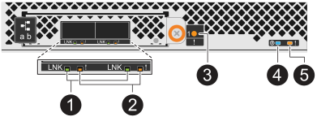

= LED dello shelf del disco del monitor - shelf NS224
:allow-uri-read: 
:icons: font
:imagesdir: ../media/

[role="lead"]
È possibile monitorare lo stato dello shelf di dischi comprendendo la posizione e le condizioni di stato dei LED sui componenti dello shelf di dischi.

* I LED di posizione (blu), sul pannello di visualizzazione dell'operatore (ODP) di uno scaffale e su entrambi gli NSM, possono essere attivati per facilitare l'individuazione fisica dello scaffale che necessita di manutenzione: `storage shelf location-led modify -shelf-name _shelf_name_ -led-status on`
+
Se non si conosce `_shelf_name_` dello shelf interessato, eseguire `storage shelf show` comando.

+
I LED di posizione rimangono accesi per 30 minuti. È possibile disattivarle immettendo lo stesso comando, ma utilizzando `off` opzione.

* Uno stato LED può essere:
+
** "On" (acceso): L'illuminazione LED è fissa/fissa
** "OFF" (spento): Il LED non si accende
** "Lampeggiante": Il LED si accende e si spegne a intervalli variabili a seconda dello stato della FRU
** "Qualsiasi stato": Il LED può essere acceso, spento o lampeggiante

== LED del pannello del display dell'operatore

I LED sul pannello ODP (Front Operator Display) del ripiano dei dischi indicano se il ripiano dei dischi funziona normalmente o se si verificano problemi con l'hardware.

L'illustrazione e la tabella seguenti descrivono i tre LED dell'ODP:

image::../media/drw_ns224_odp_leds_IEOPS-1262.svg[LED del pannello del display dell'operatore]

[cols="1,2,1,5"]
|===
| Icona LED | Nome e colore del LED | Stato | Descrizione 

 a| 
image::../media/drw_sas_power_icon.svg[LED di alimentazione del pannello del display dell'operatore]
 a| 
Alimentazione (verde)
 a| 
Acceso
 a| 
Uno o più alimentatori alimentano lo shelf di dischi.

 a| 
image::../media/drw_sas_fault_icon.svg[LED di attenzione del pannello del display dell'operatore]
 a| 
Attenzione (ambra)
 a| 
Acceso
 a| 
* Si è verificato un errore nella funzione di una o più FRU dello shelf.
+
Controllare i messaggi di evento per determinare l'azione correttiva da intraprendere.

* Se lampeggia anche l'ID dello shelf a due cifre, l'ID dello shelf è in stato di attesa.
+
Spegnere e riaccendere lo shelf del disco per modificare l'ID dello shelf.

 a| 
image::../media/drw_sas3_location_icon.svg[LED di posizione del pannello del display dell'operatore]
 a| 
Posizione (blu)
 a| 
Acceso
 a| 
L'amministratore di sistema ha attivato questa funzione LED.

|===

== LED NSM

I LED su un NSM indicano se il modulo funziona normalmente, se è pronto per il traffico i/o e se ci sono problemi con l'hardware.

L'illustrazione e le tabelle seguenti descrivono i LED NSM associati alla funzione di un modulo e alla funzione di ciascuna porta NVMe su un modulo.

[role="tabbed-block"]
====
.NSM100 moduli
--
image::../media/drw_ns224_nsm_leds_IEOPS-1270.svg[NS224 NSM100 LED del modulo]

[cols="1,1,2,4"]
|===
| Chiama | Icona LED | Colore | Descrizione 

 a| 
image:../media/icon_round_1.png["Numero di didascalia 1"]
 a| 
image::../media/drw_sas3_location_icon.svg[LED di posizione del pannello del display dell'operatore]
 a| 
Blu
 a| 
NSM: Posizione

 a| 
image:../media/icon_round_2.png["Numero di didascalia 2"]
 a| 
image::../media/drw_sas_fault_icon.svg[LED di attenzione del pannello del display dell'operatore]
 a| 
Ambra
 a| 
NSM: Attenzione

 a| 
image:../media/icon_round_3.png["Numero di didascalia 3"]
 a| 
LNK
 a| 
Verde
 a| 
NVMe port/link: Status (porta/collegamento NVMe)

 a| 
image:../media/icon_round_4.png["Numero di didascalia 4"]
 a| 
image::../media/drw_sas_fault_icon.svg[LED di attenzione del pannello del display dell'operatore]
 a| 
Ambra
 a| 
Porta/collegamento NVMe: Attenzione

|===
--
.NSM100B moduli
--

[cols="1,1,2,4"]
|===
| Chiama | Icona LED | Colore | Descrizione 

 a| 
image:../media/icon_round_1.png["Numero di didascalia 1"]
 a| 
LNK
 a| 
Verde
 a| 
NVMe port/link: Status (porta/collegamento NVMe)

 a| 
image:../media/icon_round_2.png["Numero di didascalia 2"]
 a| 
image::../media/drw_sas_fault_icon.svg[LED di attenzione del pannello del display dell'operatore]
 a| 
Ambra
 a| 
Porta/collegamento NVMe: Attenzione

 a| 
image:../media/icon_round_3.png["Numero di didascalia 3"]
 a| 
image::../media/drw_sas_fault_icon.svg[LED di attenzione del pannello del display dell'operatore]
 a| 
Ambra
 a| 
Modulo i/o: Stato

 a| 
image:../media/icon_round_4.png["Numero di didascalia 4"]
 a| 
image::../media/drw_sas3_location_icon.svg[LED di posizione del pannello del display dell'operatore]
 a| 
Blu
 a| 
NSM: Posizione

 a| 
image:../media/icon_round_5.png["Numero di didascalia 5"]
 a| 
image::../media/drw_sas_fault_icon.svg[LED di attenzione del pannello del display dell'operatore]
 a| 
Ambra
 a| 
NSM: Attenzione

|===
--
====
[cols="2,1,1,1"]
|===
| Stato | Attenzione NSM (ambra) | Porta LNK (verde) | Attenzione porta (ambra) 

 a| 
NSM normale
 a| 
Spento
 a| 
Qualsiasi stato
 a| 
Spento

 a| 
Guasto NSM
 a| 
Acceso
 a| 
Qualsiasi stato
 a| 
Qualsiasi stato

 a| 
Errore NSM VPD
 a| 
Acceso
 a| 
Qualsiasi stato
 a| 
Qualsiasi stato

 a| 
Nessuna connessione alla porta host
 a| 
Qualsiasi stato
 a| 
Spento
 a| 
Spento

 a| 
Collegamento alla porta host attivo
 a| 
Qualsiasi stato
 a| 
Acceso/lampeggiante con attività
 a| 
Qualsiasi stato

 a| 
Connessione porta host con guasto
 a| 
Acceso
 a| 
On/Off se tutte le corsie sono guainate
 a| 
Acceso

 a| 
Eseguire l'avvio del BIOS dall'immagine del BIOS dopo l'accensione
 a| 
Lampeggia
 a| 
Qualsiasi stato
 a| 
Qualsiasi stato

|===

== LED dell'alimentatore

I LED di un alimentatore CA o CC (PSU) indicano se l'alimentatore funziona normalmente o se si verificano problemi hardware.

L'illustrazione e le tabelle seguenti descrivono il LED di un alimentatore. (L'illustrazione mostra un alimentatore CA; tuttavia, la posizione dei LED è la stessa sull'alimentatore CC):

image::../media/drw_ns224_psu_leds_IEOPS-1261.svg[LED di attività dell'alimentatore]

[cols="1,4"]
|===
| Chiama | Descrizione 

 a| 
image:../media/icon_round_1.png["Numero di didascalia 1"]
 a| 
Il LED bicolore indica l'alimentazione/attività quando è verde e un guasto quando è rosso.

|===
[cols="2,1,1"]
|===
| Stato | Alimentazione/attività (verde) | Attenzione (rosso) 

 a| 
Assenza di alimentazione CA/CC nell'enclosure
 a| 
Spento
 a| 
Spento

 a| 
Nessuna alimentazione CA/CC all'alimentatore
 a| 
Spento
 a| 
Acceso

 a| 
Alimentazione CA/CC attiva, ma PSU non presente nell'enclosure
 a| 
Lampeggia
 a| 
Spento

 a| 
PSU funzionante correttamente
 a| 
Acceso
 a| 
Spento

 a| 
Guasto PSU
 a| 
Spento
 a| 
Acceso

 a| 
Guasto alla ventola
 a| 
Spento
 a| 
Acceso

 a| 
Modalità di aggiornamento del firmware
 a| 
Lampeggia
 a| 
Spento

|===

== LED delle unità

I LED di un'unità NVMe indicano se funziona normalmente o se si verificano problemi con l'hardware.

L'illustrazione e le tabelle seguenti descrivono i due LED di un'unità NVMe:

[cols="1,2,2"]
|===
| Chiama | Nome del LED | Colore 

 a| 
image:../media/icon_round_1.png["Numero di didascalia 1"]
 a| 
Attenzione
 a| 
Ambra

 a| 
image:../media/icon_round_2.png["Numero di didascalia 2"]
 a| 
Alimentazione/attività
 a| 
Verde

|===
[cols="2,1,1,1"]
|===
| Stato | Alimentazione/attività (verde) | Attenzione (ambra) | LED ODP associato 

 a| 
Disco installato e operativo
 a| 
Acceso/lampeggiante con attività
 a| 
Qualsiasi stato
 a| 
N/A.

 a| 
Guasto al disco
 a| 
Acceso/lampeggiante con attività
 a| 
Acceso
 a| 
Attenzione (ambra)

 a| 
Set di identificazione del dispositivo SES
 a| 
Acceso/lampeggiante con attività
 a| 
Lampeggia
 a| 
Attenzione (ambra) disattivata

 a| 
Set di bit di errore del dispositivo SES
 a| 
Acceso/lampeggiante con attività
 a| 
Acceso
 a| 
Attenzione (ambra)

 a| 
Guasto al circuito di controllo dell'alimentazione
 a| 
Spento
 a| 
Qualsiasi stato
 a| 
Attenzione (ambra)

|===