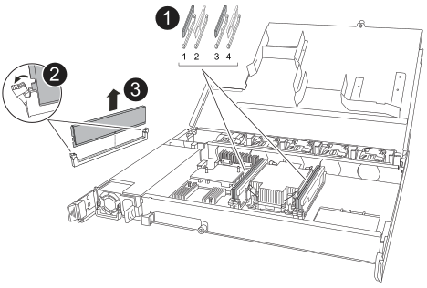

= Sostituire un NSM - NS224 ripiani
:allow-uri-read: 
:icons: font
:imagesdir: ../media/

[role="lead"]
È possibile sostituire un modulo shelf NVMe (NSM) non compromesso senza interruzioni in uno shelf di dischi NS224 acceso e mentre l'i/o è in corso.

.Prima di iniziare
* Il NSM partner dello shelf deve essere attivo e funzionante e deve essere collegato correttamente in modo che lo shelf mantenga la connettività quando si rimuove il NSM guasto.
+
https://mysupport.netapp.com/site/tools/tool-eula/activeiq-configadvisor["Download NetApp: Config Advisor"^]

* Tutti gli altri componenti del sistema devono funzionare correttamente.

.A proposito di questa attività
* La sostituzione dell'NSM implica lo spostamento di quanto segue:
+
** *NSM100 moduli*: DIMM, ventole e alimentatore dall'NSM danneggiato all'NSM sostitutivo.
** *NSM100B moduli*: DIMM, ventole, supporti di avvio, modulo i/o e alimentatore dall'NSM danneggiato all'NSM sostitutivo.
+
Non spostare la batteria dell'orologio in tempo reale (RTC). Sono preinstallati nel NSM sostitutivo.

* Attendere almeno 70 secondi tra la rimozione e l'installazione del modulo NVMe shelf (NSM).
+
Ciò consente a ONTAP di elaborare l'evento di rimozione NSM.

* *Best practice:* la Best practice consiste nel disporre delle versioni correnti del firmware NVMe shelf module (NSM) e del firmware del disco sul sistema prima di sostituire i componenti FRU.
+
https://mysupport.netapp.com/site/downloads/firmware/disk-shelf-firmware["Download NetApp: Firmware shelf di dischi"^]

+
https://mysupport.netapp.com/site/downloads/firmware/disk-drive-firmware["Download NetApp: Firmware del disco"^]

+
[NOTE]
====
Non riportare il firmware a una versione che non supporta lo shelf e i relativi componenti.

====
* Il firmware dello shelf (NSM) viene aggiornato automaticamente (senza interruzioni) su un nuovo NSM con una versione del firmware non corrente.
+
I controlli del firmware NSM vengono eseguiti ogni 10 minuti. L'aggiornamento del firmware NSM può richiedere fino a 30 minuti.

* Se necessario, è possibile attivare i LED di posizione (blu) dello shelf per individuare fisicamente lo shelf interessato: `storage shelf location-led modify -shelf-name _shelf_name_ -led-status on`
+
Se non si conosce `shelf_name` dello shelf interessato, eseguire `storage shelf show` comando.

+
Uno scaffale ha tre LED di posizione: Uno sul pannello del display dell'operatore e uno su ciascun NSM. I LED di posizione rimangono accesi per 30 minuti. È possibile disattivarle immettendo lo stesso comando, ma utilizzando l' `off`opzione .

* Quando si disimballano i moduli NSM sostitutivi, conservare tutti i materiali di imballaggio per utilizzarli quando si restituisce il modulo NSM guasto.
+
Per ottenere il numero RMA o ulteriore assistenza per la procedura di sostituzione, contattare il supporto tecnico all'indirizzo https://mysupport.netapp.com/site/global/dashboard["Supporto NetApp"^], 888-463-8277 (Nord America), 00-800-44-638277 (Europa) o +800-800-80-800 (Asia/Pacifico).

[role="tabbed-block"]
====
.NSM100 moduli
--
Per sostituire un NSM, è possibile utilizzare l'animazione seguente o i passaggi scritti.

.Sostituire un NSM in uno shelf NS224
video::f57693b3-b164-4014-a827-aa86002f4b34[panopto]
.Fasi
. Mettere a terra l'utente.
. Identificare fisicamente il NSM con disabilità.
+
Il sistema registra un messaggio di avviso alla console di sistema che indica quale modulo è guasto. Inoltre, il LED attenzione (ambra) sul display operatore dello shelf di dischi e il modulo per problemi si illuminano.

. Scollegare il cablaggio dall'NSM danneggiato:
+
.. Scollegare il cavo di alimentazione dall'alimentatore aprendo il fermo del cavo di alimentazione, se si tratta di un alimentatore CA, oppure svitando le due viti pollici, se si tratta di un alimentatore CC, quindi scollegare il cavo di alimentazione dall'alimentatore.
+
Gli alimentatori non dispongono di un interruttore di alimentazione.

.. Scollegare il cablaggio di archiviazione dalle porte NSM.
+
Prendere nota delle porte NSM a cui è collegato ciascun cavo. I cavi vengono ricollegati alle stesse porte sul NSM sostitutivo, più avanti in questa procedura.

. Rimuovere l'NSM dallo scaffale:
+
.. Far passare le dita attraverso i fori delle dita dei meccanismi di chiusura su entrambi i lati dell'NSM.
+

NOTE: Se si sta rimuovendo il NSM inferiore e se la guida inferiore ostruisce l'accesso ai meccanismi di chiusura, posizionare le dita di indice attraverso i fori delle dita dall'interno (incrociando le braccia).

.. Con i pollici, tenere premuti le linguette arancioni sulla parte superiore dei meccanismi di blocco.
+
I meccanismi di chiusura si sollevano, liberando i perni di chiusura sullo scaffale.

.. Tirare delicatamente fino a quando l'NSM non si trova a circa un terzo del percorso fuori dal ripiano, afferrare i lati dell'NSM con entrambe le mani per sostenere il suo peso, quindi collocarlo su una superficie piana e stabile.
+
Quando si inizia a tirare, i bracci del meccanismo di chiusura si estendono dall'NSM e si bloccano nella loro posizione completamente estesa.

. Disimballare l'NSM sostitutivo e posizionarlo su una superficie piana vicino al NSM danneggiato.
. Aprire il coperchio dell'NSM danneggiato e l'NSM sostitutivo allentando la vite a testa zigrinata su ciascun coperchio.
+

NOTE: L'etichetta FRU sul coperchio NSM indica la posizione dei moduli DIMM e delle ventole.

. Spostare i moduli DIMM dall'NSM danneggiato all'NSM sostitutivo:
+
.. Prendere nota dell'orientamento dei moduli DIMM negli slot in modo da poter inserire i moduli DIMM nell'NSM sostitutivo utilizzando lo stesso orientamento.
.. Estrarre un modulo DIMM dal relativo slot spingendo lentamente le linguette di espulsione su entrambe le estremità dello slot, quindi estrarre il modulo DIMM dallo slot.
+

NOTE: Tenere il modulo DIMM per gli angoli o i bordi per evitare di esercitare pressione sui componenti della scheda a circuiti stampati del modulo DIMM. Le linguette dell'espulsore rimangono in posizione aperta.

.. Tenere il modulo DIMM dagli angoli, quindi inserire il modulo DIMM perpendicolarmente in uno slot dell'NSM sostitutivo.
+
La tacca sulla parte inferiore del DIMM, tra i pin, deve allinearsi con la linguetta nello slot.

+
Una volta inserito correttamente, il DIMM dovrebbe essere inserito facilmente ma saldamente nello slot. In caso contrario, reinserire il DIMM.

.. Spingere con cautela, ma con decisione, il bordo superiore del modulo DIMM fino a quando le linguette di espulsione non scattano in posizione sulle tacche di entrambe le estremità del modulo DIMM.
.. Ripetere i passaggi da 7a a 7d per i DIMM rimanenti.

. Spostare le ventole dall'NSM danneggiato all'NSM sostitutivo:
+
.. Afferrare saldamente una ventola dai lati, dove si trovano i punti di contatto blu, quindi sollevarla verticalmente per scollegarla dalla presa.
+
Potrebbe essere necessario far oscillare delicatamente la ventola avanti e indietro per scollegarla prima di sollevarla.

.. Allineare la ventola alle guide nell'NSM sostitutivo, quindi spingere verso il basso finché il connettore del modulo della ventola non è completamente inserito nello zoccolo.
.. Ripetere i passaggi secondari 8a e 8b per le ventole rimanenti.

. Chiudere il coperchio di ciascun NSM, quindi serrare ciascuna vite a testa zigrinata.
. Spostare l'alimentatore dal NSM danneggiato al NSM sostitutivo:
+
.. Ruotare la maniglia verso l'alto, in posizione orizzontale, quindi afferrarla.
.. Con il pollice, premere la linguetta blu per rilasciare il meccanismo di bloccaggio.
.. Estrarre l'alimentatore dall'NSM mentre si utilizza l'altra mano per sostenere il suo peso.
.. Con entrambe le mani, sostenere e allineare i bordi dell'alimentatore con l'apertura nell'NSM sostitutivo.
.. Spingere delicatamente l'alimentatore nell'NSM finché il meccanismo di bloccaggio non scatta in posizione.
+

NOTE: Non esercitare una forza eccessiva per evitare di danneggiare il connettore interno.

.. Ruotare la maniglia verso il basso, in modo che non sia di intralcio alle normali operazioni.

. Inserire l'NSM sostitutivo nello scaffale:
+
.. Assicurarsi che i bracci del meccanismo di chiusura siano bloccati in posizione completamente estesa.
.. Con entrambe le mani, far scorrere delicatamente l'NSM nel ripiano fino a quando il peso dell'NSM non è completamente sostenuto dal ripiano.
.. Spingere l'NSM nel ripiano finché non si ferma (circa mezzo pollice dal retro del ripiano).
+
È possibile posizionare i pollici sulle linguette arancioni sulla parte anteriore di ciascun anello per le dita (dei bracci del meccanismo di chiusura) per spingere l'NSM.

.. Far passare le dita attraverso i fori delle dita dei meccanismi di chiusura su entrambi i lati dell'NSM.
+

NOTE: Se si inserisce il NSM inferiore e se la guida inferiore ostruisce l'accesso ai meccanismi di chiusura, posizionare le dita di indice attraverso i fori delle dita dall'interno (incrociando le braccia).

.. Con i pollici, tenere premuti le linguette arancioni sulla parte superiore dei meccanismi di blocco.
.. Spingere delicatamente in avanti i fermi fino al punto di arresto.
.. Rilasciare i pollici dalla parte superiore dei meccanismi di blocco, quindi continuare a spingere fino a quando i meccanismi di blocco non scattano in posizione.
+
L'NSM deve essere inserito completamente nel ripiano e a filo con i bordi del ripiano.

. Ricollegare il cablaggio all'NSM:
+
.. Ricollegare il cablaggio dello storage alle stesse due porte NSM.
+
I cavi devono essere inseriti con la linguetta di estrazione del connettore rivolta verso l'alto. Quando un cavo è inserito correttamente, scatta in posizione.

.. Ricollegare il cavo di alimentazione all'alimentatore, quindi fissare il cavo di alimentazione con il relativo fermo, se si tratta di un alimentatore CA, oppure serrare le due viti ad alette, se si tratta di un alimentatore CC.
+
Quando funziona correttamente, il LED bicolore di un alimentatore si illumina di verde.

+
Inoltre, entrambi i LED LNK (verde) della porta NSM si accendono. Se il LED LNK non si accende, ricollegare il cavo.

. Verificare che il LED attenzione (ambra) sul display operatore dello scaffale non sia più acceso.
+
Il LED di attenzione del pannello del display dell'operatore si spegne dopo il riavvio dell'NSM. Questa operazione può richiedere da tre a cinque minuti.

. Verificare che l'NSM sia collegato correttamente, eseguendo Active IQ Config Advisor.
+
Se vengono generati errori di cablaggio, seguire le azioni correttive fornite.

+
https://mysupport.netapp.com/site/tools/tool-eula/activeiq-configadvisor["Download NetApp: Config Advisor"^]

. Assicurarsi che entrambi gli NSM presenti nello shelf eseguano la stessa versione del firmware: Versione 0200 o successiva.

--
.NSM100B moduli
--
.Fasi
. Mettere a terra l'utente.
. Identificare fisicamente il NSM con disabilità.
+
Il sistema registra un messaggio di avviso alla console di sistema che indica quale modulo è guasto. Inoltre, il LED attenzione (ambra) sul display operatore dello shelf di dischi e il modulo per problemi si illuminano.

. Scollegare il cablaggio dall'NSM danneggiato:
+
.. Scollegare il cavo di alimentazione dall'alimentatore aprendo il fermo del cavo di alimentazione, se si tratta di un alimentatore CA, oppure svitando le due viti pollici, se si tratta di un alimentatore CC, quindi scollegare il cavo di alimentazione dall'alimentatore.
+
Gli alimentatori non dispongono di un interruttore di alimentazione.

.. Scollegare il cablaggio di archiviazione dalle porte NSM.
+
Prendere nota delle porte NSM a cui è collegato ciascun cavo. I cavi vengono ricollegati alle stesse porte sul NSM sostitutivo, più avanti in questa procedura.

. Rimuovere l'NSM:
+
image::../media/drw_g_and_t_handles_remove_ieops-1837.svg[Rimuovere l'NSM.]

+
[cols="1,4"]
|===

 a| 
image::../media/icon_round_1.png[Numero di didascalia 1]
 a| 
Su entrambe le estremità dell'NSM, spingere le linguette di bloccaggio verticali verso l'esterno per rilasciare le maniglie.

 a| 
image::../media/icon_round_2.png[Numero di didascalia 2]
 a| 
** Tirare le maniglie verso di sé per sganciare l'NSM dalla midplane.
+
Mentre tirate, le maniglie si estendono fuori dal ripiano. Quando si avverte una certa resistenza, continuare a tirare.

** Far scorrere l'NSM fuori dal ripiano e posizionarlo su una superficie piana e stabile.
+
Assicurarsi di sostenere la parte inferiore dell'NSM mentre la si fa scorrere fuori dallo scaffale.

 a| 
image::../media/icon_round_3.png[Numero di didascalia 3]
 a| 
Ruotare le maniglie in posizione verticale (accanto alle linguette) per spostarle in modo che non siano di intralcio.

|===
. Disimballare l'NSM sostitutivo e posizionarlo su una superficie piana vicino al NSM danneggiato.
. Aprire i coperchi di entrambi gli NSM allentando la vite a testa zigrinata su ciascun coperchio.
. Spostare i moduli DIMM dal modulo NSM danneggiato al modulo NSM sostitutivo:
+
.. Rimuovere il DIMM dall'NSM danneggiato:
+

+
[cols="1,4"]
|===

 a| 
image::../media/icon_round_1.png[Numero di didascalia 1]
 a| 
Numerazione e posizioni degli slot DIMM.

L'NSM contiene DIMM negli slot 1 e 3 e DIMM negli slot 2 e 4.

 a| 
image::../media/icon_round_2.png[Numero di didascalia 2]
 a| 
*** Prendere nota dell'orientamento del modulo DIMM nello zoccolo in modo da poterlo inserire nel modulo DIMM sostitutivo utilizzando lo stesso orientamento.
*** Espellere il modulo DIMM difettoso spostando lentamente le due linguette dell'estrattore DIMM su entrambe le estremità dell'alloggiamento DIMM.

IMPORTANT: Tenere il modulo DIMM per gli angoli o i bordi per evitare di esercitare pressione sui componenti della scheda a circuiti stampati del modulo DIMM.

 a| 
image::../media/icon_round_3.png[Numero di didascalia 3]
 a| 
Sollevare il DIMM ed estrarlo dall'alloggiamento.

Le linguette dell'espulsore rimangono in posizione aperta.

|===
.. Installare il DIMM nell'NSM sostitutivo:
+
... Tenere il modulo DIMM per gli angoli, quindi inserirlo correttamente in uno slot.
+
La tacca sulla parte inferiore del DIMM, tra i pin, deve allinearsi con la linguetta nello slot.

+
Una volta inserito correttamente, il DIMM dovrebbe essere inserito facilmente ma saldamente nello slot. In caso contrario, reinserire il DIMM.

... Spingere con cautela, ma con decisione, il bordo superiore del modulo DIMM fino a quando le linguette di espulsione non scattano in posizione sulle tacche di entrambe le estremità del modulo DIMM.
... Ripetere l'operazione per l'altro DIMM.

. Spostare tutte le ventole dall'NSM non funzionante all'NSM sostitutivo:
+
image::../media/drw_t_fan_replace_ieops-1979.svg[Rimuovere la ventola guasta.]

+
[cols="1,4"]
|===

 a| 
image::../media/icon_round_1.png[Numero di didascalia 1]
 a| 
Rimuovere la ventola guasta afferrando saldamente i lati in cui si trovano i punti di contatto blu, quindi tirarla verso l'alto per estrarla dal relativo alloggiamento.

 a| 
image::../media/icon_round_1.png[Numero di didascalia 2]
 a| 
Inserire la ventola di ricambio allineandola all'interno delle guide, quindi spingere verso il basso finché il connettore della ventola non è completamente inserito nello zoccolo.

|===
. Spostare il supporto di avvio nel NSM sostitutivo:
+
.. Rimuovere il supporto di avvio dal NSM danneggiato:
+
image::../media/drw_t_boot_media_replace_ieops-1977.svg[Rimuovere il supporto di avvio.]

+
[cols="1,4"]
|===

 a| 
image::../media/icon_round_1.png[Numero di didascalia 1]
 a| 
Posizione dei supporti di avvio

 a| 
image::../media/icon_round_2.png[Numero di didascalia 2]
 a| 
Premere la linguetta blu per rilasciare l'estremità destra del supporto di avvio.

 a| 
image::../media/icon_round_3.png[Numero di didascalia 3]
 a| 
Sollevare leggermente l'estremità destra del supporto di avvio per ottenere una buona presa lungo i lati del supporto di avvio.

 a| 
image::../media/icon_round_4.png[Numero di didascalia 4]
 a| 
Estrarre delicatamente l'estremità sinistra del supporto di avvio dal relativo alloggiamento.

|===
.. Installare il supporto di avvio nell'NSM sostitutivo:
+
... Allineare i bordi del supporto di avvio con l'alloggiamento dello zoccolo nell'NSM sostitutivo, quindi spingerlo delicatamente perpendicolarmente nello zoccolo.
... Ruotare il supporto di avvio verso il basso verso il pulsante di bloccaggio.
... Premere il pulsante di blocco, ruotare completamente il supporto di avvio, quindi rilasciare il pulsante di blocco.

. Spostare il modulo i/o dal NSM danneggiato al NSM sostitutivo.
+
.. Rimuovere il modulo i/o dall'NSM danneggiato:
+
image::../media/drw_t_io_module_replace_ieops-1980.svg[Sostituire il modulo i/O.]

+
[cols="1,4"]
|===

 a| 
image::../media/icon_round_1.png[Numero di didascalia 1]
 a| 
Ruotare la vite a testa zigrinata del modulo i/o in senso antiorario per allentarla.

 a| 
image::../media/icon_round_2.png[Numero di didascalia 2]
 a| 
Estrarre il modulo i/o dall'NSM utilizzando la linguetta dell'etichetta della porta a sinistra e la vite a testa zigrinata.

|===
.. Installare il modulo i/o nell'NSM sostitutivo:
+
... Allineare il modulo i/o con i bordi dello slot nell'NSM sostitutivo.
... Spingere delicatamente il modulo i/o fino in fondo nello slot, assicurandosi di inserirlo correttamente nel connettore.
+
È possibile utilizzare la linguetta a sinistra e la vite a testa zigrinata per inserire il modulo i/O.

. Chiudere il coperchio di ciascun NSM, quindi serrare ciascuna vite a testa zigrinata.
. Spostare l'alimentatore dal NSM danneggiato al NSM sostitutivo:
+
.. Ruotare la maniglia verso l'alto, in posizione orizzontale, quindi afferrarla.
.. Con il pollice, premere la linguetta blu (alimentatore CA) o la linguetta della terracotta (alimentatore CC) per rilasciare il meccanismo di bloccaggio.
.. Estrarre l'alimentatore dall'NSM mentre si utilizza l'altra mano per sostenere il suo peso.
.. Con entrambe le mani, sostenere e allineare i bordi dell'alimentatore con l'apertura nell'NSM sostitutivo.
.. Spingere delicatamente l'alimentatore nell'NSM finché il meccanismo di bloccaggio non scatta in posizione.
+

NOTE: Non esercitare una forza eccessiva per evitare di danneggiare il connettore interno.

.. Ruotare la maniglia verso il basso, in modo che non sia di intralcio alle normali operazioni.

. Inserire l'NSM nello scaffale:
+
image::../media/drw_g_and_t_handles_reinstall_ieops-1838.svg[Sostituire l'NSM.]

+
[cols="1,4"]
|===

 a| 
image::../media/icon_round_1.png[Numero di didascalia 1]
 a| 
Se le maniglie NSM sono state ruotate in posizione verticale (accanto alle linguette) per spostarle in modo che non siano di intralcio durante la manutenzione dell'NSM, ruotarle in posizione orizzontale.

 a| 
image::../media/icon_round_2.png[Numero di didascalia 2]
 a| 
Allineare la parte posteriore dell'NSM con l'apertura nel ripiano, quindi spingere delicatamente l'NSM utilizzando le maniglie fino a insediarlo completamente.

 a| 
image::../media/icon_round_3.png[Numero di didascalia 3]
 a| 
Ruotare le maniglie in posizione verticale e bloccarle in posizione con le linguette.

|===
. Ricollegare il cablaggio all'NSM:
+
.. Ricollegare il cablaggio dello storage alle stesse due porte NSM.
+
I cavi devono essere inseriti con la linguetta di estrazione del connettore rivolta verso l'alto. Quando un cavo è inserito correttamente, scatta in posizione.

.. Ricollegare il cavo di alimentazione all'alimentatore, quindi fissare il cavo di alimentazione con il relativo fermo, se si tratta di un alimentatore CA, oppure serrare le due viti ad alette, se si tratta di un alimentatore CC.
+
Quando funziona correttamente, il LED bicolore di un alimentatore si illumina di verde.

+
Inoltre, entrambi i LED LNK (verde) della porta NSM si accendono. Se il LED LNK non si accende, ricollegare il cavo.

. Verificare che il LED attenzione (ambra) sul display operatore dello scaffale non sia più acceso.
+
Il LED di attenzione del pannello del display dell'operatore si spegne dopo il riavvio dell'NSM. Questa operazione può richiedere da tre a cinque minuti.

. Verificare che l'NSM sia collegato correttamente, eseguendo Active IQ Config Advisor.
+
Se vengono generati errori di cablaggio, seguire le azioni correttive fornite.

+
https://mysupport.netapp.com/site/tools/tool-eula/activeiq-configadvisor["Download NetApp: Config Advisor"^]

. Assicurarsi che entrambi gli NSM presenti nello shelf eseguano la stessa versione del firmware: Versione 0300 o successiva.

--
====