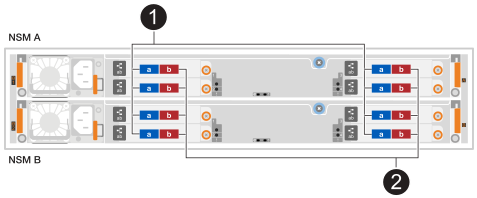
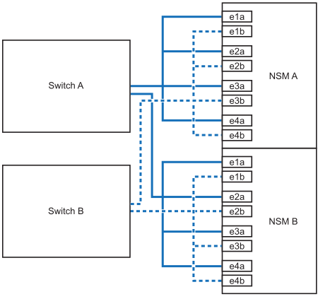

= Aggiungi uno scaffale a caldo - Scaffali NX224
:allow-uri-read: 
:icons: font
:imagesdir: ../media/

[role="lead"]
È possibile espandere le capacità di archiviazione aggiungendo a caldo uno scaffale NX224 alla configurazione del cluster AFX esistente.

.A proposito di questa attività
* Dopo aver cablato uno scaffale aggiunto a caldo, ONTAP riconosce lo scaffale.  Se necessario, il firmware dello scaffale NSM e il firmware dell'unità dovrebbero essere aggiornati automaticamente.
+

NOTE: Gli aggiornamenti del firmware possono richiedere fino a 30 minuti.

.Prima di iniziare
* Prima di aggiungere un ripiano a caldo, assicurati di avere:
+
** Una graffetta con un lato raddrizzato o una penna a sfera con la punta stretta.
+
Per modificare l'ID dello scaffale, utilizzare la graffetta o la penna a sfera per accedere al pulsante ID dello scaffale dietro il pannello ODP (Operator Display Panel) per il passo di modifica dell'ID dello scaffale.

** Il numero e il tipo corretti di cavi per collegare lo scaffale. Vedere https://hwu.netapp.com["NetApp Hardware Universe"^] .

* Tieni presente che uno scaffale NX224 completamente carico può pesare in media 56,8 libbre (25,8 kg) e che per sollevarlo sono necessarie due persone o l'uso di un sollevatore idraulico.  Evitare di rimuovere i componenti dello scaffale (dalla parte anteriore o posteriore dello scaffale) per ridurre il peso dello scaffale, poiché il peso dello scaffale risulterebbe sbilanciato.
* Uno scaffale NX224 contiene due moduli NSM140.  Il modulo superiore va nello slot A (NSM A) e il modulo inferiore va nello slot B (NSM B).
* Il modello della piattaforma e la versione di ONTAP devono supportare lo scaffale NX224 e le unità che si stanno aggiungendo a caldo.  Vedere https://hwu.netapp.com["NetApp Hardware Universe"^]
* Il tuo cluster AFX deve avere un numero di ripiani inferiore al massimo supportato, almeno pari al numero di ripiani che intendi aggiungere a caldo.
+
Non è possibile aver superato il numero massimo di ripiani supportati dal cluster AFX dopo aver aggiunto ripiani a caldo. Vedere https://hwu.netapp.com["NetApp Hardware Universe"^] .

* *Migliore pratica:* assicurati di avere la versione corrente del https://mysupport.netapp.com/site/downloads/firmware/disk-drive-firmware/download/DISKQUAL/ALL/qual_devices.zip["Pacchetto di Disk Qualification"^] installato prima di aggiungere a caldo un ripiano.
+
L'installazione della versione corrente di DQP consente al sistema di riconoscere e utilizzare dischi appena qualificati. In questo modo si evitano messaggi di eventi di sistema relativi alla presenza di informazioni non aggiornate sui dischi e alla prevenzione della partizione dei dischi perché i dischi non vengono riconosciuti. Inoltre, il DQP notifica la presenza di firmware del disco non aggiornato.

* *Migliore pratica*: Esegui https://mysupport.netapp.com/site/tools/tool-eula/activeiq-configadvisor["Active IQ Config Advisor"^] prima e dopo l'aggiunta a caldo di uno scaffale per visualizzare eventuali messaggi di errore relativi al cablaggio di archiviazione e le azioni correttive da intraprendere.
+
L'esecuzione di Active IQ Config Advisor prima di aggiungere a caldo uno shelf fornisce un'istantanea della connettività Ethernet (ENET) dello shelf esistente, verifica le versioni del firmware del modulo NVMe shelf (NSM) e consente di verificare un ID shelf già in uso nel cluster AFX.

+
L'esecuzione di Active IQ Config Advisor dopo l'aggiunta a caldo di uno scaffale consente di verificare che gli scaffali siano cablati correttamente e che gli ID degli scaffali siano univoci all'interno del cluster AFX.

* *Migliore pratica:* assicurati di avere le versioni aggiornate di https://mysupport.netapp.com/site/downloads/firmware/disk-shelf-firmware["Firmware NVMe Shelf Module (NSM)"^] E https://mysupport.netapp.com/site/downloads/firmware/disk-drive-firmware["firmware del disco"^] sul tuo sistema di archiviazione prima di aggiungere un nuovo ripiano.
+

NOTE: Non riportare il firmware a una versione che non supporta lo shelf e i relativi componenti.

== Fase 1: Installare uno scaffale per un hot-add

È necessario installare uno scaffale NX224 in un armadio o in un rack per telecomunicazioni, collegare i cavi di alimentazione (che accendono automaticamente lo scaffale) e impostare l'ID dello scaffale.

.Fasi
. Installare il kit guide per il ripiano, secondo necessità, seguendo le istruzioni fornite con il kit.
+

NOTE: Utilizzare sempre il kit guide appropriato per il proprio ripiano per installarlo in un rack o in un armadietto.

. Installare il ripiano:
+
.. Posizionare la parte posteriore del ripiano sulle guide, quindi sostenere il ripiano dal basso e farlo scorrere nell'armadietto o nel rack per telecomunicazioni.
+
Si consiglia di installare tutti i ripiani vicini agli switch nello stesso rack.

.. Fissare il ripiano all'armadietto o al rack per telecomunicazioni utilizzando le viti di montaggio incluse nel kit.

. Collegare l'alimentazione:
+
.. Collegare i cavi di alimentazione allo scaffale e fissarli in posizione con gli appositi fermacavi.
.. Collegare i cavi di alimentazione a diverse fonti di alimentazione per una maggiore resilienza.
+
Uno shelf si accende quando viene collegato a una fonte di alimentazione; non dispone di interruttori di alimentazione. Quando funziona correttamente, il LED bicolore di un alimentatore si illumina di verde.

. Imposta l'ID dello scaffale su un numero univoco all'interno del cluster AFX:
+
Per istruzioni più dettagliate, vederelink:change-shelf-id.html["Modificare un ID scaffale - Scaffali NX224"^] .

+
image::../media/drw_tp_change_shelf_id_ieops-2381.svg[Cambia ID scaffale NX224]

+
[cols="20%,80%"]
|===

 a| 
image::../media/icon_round_1.png[Numero di didascalia 1]
 a| 
Tappo terminale dello scaffale

 a| 
image::../media/icon_round_2.png[[Numero di didascalia 2]
 a| 
Mascherina dello scaffale

 a| 
image::../media/icon_round_3.png[[Numero di didascalia 3]
 a| 
Numero ID ripiano

 a| 
image::../media/icon_round_4.png[[Numero di didascalia 4]
 a| 
Accesso tramite pulsante ID scaffale

|===
+
.. Rimuovere il cappuccio terminale sinistro e individuare il piccolo foro a destra dei LED.
.. Inserire l'estremità di una graffetta o di uno strumento simile nel piccolo foro per raggiungere il pulsante ID dello scaffale.
.. Tenere premuto il pulsante (fino a 15 secondi) fino a quando il primo numero sul display digitale non lampeggia, quindi rilasciare il pulsante.
+
Se l'ID impiega più di 15 secondi per lampeggiare, tenere premuto di nuovo il pulsante, assicurandosi di premerlo completamente.

.. Premere e rilasciare il pulsante per avanzare il numero fino a raggiungere il numero desiderato da 0 a 9.
.. Ripetere i passaggi secondari 4c e 4d per impostare il secondo numero dell'ID dello shelf.
+
Il lampeggiamento del numero può richiedere fino a tre secondi (invece di 15 secondi).

.. Tenere premuto il pulsante fino a quando il secondo numero non smette di lampeggiare.
+
Dopo circa cinque secondi, entrambi i numeri iniziano a lampeggiare e il LED ambra sull'ODP si illumina.

.. Spegnere e riaccendere lo shelf per rendere effettivo l'ID dello shelf.
+
Scollegare entrambi i cavi di alimentazione dallo shelf, attendere 10 secondi, quindi ricollegarli.

+
Quando l'alimentazione viene ripristinata, i LED bicolore si illuminano di verde.

== Fase 2: Ripiano per cavi per hot-add

Cablare ogni ripiano NX224 che si sta aggiungendo a caldo in modo che ogni ripiano abbia otto connessioni a ciascun switch.

.Prima di iniziare
* Acquisire familiarità con il corretto orientamento dei connettori dei cavi, nonché con la posizione e l'etichettatura delle porte sui moduli a scaffale NX224 NSM140.
+
** I cavi devono essere inseriti con la linguetta di estrazione del connettore rivolta verso l'alto.
+
Quando un cavo è inserito correttamente, scatta in posizione.

+
Dopo aver collegato entrambe le estremità del cavo, i LED LNK (verde) dello shelf e della porta del controller si illuminano. Se il LED LNK della porta non si accende, ricollegare il cavo.

+
image::../media/oie_cable_pull_tab_up.png[I cavi vengono inseriti con la linguetta di estrazione del connettore rivolta verso l'alto]

** Ogni modulo NSM140 include 4 porte CX7 Path_A da 100GbE (e1a, e2a, e3a ed e4a) e 4 porte CX7 Path_B da 100GbE (e1b, e2b, e3b ed e4b).
+

NOTE: Sono necessari cavi breakout separati per le porte Path_A e Path_B su ciascun modulo NSM140, per un totale di quattro cavi breakout per ripiano.

+
L'illustrazione seguente evidenzia le porte Path_A e Path_B sui moduli NSM140:

+

+
[cols="1,4"]
|===

 a| 
image::../media/icon_round_1.png[Numero di didascalia 1]
 a| 
Porte Path_A (porte blu)

 a| 
image::../media/icon_round_2.png[Numero di didascalia 2]
 a| 
Porte Path_B (porte rosse)

|===

.Fasi
. Ripiano cavi NSM A e NSM B Percorso_A porte e1a, e2a, e3a ed e4a verso qualsiasi porta sullo switch A.
. Ripiano cavi NSM A e NSM B Percorso_B porte e1b, e2b, e3b ed e4b verso qualsiasi porta sullo switch B.
+
L'illustrazione seguente evidenzia il cablaggio per l'aggiunta a caldo di un ripiano supplementare a una configurazione di switch.  Per aggiungere ulteriori ripiani, seguire la stessa metodologia di cablaggio basata sullo switch.

+

. Verificare che il ripiano aggiunto a caldo sia collegato correttamente utilizzando https://mysupport.netapp.com/site/tools/tool-eula/activeiq-configadvisor["Active IQ Config Advisor"^].
+
Se vengono generati errori di cablaggio, seguire le azioni correttive fornite.

