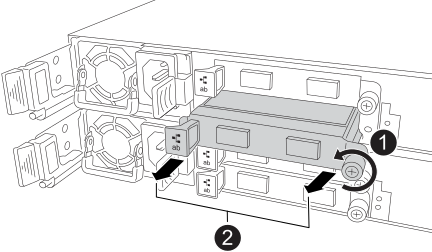

= Sostituire un NSM - ripiani NX224
:allow-uri-read: 
:icons: font
:imagesdir: ../media/

[role="lead"]
È possibile sostituire un modulo NVMe shelf (NSM) danneggiato senza interruzioni in uno shelf di unità NX224 acceso e mentre è in corso un'operazione di I/O.

.A proposito di questa attività
* La sostituzione dell'NSM comporta lo spostamento dei moduli DIMM, delle ventole, del supporto di avvio, del modulo I/O e dell'alimentatore dall'NSM danneggiato all'NSM sostitutivo.
+
Non spostare la batteria dell'orologio in tempo reale (RTC).  Viene preinstallato nel NSM sostitutivo.

* Attendere almeno 70 secondi tra la rimozione e l'installazione dell'NSM.
+
Ciò consente a ONTAP di elaborare l'evento di rimozione NSM.

* *Migliore pratica:* la migliore pratica è quella di avere le versioni aggiornate del firmware NSM e del firmware dell'unità sul sistema prima di sostituire i componenti FRU. È possibile visitare il sito di supporto NetApp per  https://mysupport.netapp.com/site/downloads/firmware/disk-shelf-firmware["scarica il firmware dello scaffale del disco"^] E  https://mysupport.netapp.com/site/downloads/firmware/disk-drive-firmware["scarica il firmware dell'unità disco"^] .
+
[NOTE]
====
Non riportare il firmware a una versione che non supporta lo shelf e i relativi componenti.

====
* Il firmware dello shelf (NSM) viene aggiornato automaticamente (senza interruzioni) su un nuovo NSM con una versione del firmware non corrente.
+
I controlli del firmware NSM vengono eseguiti ogni 10 minuti. L'aggiornamento del firmware NSM può richiedere fino a 30 minuti.

* Se necessario, è possibile attivare i LED di posizione (blu) dello shelf per individuare fisicamente lo shelf interessato: `storage shelf location-led modify -shelf-name _shelf_name_ -led-status on`
+
Se non si conosce `shelf_name` dello shelf interessato, eseguire `storage shelf show` comando.

+
Uno scaffale ha tre LED di posizione: Uno sul pannello del display dell'operatore e uno su ciascun NSM. I LED di posizione rimangono accesi per 30 minuti. È possibile disattivarle immettendo lo stesso comando, ma utilizzando l' `off`opzione .

* Quando si disimballano i moduli NSM sostitutivi, conservare tutti i materiali di imballaggio per utilizzarli quando si restituisce il modulo NSM guasto.
+
Per ottenere il numero RMA o ulteriore assistenza per la procedura di sostituzione, contattare il supporto tecnico all'indirizzo https://mysupport.netapp.com/site/global/dashboard["Supporto NetApp"^], 888-463-8277 (Nord America), 00-800-44-638277 (Europa) o +800-800-80-800 (Asia/Pacifico).

.Prima di iniziare
* Il NSM partner dello scaffale deve essere attivo e funzionante e cablato correttamente, in modo che lo scaffale mantenga la connettività quando si rimuove l'NSM guasto.  Puoi verificare lo stato del partner NSM tramite https://mysupport.netapp.com/site/tools/tool-eula/activeiq-configadvisor["scaricando ed eseguendo Config Advisor"^] .
* Tutti gli altri componenti del sistema devono funzionare correttamente.

.Fasi
. Mettere a terra l'utente.
. Identificare fisicamente il NSM con disabilità.
+
Il sistema registra un messaggio di avviso alla console di sistema che indica quale modulo è guasto. Inoltre, il LED attenzione (ambra) sul display operatore dello shelf di dischi e il modulo per problemi si illuminano.

. Scollegare il cablaggio dall'NSM danneggiato:
+
.. Scollegare il cavo di alimentazione dall'alimentatore aprendo il fermo del cavo di alimentazione e quindi scollegando il cavo di alimentazione dall'alimentatore.
+
Gli alimentatori non dispongono di un interruttore di alimentazione.

.. Scollegare il cablaggio di archiviazione dalle porte NSM.
+
Prendere nota delle porte NSM a cui è collegato ciascun cavo. I cavi vengono ricollegati alle stesse porte sul NSM sostitutivo, più avanti in questa procedura.

. Rimuovere l'NSM:
+
image::../media/drw_g_and_t_handles_remove_ieops-1837.svg[Rimuovere l'NSM.]

+
[cols="1,4"]
|===

 a| 
image::../media/icon_round_1.png[Numero di didascalia 1]
 a| 
Su entrambe le estremità dell'NSM, spingere le linguette di bloccaggio verticali verso l'esterno per rilasciare le maniglie.

 a| 
image::../media/icon_round_2.png[Numero di didascalia 2]
 a| 
** Tirare le maniglie verso di sé per sganciare l'NSM dalla midplane.
+
Mentre tirate, le maniglie si estendono fuori dal ripiano. Quando si avverte una certa resistenza, continuare a tirare.

** Far scorrere l'NSM fuori dal ripiano e posizionarlo su una superficie piana e stabile.
+
Assicurarsi di sostenere la parte inferiore dell'NSM mentre la si fa scorrere fuori dallo scaffale.

 a| 
image::../media/icon_round_3.png[Numero di didascalia 3]
 a| 
Ruotare le maniglie in posizione verticale (accanto alle linguette) per spostarle in modo che non siano di intralcio.

|===
. Disimballare l'NSM sostitutivo e posizionarlo su una superficie piana vicino al NSM danneggiato.
. Aprire i coperchi di entrambi gli NSM allentando la vite a testa zigrinata su ciascun coperchio.
. Spostare tutti e quattro i moduli DIMM dal modulo NSM danneggiato al modulo NSM sostitutivo:
+
.. Rimuovere ogni DIMM dal NSM danneggiato:
+
image::../media/drw_tp_dimm_replace_ieops-2202.svg[Rimuovere i DIMM.]

+
[cols="1,4"]
|===

 a| 
image::../media/icon_round_1.png[Numero di didascalia 1]
 a| 
Numerazione e posizioni degli slot DIMM.

 a| 
image::../media/icon_round_2.png[Numero di didascalia 2]
 a| 
*** Prendere nota dell'orientamento del modulo DIMM nello zoccolo in modo da poterlo inserire nel modulo DIMM sostitutivo utilizzando lo stesso orientamento.
*** Espellere il modulo DIMM difettoso spostando lentamente le due linguette dell'estrattore DIMM su entrambe le estremità dell'alloggiamento DIMM.

IMPORTANT: Tenere il modulo DIMM per gli angoli o i bordi per evitare di esercitare pressione sui componenti della scheda a circuiti stampati del modulo DIMM.

 a| 
image::../media/icon_round_3.png[Numero di didascalia 3]
 a| 
Sollevare il DIMM ed estrarlo dall'alloggiamento.

Le linguette dell'espulsore rimangono in posizione aperta.

|===
.. Installare ciascun DIMM nel modulo NSM sostitutivo:
+
... Tenere il modulo DIMM per gli angoli, quindi inserirlo correttamente in uno slot.
+
La tacca sulla parte inferiore del DIMM, tra i pin, deve allinearsi con la linguetta nello slot.

+
Una volta inserito correttamente, il DIMM dovrebbe essere inserito facilmente ma saldamente nello slot. In caso contrario, reinserire il DIMM.

... Spingere con cautela, ma con decisione, il bordo superiore del modulo DIMM fino a quando le linguette di espulsione non scattano in posizione sulle tacche di entrambe le estremità del modulo DIMM.

. Spostare tutte le ventole dall'NSM non funzionante all'NSM sostitutivo:
+
image::../media/drw_tp_fan_replace_ieops-2203.svg[Rimuovere la ventola guasta.]

+
[cols="1,4"]
|===

 a| 
image::../media/icon_round_1.png[Numero di didascalia 1]
 a| 
Rimuovere la ventola guasta afferrando saldamente i lati in cui si trovano i punti di contatto blu, quindi tirarla verso l'alto per estrarla dal relativo alloggiamento.

 a| 
image::../media/icon_round_1.png[Numero di didascalia 2]
 a| 
Inserire la ventola di ricambio allineandola all'interno delle guide, quindi spingere verso il basso finché il connettore della ventola non è completamente inserito nello zoccolo.

|===
. Spostare il supporto di avvio nel NSM sostitutivo:
+
.. Rimuovere il supporto di avvio dal NSM danneggiato:
+
image::../media/drw_tp_boot_media_replace_ieops-2201.svg[Rimuovere il supporto di avvio.]

+
[cols="1,4"]
|===

 a| 
image::../media/icon_round_1.png[Numero di didascalia 1]
 a| 
Posizione dei supporti di avvio

 a| 
image::../media/icon_round_2.png[Numero di didascalia 2]
 a| 
Premere la linguetta blu per rilasciare l'estremità destra del supporto di avvio.

 a| 
image::../media/icon_round_3.png[Numero di didascalia 3]
 a| 
Sollevare leggermente l'estremità destra del supporto di avvio per ottenere una buona presa lungo i lati del supporto di avvio.

 a| 
image::../media/icon_round_4.png[Numero di didascalia 4]
 a| 
Estrarre delicatamente l'estremità sinistra del supporto di avvio dal relativo alloggiamento.

|===
.. Installare il supporto di avvio nell'NSM sostitutivo:
+
... Allineare i bordi del supporto di avvio con l'alloggiamento dello zoccolo nell'NSM sostitutivo, quindi spingerlo delicatamente perpendicolarmente nello zoccolo.
... Ruotare il supporto di avvio verso il basso verso il pulsante di bloccaggio.
... Premere il pulsante di blocco, ruotare completamente il supporto di avvio, quindi rilasciare il pulsante di blocco.

. Spostare tutti e quattro i moduli I/O dall'NSM danneggiato all'NSM sostitutivo.
+
.. Rimuovere ciascun modulo I/O dall'NSM danneggiato:
+

+
[cols="1,4"]
|===

 a| 
image::../media/icon_round_1.png[Numero di didascalia 1]
 a| 
Ruotare la vite a testa zigrinata del modulo i/o in senso antiorario per allentarla.

 a| 
image::../media/icon_round_2.png[Numero di didascalia 2]
 a| 
Estrarre il modulo i/o dall'NSM utilizzando la linguetta dell'etichetta della porta a sinistra e la vite a testa zigrinata.

|===
.. Installare ciascun modulo I/O nell'NSM sostitutivo:
+
... Allineare il modulo i/o con i bordi dello slot nell'NSM sostitutivo.
... Spingere delicatamente il modulo i/o fino in fondo nello slot, assicurandosi di inserirlo correttamente nel connettore.
+
È possibile utilizzare la linguetta a sinistra e la vite a testa zigrinata per inserire il modulo i/O.

. Chiudere il coperchio di ciascun NSM, quindi serrare ciascuna vite a testa zigrinata.
. Spostare l'alimentatore dal NSM danneggiato al NSM sostitutivo:
+
.. Ruotare la maniglia dell'alimentatore verso l'alto, in posizione orizzontale, quindi afferrarla.
.. Con il pollice, premere la linguetta in terracotta sull'alimentatore per sbloccare il meccanismo di bloccaggio.
.. Estrarre l'alimentatore dall'NSM mentre si utilizza l'altra mano per sostenere il suo peso.
.. Con entrambe le mani, sostenere e allineare i bordi dell'alimentatore con l'apertura nell'NSM sostitutivo.
.. Spingere delicatamente l'alimentatore nell'NSM finché il meccanismo di bloccaggio non scatta in posizione.
+

NOTE: Non esercitare una forza eccessiva per evitare di danneggiare il connettore interno.

.. Ruotare la maniglia dell'alimentatore verso il basso, in modo che non intralci le normali operazioni.

. Inserire l'NSM nello scaffale:
+
image::../media/drw_g_and_t_handles_reinstall_ieops-1838.svg[Sostituire l'NSM.]

+
[cols="1,4"]
|===

 a| 
image::../media/icon_round_1.png[Numero di didascalia 1]
 a| 
Se le maniglie NSM sono state ruotate in posizione verticale (accanto alle linguette) per spostarle in modo che non siano di intralcio durante la manutenzione dell'NSM, ruotarle in posizione orizzontale.

 a| 
image::../media/icon_round_2.png[Numero di didascalia 2]
 a| 
Allineare la parte posteriore dell'NSM con l'apertura nel ripiano, quindi spingere delicatamente l'NSM utilizzando le maniglie fino a insediarlo completamente.

 a| 
image::../media/icon_round_3.png[Numero di didascalia 3]
 a| 
Ruotare le maniglie in posizione verticale e bloccarle in posizione con le linguette.

|===
. Ricollegare il cablaggio all'NSM:
+
.. Ricollegare il cablaggio di archiviazione alle stesse otto porte NSM.
+
I cavi devono essere inseriti con la linguetta di estrazione del connettore rivolta verso l'alto. Quando un cavo è inserito correttamente, scatta in posizione.

.. Ricollegare il cavo di alimentazione all'alimentatore, quindi fissarlo con l'apposito fermacavo.
+
Quando funziona correttamente, il LED bicolore di un alimentatore si illumina di verde.

+
Inoltre, entrambi i LED LNK (verde) della porta NSM si accendono. Se il LED LNK non si accende, ricollegare il cavo.

. Verificare che il LED attenzione (ambra) sul display operatore dello scaffale non sia più acceso.
+
Il LED di attenzione del pannello del display dell'operatore si spegne dopo il riavvio dell'NSM. Questa operazione può richiedere da tre a cinque minuti.

. Verificare che l'NSM sia cablato correttamente, https://mysupport.netapp.com/site/tools/tool-eula/activeiq-configadvisor["esecuzione di Active IQ Config Advisor"^] .
+
Se vengono generati errori di cablaggio, seguire le azioni correttive fornite.

. Assicurarsi che entrambi gli NSM presenti nello shelf eseguano la stessa versione del firmware: Versione 0300 o successiva.

