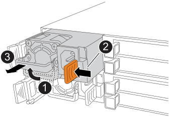

= Sostituzione a caldo di un alimentatore - ripiani NX224
:allow-uri-read: 
:icons: font
:imagesdir: ../media/

[role="lead"]
È possibile sostituire un alimentatore guasto senza interrompere l'alimentazione in uno scaffale NX224 acceso e mentre è in corso un'operazione di I/O.

.A proposito di questa attività
* Non utilizzare alimentatori con diversi livelli di efficienza o tipi di ingresso diversi.
+
Sostituire sempre come per come.

* Se si stanno sostituendo più alimentatori, è necessario farlo uno alla volta in modo che lo shelf mantenga l'alimentazione.
* *Best practice:* la procedura migliore consiste nel sostituire l'alimentatore entro due minuti dalla rimozione dall'NSM.
+
Se si superano i due minuti, lo shelf continua a funzionare, ma ONTAP invia messaggi alla console sull'alimentatore danneggiato fino a quando l'alimentatore non viene sostituito.

* Non riportare il firmware a una versione che non supporta lo shelf e i relativi componenti.
* Se necessario, è possibile attivare i LED di posizione (blu) dello shelf per individuare fisicamente lo shelf interessato: `storage shelf location-led modify -shelf-name _shelf_name_ -led-status on`
+
Se non si conosce `shelf_name` dello shelf interessato, eseguire `storage shelf show` comando.

+
Uno scaffale ha tre LED di posizione: Uno sul pannello del display dell'operatore e uno su ciascun NSM. I LED di posizione rimangono accesi per 30 minuti. È possibile disattivarli immettendo lo stesso comando, ma utilizzando l'opzione Off.

* Quando si disimballano gli alimentatori sostitutivi, conservare tutti i materiali di imballaggio per utilizzarli quando si restituisce l'alimentatore guasto.
+
Per ottenere il numero RMA o ulteriore assistenza per la procedura di sostituzione, contattare il supporto tecnico all'indirizzo https://mysupport.netapp.com/site/global/dashboard["Supporto NetApp"^], 888-463-8277 (Nord America), 00-800-44-638277 (Europa) o +800-800-80-800 (Asia/Pacifico).

.Fasi
. Mettere a terra l'utente.
. Identificare fisicamente l'alimentatore guasto.
+
Il sistema registra un messaggio di avviso alla console di sistema che indica quale alimentatore si è guastato. Inoltre, il LED attenzione (ambra) sul display operatore dello shelf si illumina e il LED bicolore sull'alimentatore guasto si illumina di rosso.

. Scollegare il cavo di alimentazione dall'alimentatore aprendo il relativo fermo, quindi scollegare il cavo di alimentazione dall'alimentatore.
+
Gli alimentatori non dispongono di un interruttore di alimentazione.

. Rimuovere l'alimentatore:
+

+
[cols="1,3"]
|===

 a| 
image:../media/icon_round_1.png["Numero di didascalia 1"]
 a| 
Ruotare la maniglia verso l'alto, in posizione orizzontale, quindi afferrarla.

 a| 
image:../media/icon_round_2.png["Numero di didascalia 2"]
 a| 
Con il pollice, premere la linguetta della terracotta per rilasciare il meccanismo di bloccaggio.

 a| 
image:../media/icon_round_3.png["Numero di didascalia 3"]
 a| 
Estrarre l'alimentatore dall'NSM mentre si utilizza l'altra mano per sostenere il suo peso.

|===
. Inserire l'alimentatore sostitutivo:
+
.. Con entrambe le mani, sostenere e allineare i bordi dell'alimentatore con l'apertura nell'NSM.
.. Spingere delicatamente l'alimentatore nell'NSM finché il meccanismo di bloccaggio non scatta in posizione.
+

NOTE: Non esercitare una forza eccessiva per evitare di danneggiare il connettore interno.

.. Ruotare la maniglia verso il basso, in modo che non sia di intralcio alle normali operazioni.

. Collegare il cavo di alimentazione all'alimentatore e fissarlo con il relativo fermo.
+
Quando funziona correttamente, il LED bicolore di un alimentatore si illumina di verde.

