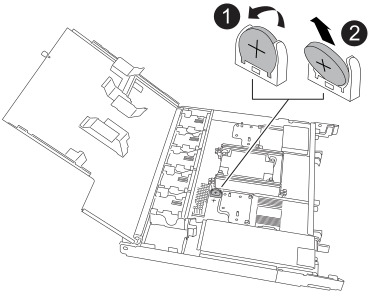

= Sostituire la batteria dell'orologio in tempo reale - Scaffali NX224
:allow-uri-read: 
:icons: font
:imagesdir: ../media/

[role="lead"]
È possibile sostituire una batteria dell'orologio in tempo reale (RTC) guasta senza interrompere l'alimentazione in uno scaffale NX224 acceso e mentre è in corso un'operazione di I/O.

.Prima di iniziare
* L'NSM partner dello scaffale deve essere attivo e funzionante e cablato correttamente, in modo che lo scaffale mantenga la connettività quando si rimuove l'NSM con la FRU guasta (NSM di destinazione).  Puoi verificare lo stato del partner NSM tramite https://mysupport.netapp.com/site/tools/tool-eula/activeiq-configadvisor["scaricando ed eseguendo Config Advisor"^] .
* Tutti gli altri componenti del sistema devono funzionare correttamente.

.A proposito di questa attività
* Attendere almeno 70 secondi tra la rimozione e l'installazione del modulo NVMe shelf (NSM).
+
Ciò consente a ONTAP di elaborare l'evento di rimozione NSM.

* Dopo aver sostituito la batteria RTC, reinstallare l'NSM e il modulo si avvia, l'ora in tempo reale viene aggiornata da ONTAP.
* *Migliore pratica:* la migliore pratica è quella di avere le versioni aggiornate del firmware del modulo NVMe shelf (NSM) e del firmware dell'unità sul sistema prima di sostituire i componenti FRU. È possibile visitare il sito di supporto NetApp per  https://mysupport.netapp.com/site/downloads/firmware/disk-shelf-firmware["scarica il firmware dello scaffale del disco"^] E  https://mysupport.netapp.com/site/downloads/firmware/disk-drive-firmware["scarica il firmware dell'unità disco"^] .
+
[NOTE]
====
Non riportare il firmware a una versione che non supporta lo shelf e i relativi componenti.

====
* Se necessario, è possibile attivare i LED di posizione (blu) dello shelf per individuare fisicamente lo shelf interessato: `storage shelf location-led modify -shelf-name _shelf_name_ -led-status on`
+
Se non si conosce `shelf_name` dello shelf interessato, eseguire `storage shelf show` comando.

+
Uno scaffale ha tre LED di posizione: Uno sul pannello del display dell'operatore e uno su ciascun NSM. I LED di posizione rimangono accesi per 30 minuti. È possibile disattivarle immettendo lo stesso comando, ma utilizzando l' `off`opzione .

* Quando si disimballano le batterie RTC sostitutive, conservare tutto il materiale di imballaggio da utilizzare quando si restituisce la batteria RTC guasta.
+
Per ottenere il numero RMA o ulteriore assistenza per la procedura di sostituzione, contattare il supporto tecnico all'indirizzo https://mysupport.netapp.com/site/global/dashboard["Supporto NetApp"^], 888-463-8277 (Nord America), 00-800-44-638277 (Europa) o +800-800-80-800 (Asia/Pacifico).

.Fasi
. Mettere a terra l'utente.
. Scollegare il cablaggio dall'NSM che contiene la FRU che si sta sostituendo:
+
.. Scollegare il cavo di alimentazione dall'alimentatore aprendo il fermo del cavo di alimentazione e quindi scollegando il cavo di alimentazione dall'alimentatore.
+
Gli alimentatori non dispongono di un interruttore di alimentazione.

.. Scollegare il cablaggio di archiviazione dalle porte NSM.
+
Prendere nota delle porte NSM a cui è collegato ciascun cavo. Quando si reinserisce l'NSM, ricollegare i cavi alle stesse porte, più avanti in questa procedura.

. Rimuovere l'NSM:
+
image::../media/drw_g_and_t_handles_remove_ieops-1837.svg[Rimuovere l'NSM.]

+
[cols="1,4"]
|===

 a| 
image::../media/icon_round_1.png[Numero di didascalia 1]
 a| 
Su entrambe le estremità dell'NSM, spingere le linguette di bloccaggio verticali verso l'esterno per rilasciare le maniglie.

 a| 
image::../media/icon_round_2.png[Numero di didascalia 2]
 a| 
** Tirare le maniglie verso di sé per sganciare l'NSM dalla midplane.
+
Mentre tirate, le maniglie si estendono fuori dal ripiano. Quando si avverte una certa resistenza, continuare a tirare.

** Far scorrere l'NSM fuori dal ripiano e posizionarlo su una superficie piana e stabile.
+
Assicurarsi di sostenere la parte inferiore dell'NSM mentre la si fa scorrere fuori dallo scaffale.

 a| 
image::../media/icon_round_3.png[Numero di didascalia 3]
 a| 
Ruotare le maniglie in posizione verticale (accanto alle linguette) per spostarle in modo che non siano di intralcio.

|===
. Aprire il coperchio del modulo ruotando la vite a testa zigrinata in senso antiorario per allentarla, quindi aprire il coperchio.
. Individuare la batteria RTC e sostituirla.
+
.. Rimuovere la batteria guasta:
+

+
[cols="1,4"]
|===

 a| 
image::../media/icon_round_1.png[Numero di didascalia 1]
 a| 
Ruotare delicatamente la batteria RTC ad un angolo lontano dal relativo supporto.

 a| 
image::../media/icon_round_2.png[Numero di didascalia 2]
 a| 
Estrarre la batteria RTC dal relativo supporto.

|===
.. Rimuovere la batteria di ricambio dalla confezione antistatica per la spedizione.
.. Prendere nota della polarità della batteria RTC, quindi inserirla nel supporto inclinandola e spingendola verso il basso.
+

NOTE: Assicurarsi che il segno più sulla batteria corrisponda al segno più sulla scheda madre.

.. Controllare visivamente che la batteria sia completamente installata nel supporto e che la polarità sia corretta.

. Chiudere il coperchio NSM e ruotare la vite a testa zigrinata in senso orario fino a serrarla.
. Inserire l'NSM nello scaffale:
+
image::../media/drw_g_and_t_handles_reinstall_ieops-1838.svg[Sostituire l'NSM.]

+
[cols="1,4"]
|===

 a| 
image::../media/icon_round_1.png[Numero di didascalia 1]
 a| 
Se le maniglie NSM sono state ruotate in posizione verticale (accanto alle linguette) per spostarle in modo che non siano di intralcio durante la manutenzione dell'NSM, ruotarle in posizione orizzontale.

 a| 
image::../media/icon_round_2.png[Numero di didascalia 2]
 a| 
Allineare la parte posteriore dell'NSM con l'apertura nel ripiano, quindi spingere delicatamente l'NSM utilizzando le maniglie fino a insediarlo completamente.

 a| 
image::../media/icon_round_3.png[Numero di didascalia 3]
 a| 
Ruotare le maniglie in posizione verticale e bloccarle in posizione con le linguette.

|===
. Recable il NSM.
+
.. Ricollegare il cablaggio di archiviazione alle stesse otto porte NSM.
+
I cavi devono essere inseriti con la linguetta di estrazione del connettore rivolta verso l'alto. Quando un cavo è inserito correttamente, scatta in posizione.

.. Ricollegare il cavo di alimentazione all'alimentatore, quindi fissarlo con l'apposito fermacavo.
+
Quando funziona correttamente, il LED bicolore di un alimentatore si illumina di verde.

+
Inoltre, entrambi i LED LNK (verde) della porta NSM si accendono. Se il LED LNK non si accende, ricollegare il cavo.

. Verificare che i LED di attenzione (ambra) sull'NSM contenenti la batteria RTC guasta e il pannello del display operatore non siano più illuminati
+
I LED di attenzione NSM si spengono dopo il riavvio dell'NSM e non rilevano più un problema alla batteria RTC. Questa operazione può richiedere da tre a cinque minuti.

. Verificare che l'NSM sia cablato correttamente, https://mysupport.netapp.com/site/tools/tool-eula/activeiq-configadvisor["esecuzione di Active IQ Config Advisor"^] .
+
Se vengono generati errori di cablaggio, seguire le azioni correttive fornite.

