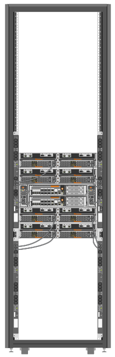

= Accendere l'armadio di sistema
:allow-uri-read: 
:icons: font
:imagesdir: ../media/

[role="lead"]
È necessario collegare i componenti del sistema alle PDU, instradare i cavi PDU alle fonti di alimentazione CA, collegarli alle fonti di alimentazione e accendere il sistema.

IMPORTANT: Per evitare un'interruzione del sistema in caso di errore di una PDU, non collegare entrambi i cavi di alimentazione di un componente in una PDU. Distribuire il carico attraverso il PDS collegato a circuiti diversi, come mostrato nell'illustrazione.

È necessario disporre di circuiti di alimentazione separati per ciascuna PDU nell'armadio del sistema.

. Collegare l'apparecchiatura alle PDU:
+
.. Collegare gli alimentatori del controller a diverse PDU collegate a diverse fonti di alimentazione.
.. Collegare gli alimentatori dello shelf di unità a diverse PDU collegate a diverse fonti di alimentazione.
.. Collegare qualsiasi alimentatore switch a diverse PDU collegate a diverse fonti di alimentazione.
+

+
Inserire i cavi di alimentazione PDU in una delle seguenti aperture nell'armadio di sistema:

+
*** Nella parte superiore dell'armadietto del sistema
*** Tra la parte inferiore dello sportello posteriore e il telaio dell'armadietto del sistema
*** Attraverso l'apertura a pavimento e sotto l'armadietto del sistema

. Spegnere gli interruttori di alimentazione o gli interruttori automatici delle PDU.
. Collegare ciascun cavo di alimentazione PDU a singole fonti di alimentazione CA che si trovano su circuiti CA separati.
. Accendere gli interruttori di alimentazione o gli interruttori di circuito delle PDU.
. Accendere i componenti e avviare il sistema.
. Chiudere e bloccare gli sportelli del cabinet di sistema.

