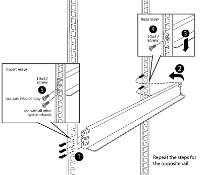

= Installare guide di supporto aggiuntive
:allow-uri-read: 
:icons: font
:imagesdir: ../media/

[role="lead"]
Nel cabinet di sistema sono già installate alcune guide di supporto. Se sono necessarie guide di supporto aggiuntive per il sistema, è necessario installarle prima di installare i componenti del sistema.

Questa attività si applica a tutti i controller e shelf di dischi, ad eccezione degli shelf di dischi DS212C e DE212C. Seguire le istruzioni riportate nel volantino del kit guide applicabile a questi due shelf di dischi.

https://library.netapp.com/ecm/ecm_download_file/ECMLP2484194["Installazione di uno shelf DE212C o DS212C in un rack a due o quattro montanti"]

. Determinare lo spazio necessario per l'apparecchiatura.
+
Calcolare la quantità di spazio U (1.75 pollici per U) richiesta dall'apparecchiatura, in base all'altezza dell'apparecchiatura, quindi determinare dove l'apparecchiatura verrà installata nell'armadio del sistema in base allo spazio disponibile.

. Individuare dove installare le guide di supporto, quindi installarle utilizzando la seguente illustrazione come riferimento:
+

. Se le flange di montaggio dell'attrezzatura si estendono oltre i fori delle viti nella guida di supporto, installare i dadi a gabbia sopra la guida di supporto, dove necessario.
+
image::../media/drw_clip_nut_install.gif[montaggio del dado del fermo drw]

