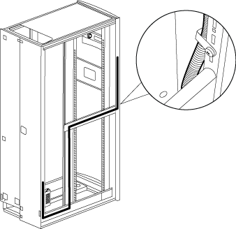

= Spostare l'alimentatore e il cablaggio del badge
:allow-uri-read: 
:icons: font
:imagesdir: ../media/

[role="lead"]
È necessario spostare l'alimentatore e il cablaggio del badge illuminato sul lato opposto del telaio dell'armadio di sistema prima di invertire lo sportello e reinstallare il badge illuminato.

È necessario rimuovere lo sportello e i pannelli laterali del cabinet di sistema.

Quando si inverte lo sportello dell'armadio di sistema, è necessario spostare l'alimentatore con badge illuminato, il cavo di alimentazione e il condotto di cablaggio sul lato opposto dell'armadio di sistema. Il gruppo è progettato in modo che il cavo che collega il badge si trovi sul lato dell'armadio in cui è installata la cerniera dello sportello.

. Aprire il fermo di fissaggio del cavo di alimentazione, quindi scollegare il cavo di alimentazione dall'alimentatore.
. Rimuovere l'alloggiamento dell'alimentatore e l'alimentatore, facendo riferimento all'illustrazione:
+
image::../media/drw_sys_cab_bezel_psu_remove_ozeki.gif[pannello della cabina del sistema drw psu rimuovere ozeki]

+
.. Sollevare il perno di fissaggio sull'alloggiamento dell'alimentatore, quindi rimuovere il coperchio dell'alloggiamento ruotandolo verso il basso e sollevandolo dall'alloggiamento dell'alimentatore posteriore.
+

NOTE: L'alimentatore è collegato all'alloggiamento dell'alimentatore con una patch a gancio e loop.

.. Scollegare l'alimentatore dal cavo del badge illuminato, quindi posizionare di lato il coperchio dell'alimentatore e dell'alimentatore.
.. Rimuovere le viti dalla parte superiore e inferiore dell'alloggiamento dell'alimentatore collegato al telaio dell'armadio di sistema, quindi rimuovere l'alloggiamento dell'alimentatore.

. Installare l'alimentatore e l'alloggiamento dell'alimentatore sul lato opposto dell'armadio del sistema:
+
.. Individuare i due fori per le viti uno accanto all'altro sul telaio del cabinet, quindi collegare la parte superiore dell'alloggiamento dell'alimentatore alla parte inferiore dei due fori per le viti.
+

NOTE: Potrebbe essere necessario rimuovere la fascetta di fissaggio inferiore del cavo, se presente.

.. Fissare la parte inferiore dell'alloggiamento dell'alimentatore al telaio del cabinet di sistema.
.. Installare il coperchio dell'alimentatore e l'alimentatore allineando i ganci del coperchio con l'alimentatore, tirando lo stantuffo verso l'alto sul coperchio, ruotando lo stantuffo in posizione chiusa e rilasciando lo stantuffo.

. Rimuovere il condotto di alimentazione del pannello anteriore rimuovendo i fermagli di fissaggio del condotto dai fermi, quindi estrarre il condotto dal cavo di alimentazione.
+
Conservare le clip di fissaggio e le viti per l'installazione del condotto sul lato opposto del cabinet.

+

. Spostare il cavo di alimentazione del badge sull'altro lato del cabinet:
+
image::../media/drw_sys_cab_bezel_power_cable_move.gif[spostamento del cavo di alimentazione del pannello della cabina del sistema drw]

+
.. Ruotare il fermacavo in gomma dell'armadio di 180° verso destra, rimuoverlo dal telaio dell'armadio di sistema, quindi estrarre delicatamente il cavo dall'armadio di sistema.
.. Spostare il cavo sull'altro lato del cabinet, quindi farlo passare completamente attraverso il foro vicino alla parte superiore del cabinet in posizione verticale.
.. Allineare il fermacavo in gomma con il foro nel telaio, spingerlo fino in fondo, quindi ruotare il fermacavo di 180° verso sinistra per fissarlo.
.. Far scorrere il cavo lungo il telaio del cabinet fino alla parte posteriore del cabinet.

. Reinstallare la canalina per cavi:
+
.. Far scorrere il condotto sul cavo di alimentazione PDU e instradarlo lungo il telaio dell'armadietto del sistema fino alla PDU.
.. Installare i fermi di fissaggio del condotto dall'altro lato del cabinet sopra il condotto per fissarlo al telaio del cabinet.

. Ricollegare il cavo del badge all'alimentatore, ma non ricollegarlo alla fonte di alimentazione.

