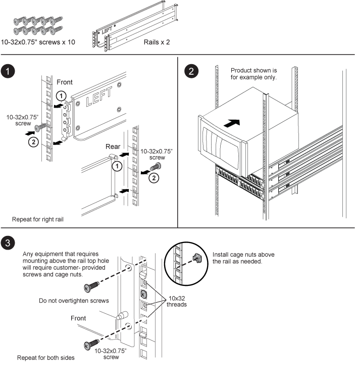
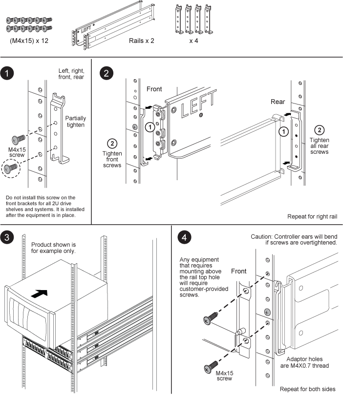

= Installa un kit SuperRail in un rack a quattro montanti per un sistema hardware ONTAP
:allow-uri-read: 
:icons: font
:imagesdir: ../media/

[role="lead"]
SuperRail può essere installato su un rack a quattro montanti con foro quadrato standard o su un rack a quattro montanti con foro rotondo standard utilizzando le staffe adattatore da foro rotondo a foro quadrato.

NOTE: La profondità minima tra i punti di collegamento anteriore e posteriore per l'installazione di SuperRail è di 24 pollici e la profondità massima è di 32 pollici.

[[installing-superrail-to-square-hole-four-post-rack]]
== Installazione di SuperRail su rack a quattro montanti con foro quadrato

[[installing-superrail-to-round-hole-four-post-rack]]
== Installazione di SuperRail su rack a quattro montanti con foro tondo

