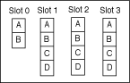
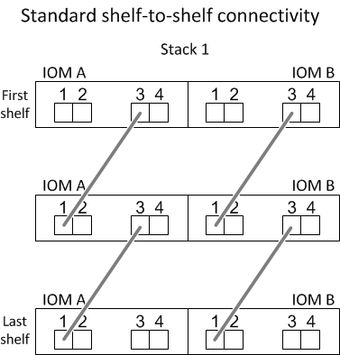
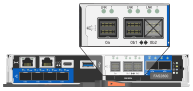

= Regole e concetti di cablaggio SAS - shelf con moduli IOM12/IOM12B
:allow-uri-read: 
:icons: font
:imagesdir: ../media/

[role="lead"]
Gli shelf di dischi con moduli IOM12/IOM12B possono essere cablati in configurazioni a coppia ha e a controller singolo (per le piattaforme supportate) applicando le regole di cablaggio SAS: Regole di configurazione, regole di numerazione degli slot del controller, regole di connessione shelf-to-shelf, regole di connessione controller-to-stack e, se applicabili, regole per cavi ottici SAS HD mini-SAS.

NOTE: Le regole di cablaggio SAS relative alle regole di numerazione degli slot dei controller, alle regole di connessione shelf-to-shelf e alle regole di connessione controller-to-stack descritte in questa guida sono le stesse che si applicano a tutti gli shelf di dischi SAS, indipendentemente dal fatto che dispongano di moduli IOM12/IOM12B, IOM6 o IOM3. Tuttavia, le informazioni contenute in questa guida sono specifiche per le caratteristiche esclusive degli shelf di dischi con moduli IOM12/IOM12B e per il loro utilizzo nelle configurazioni supportate.

Le regole di cablaggio SAS relative alle regole di configurazione e alle regole per i cavi ottici SAS mini-SAS HD descritte in questa guida sono specifiche per gli shelf di dischi con moduli IOM12/IOM12B.

Le regole di cablaggio SAS descritte in questa guida bilanciano il cablaggio SAS tra le porte SAS integrate e le porte SAS dell'adattatore bus host per fornire configurazioni di storage controller altamente disponibili e soddisfare i seguenti obiettivi:

* Fornire un unico algoritmo universale di facile comprensione per tutti i prodotti e le configurazioni SAS
* Fornire lo stesso cablaggio fisico quando si genera la distinta materiali (BOM), seguita in fabbrica e sul campo
* Sono verificabili tramite software e tool per il controllo della configurazione
* Fornire la massima resilienza possibile per mantenere la disponibilità e ridurre al minimo la dipendenza dalle acquisizioni dei controller

Evitare di discostarsi dalle regole; le deviazioni potrebbero ridurre affidabilità, universalità e compatibilità.

== Regole di configurazione

Gli shelf di dischi con moduli IOM12/IOM12B sono supportati su specifici tipi di configurazioni a coppia ha e a controller singolo.

NOTE: Le piattaforme FAS25XX non sono trattate in questo contenuto.

[NOTE]
====
Per informazioni aggiornate sulle configurazioni di cablaggio supportate per il modello di piattaforma in uso, consultare la Hardware Universe.

https://hwu.netapp.com["NetApp Hardware Universe"^]

====
* Le configurazioni di coppia HA devono essere cablate come configurazioni ha multipath o ha quad-path con le seguenti eccezioni:
+
** Le piattaforme con storage interno non supportano la connettività ha quad-path.
** Una coppia ha FAS2800 può essere cablata come ha a tre percorsi.
+
Per informazioni sulla connettività FAS2800, consultare la <<Connettività ha tri-path>> sezione.

** Le piattaforme con storage interno possono essere cablate come configurazioni ha a percorso singolo (dalla porta 0b/0b1 agli shelf esterni) per supportare la connettività a un dispositivo di backup su nastro SAS esterno (dalla porta 0a).

[NOTE]
====
Per le coppie ha FAS2800, sebbene il cablaggio agli shelf esterni sia ha a percorso singolo, a causa della connessione interna di ciascun controller della porta 0b all'espansore locale (IOM12G) e della porta 0c all'espansore del partner, la configurazione della coppia ha è ha multipath.

====
* Le configurazioni a controller singolo devono essere cablate come configurazioni multipath o quad-path, con le seguenti eccezioni:
+
** Le configurazioni a controller singolo della serie FAS2600 possono essere cablate come configurazioni a percorso singolo.
+
Poiché lo storage interno utilizza la connettività a percorso singolo, ONTAP emette occasionalmente avvisi che indicano il rilevamento di percorsi misti. Per evitare questi avvisi, è possibile utilizzare la connettività a percorso singolo agli shelf di dischi esterni. Inoltre, è possibile utilizzare la connettività a percorso singolo quando si utilizza un dispositivo di backup su nastro SAS esterno.

** Le configurazioni a controller singolo della serie FAS2600 non supportano la connettività quad-path.

== Regole di numerazione degli slot del controller

Allo scopo di applicare le regole di cablaggio a tutte le coppie ha supportate e alle configurazioni a controller singolo, viene utilizzata una convenzione di numerazione degli slot del controller.

* Per tutte le coppie ha e le configurazioni a controller singolo, si applica quanto segue:
+
** Per HBA SAS in uno slot PCI fisico si intende lo slot PCI 1, 2, 3 e così via, indipendentemente dall'etichetta fisica dello slot su un controller.
+
Ad esempio, se gli HBA SAS occupano gli slot PCI fisici 3, 5 e 7, verranno designati come slot 1, 2 e 3 allo scopo di applicare le regole di cablaggio SAS.

** Un HBA SAS integrato viene definito come slot PCI 0 nello stesso modo in cui viene etichettato su un controller.
** Ciascuna porta di ogni slot viene definita come su un controller. Ad esempio, lo slot 0 con due porte viene indicato come 0a e 0b. Lo slot 1 con quattro porte viene indicato come 1a, 1b, 1c e 1d.
+
In questo documento, gli slot e le porte degli slot sono illustrati come segue:

+

== Regole di connessione shelf-to-shelf

Quando si dispone di più shelf di dischi in uno stack di shelf di dischi, questi si collegano tra loro attraverso ciascun dominio SAS (IOM A e IOM B) utilizzando il cablaggio shelf-to-shelf "`standard`" o "`dDouble-wide`" applicabile. L'utilizzo del cablaggio shelf-to-shelf "`standard`" o "`dDouble-wide`" dipende dalla configurazione in uso.

=== Connettività standard shelf-to-shelf

* La connettività standard shelf-to-shelf viene utilizzata in qualsiasi stack di shelf di dischi con più shelf di dischi.
+
È necessaria una connessione via cavo tra shelf di dischi in ciascun dominio: Dominio A (IOM A) e dominio B (IOM B).

* La Best practice consiste nell'utilizzare le porte IOM 3 e 1 per la connettività standard shelf-to-shelf.
+
Dal primo shelf logico all'ultimo shelf logico di uno stack, collegare la porta IOM 3 alla porta IOM 1 dello shelf successivo nel dominio A e quindi nel dominio B.

=== Doppia connettività shelf-to-shelf

* La connettività shelf-to-shelf double-wide viene utilizzata nelle configurazioni quad-path (ha quad-path e quad-path).
* La doppia connettività shelf-to-shelf richiede due connessioni via cavo tra shelf di dischi in ciascun dominio: Dominio A (IOM A) e dominio B (IOM B).
+
La prima connessione via cavo è cablata come connettività standard shelf-to-shelf (utilizzando le porte IOM 3 e 1); la seconda connessione via cavo è cablata come connettività shelf-to-shelf doppia (utilizzando le porte IOM 4 e 2).

+
Dal primo shelf logico all'ultimo shelf logico di uno stack, collegare la porta IOM 3 alla porta IOM 1 dello shelf successivo nel dominio A e quindi nel dominio B. Dal primo shelf logico all'ultimo shelf logico di uno stack, collegare la porta IOM 4 alla porta IOM 2 dello shelf successivo nel dominio A e quindi nel dominio B. (Le porte IOM cablate come connettività a doppia larghezza sono visualizzate in blu).

image::../media/drw_shelf_to_shelf_double_wide.gif[larghezza doppia tra shelf e shelf drw]

== Regole di connessione controller-to-stack

È possibile collegare correttamente le connessioni SAS da ciascun controller a ogni stack in una coppia ha o in una configurazione a controller singolo, comprendendo che gli shelf di dischi SAS utilizzano la proprietà dei dischi basata su software, il modo in cui le porte a/C e B/D dei controller sono collegate agli stack, Come le porte a/C e B/D dei controller sono organizzate in coppie di porte e come le piattaforme con storage interno hanno le porte dei controller collegate agli stack.

=== Regola di proprietà dei dischi basata su software per shelf di dischi SAS

Gli shelf di dischi SAS utilizzano la proprietà dei dischi basata su software (non la proprietà dei dischi basata su hardware). Ciò significa che la proprietà del disco viene memorizzata sul disco piuttosto che essere determinata dalla topologia delle connessioni fisiche del sistema di storage (come per la proprietà del disco basata su hardware). In particolare, la proprietà del disco viene assegnata da ONTAP (automaticamente o tramite comandi CLI), non da come si collegano le connessioni controller-to-stack.

Gli shelf di dischi SAS non devono mai essere cablati utilizzando lo schema di proprietà dei dischi basato su hardware.

=== Regole di connessione delle porte controller A e C (per piattaforme senza storage interno)

* Le porte a e C sono sempre i percorsi primari verso uno stack.
* Le porte a e C si collegano sempre al primo shelf di dischi logico in uno stack.
* Le porte a e C si collegano sempre alle porte IOM 1 e 2 dello shelf di dischi.
+
La porta IOM 2 viene utilizzata solo per configurazioni quad-path ha e quad-path.

* Le porte A e C del controller 1 si collegano sempre a IOM A (dominio A).
* Le porte a e C del controller 2 si collegano sempre a IOM B (dominio B).

La seguente illustrazione evidenzia come le porte a e C del controller si connettono in una configurazione ha multipath con un HBA a quattro porte e due stack di shelf di dischi. Le connessioni allo stack 1 sono visualizzate in blu. Le connessioni allo stack 2 sono visualizzate in arancione.

image::../media/drw_controller_to_stack_rules_ports_a_and_c_example.gif[esempio di controller drw per lo stack delle porte delle regole a e c.]

=== Regole di connessione delle porte B e D del controller (per piattaforme senza storage interno)

* Le porte B e D sono sempre i percorsi secondari verso uno stack.
* Le porte B e D si collegano sempre all'ultimo shelf logico di dischi in uno stack.
* Le porte B e D si collegano sempre alle porte IOM 3 e 4 dello shelf di dischi.
+
La porta IOM 4 viene utilizzata solo per configurazioni quad-path ha e quad-path.

* Le porte B e D del controller 1 si collegano sempre a IOM B (dominio B).
* Le porte B e D del controller 2 si collegano sempre a IOM A (dominio A).
* Le porte B e D vengono collegate agli stack spostando l'ordine degli slot PCI di uno in modo che la prima porta del primo slot sia cablata per ultima.

La seguente illustrazione evidenzia come le porte B e D dei controller si connettono in una configurazione ha multipath con un HBA a quattro porte e due stack di shelf di dischi. Le connessioni allo stack 1 sono visualizzate in blu. Le connessioni allo stack 2 sono visualizzate in arancione.

image::../media/drw_controller_to_stack_rules_ports_b_and_d_example.gif[esempio di controller drw per lo stack delle porte delle regole b e d.]

=== Regole di connessione delle coppie di porte (per piattaforme senza storage interno)

Le porte SAS a, B, C e D del controller sono organizzate in coppie di porte utilizzando un metodo che sfrutta tutte le porte SAS per garantire la resilienza e la coerenza del sistema durante il cablaggio delle connessioni controller-to-stack nelle configurazioni a coppia ha e controller singolo.

* Le coppie di porte sono costituite da una porta SAS a o C del controller e da una porta SAS B o D.
+
Le porte SAS a e C si collegano al primo shelf logico di uno stack. Le porte SAS B e D si collegano all'ultimo shelf logico di uno stack.

* Le coppie di porte utilizzano tutte le porte SAS su ciascun controller del sistema.
+
È possibile aumentare la resilienza del sistema incorporando tutte le porte SAS (su un HBA in uno slot PCI fisico [slot 1-N] e sul controller [slot 0]) in coppie di porte. Non escludere porte SAS.

* Le coppie di porte sono identificate e organizzate come segue:
+
.. Elencare le porte A e le porte C in sequenza di slot (0,1, 2, 3 e così via).
+
Ad esempio: 1a, 2a, 3a, 1c, 2c, 3c

.. Elencare le porte B e le porte D in sequenza di slot (0,1, 2, 3 e così via).
+
Ad esempio: 1b, 2b, 3b, 1d, 2d, 3d

.. Riscrivere l'elenco delle porte D e B in modo che la prima porta dell'elenco venga spostata alla fine dell'elenco.
+
Ad esempio: image:../media/drw_gen_sas_cable_step2.png[""]

+
L'offset dell'ordine degli slot di uno bilancia le coppie di porte su più slot (slot PCI fisici e slot integrati) quando sono disponibili più slot di porte SAS, impedendo quindi il collegamento di uno stack a un singolo HBA SAS.

.. Associare le porte A e C (elencate al punto 1) alle porte D e B (elencate al punto 2) nell'ordine in cui sono elencate.
+
Ad esempio: 1a/2b, 2a/3b, 3a/1d, 1c/2d, 2c/3d, 3c/1b.

+

NOTE: Per una coppia ha, l'elenco delle coppie di porte identificate per il primo controller è applicabile anche al secondo controller.

* Quando si collega il sistema, è possibile utilizzare coppie di porte nell'ordine in cui sono state identificate oppure ignorare coppie di porte:
+
** Utilizzare le coppie di porte nell'ordine in cui sono state identificate (elencate) quando sono necessarie tutte le coppie di porte per collegare gli stack nel sistema.
+
Ad esempio, se sono state identificate sei coppie di porte per il sistema e si dispone di sei stack da cablare come multipath, le coppie di porte vengono cablate nell'ordine in cui sono state elencate:

+
1a/2b, 2a/3b, 3a/1d, 1c/2d, 2c/3d, 3c/1b

** Saltare le coppie di porte (utilizzare ogni altra coppia di porte) quando non sono necessarie tutte le coppie di porte per collegare gli stack nel sistema.
+
Ad esempio, se sono state identificate sei coppie di porte per il sistema e si dispone di tre stack da cablare come multipath, è possibile cablare ogni altra coppia di porte nell'elenco:

+
image::../media/drw_portpair_connection_rules_list_skip.gif[elenco regole di connessione portpair drw skip]

+

NOTE: Se si dispone di più coppie di porte di quelle necessarie per collegare gli stack nel sistema, la procedura migliore consiste nel saltare le coppie di porte per ottimizzare le porte SAS del sistema. Ottimizzando le porte SAS, si ottimizzano le prestazioni del sistema.

I fogli di lavoro per il cablaggio controller-to-stack sono pratici strumenti per identificare e organizzare le coppie di porte, in modo da poter collegare le connessioni controller-to-stack per la configurazione di coppia ha o controller singolo.

link:install-cabling-worksheet-template-multipath.html["Modello di foglio di lavoro per il cablaggio controller-to-stack per la connettività multipath"]

link:install-cabling-worksheet-template-quadpath.html["Modello di foglio di lavoro per il cablaggio controller-to-stack per la connettività quad-path"]

=== Regole di connessione delle porte del controller 0b/0b1 e 0a per piattaforme con storage interno

Le piattaforme con storage interno dispongono di un insieme univoco di regole di connessione, in quanto ciascun controller deve mantenere la stessa connettività di dominio tra lo storage interno (porta 0b/0b1) e lo stack. Ciò significa che quando un controller si trova nello slot A dello chassis (controller 1) si trova nel dominio A (IOM A) e quindi la porta 0b/0b1 deve connettersi a IOM A nello stack. Quando un controller si trova nello slot B dello chassis (controller 2), si trova nel dominio B (IOM B) e pertanto la porta 0b/0b1 deve connettersi all'IOM B nello stack.

NOTE: Le piattaforme FAS25XX non sono trattate in questo contenuto.

NOTE: Se non si connette la porta 0b/0b1 al dominio corretto (domini con connessione incrociata), si espone il sistema a problemi di resilienza che impediscono l'esecuzione di procedure senza interruzioni in modo sicuro.

* Porta 0b/0b1 del controller (porta storage interna):
+
** La porta 0b/0b1 del controller 1 si collega sempre a IOM A (dominio A).
** La porta 0b/0b1 del controller 2 si collega sempre a IOM B (dominio B).
** La porta 0b/0b1 è sempre il percorso primario.
** La porta 0b/0b1 si collega sempre all'ultimo shelf logico di dischi in uno stack.
** La porta 0b/0b1 si collega sempre alla porta IOM 3 dello shelf di dischi.

* Porta controller 0a (porta HBA interna):
+
** La porta 0a del controller 1 si collega sempre a IOM B (dominio B).
** La porta 0a del controller 2 si collega sempre a IOM A (dominio A).
** La porta 0a è sempre il percorso secondario.
** La porta 0a si collega sempre al primo shelf di dischi logico in uno stack.
** La porta 0a si collega sempre alla porta IOM 1 dello shelf di dischi.

La seguente illustrazione evidenzia la connettività di dominio della porta di storage interna (0b/0b1) a uno stack esterno di shelf:

image::../media/drw_fas2600_mpha_domain_example_IEOPS-1172.svg[Esempio di dominio mpha drw fas2600 IEOPS 1172]

=== Connettività ha tri-path

La connettività ha Tri-path è disponibile sulle coppie ha FAS2800. La connettività ha Tri-path ha tre percorsi da ciascun controller agli shelf interni (IOM12G) ed esterni:

* La connessione interna della porta 0b di ciascun controller al proprio IOM12G locale e la porta 0c al proprio IOM12G del partner fornisce una connettività ha multipath a coppia.
* Il cablaggio delle porte di storage esterne di ciascun controller, 0a e 0b1, fornisce una connettività ha a tre percorsi.
+
Le porte 0a e 0b1 sono cablate tra i due controller quando non sono presenti shelf esterni o sono cablate su shelf esterni per ottenere una connettività ha a tre percorsi.

Di seguito sono illustrati i collegamenti interni e i cavi esterni del controller che consentono la connettività ha a tre percorsi:

image::../media/drw_fas2800_concept_tpha_IEOPS-950.svg[Concetto di drw fas2800 tpha IEOPS 950]

Le porte SAS esterne di FAS2800:

* La porta 0a proviene dall'HBA interno (come altre piattaforme con shelf interno).
* La porta 0b1 proviene dallo shelf interno (come le porte 0b su altre piattaforme con shelf interno).
* La porta 0b2 non viene utilizzata. È disattivato. Se un cavo è collegato, viene generato un messaggio di errore.

Gli esempi di cablaggio di coppia ha FAS2800 sono disponibili nella link:install-cabling-worksheets-examples-fas2600.html["Schede di lavoro per il cablaggio controller-to-stack ed esempi di cablaggio per piattaforme con storage interno"] sezione.

== Regole per i cavi ottici SAS mini-SAS HD

È possibile utilizzare cavi ottici SAS mini-SAS HD--cavi ottici attivi multimodali (AOC) con connettori HD mini-SAS-mini-SAS e cavi di breakout multimode (OM4) con connettori mini-SAS HD-to-LC--per ottenere connettività SAS a lunga distanza per alcune configurazioni che dispongono di shelf di dischi con moduli IOM12.

* La piattaforma e la versione di ONTAP devono supportare l'utilizzo di cavi ottici SAS mini-SAS HD: Cavi ottici attivi multimodali (AOC) con connettori HD mini-SAS-mini-SAS e cavi di breakout multimodali (OM4) con connettori mini-SAS HD-LC.
+
https://hwu.netapp.com["NetApp Hardware Universe"]

* I cavi AOC ottici multimodali SAS con connettori mini-SAS HD-mini-SAS possono essere utilizzati per connessioni controller-to-stack e shelf-to-shelf e sono disponibili in lunghezze fino a 50 metri.
* Se si utilizzano cavi di breakout SAS OM4 (Optical Multimode) con connettori mini-SAS HD-to-LC (per patch panel), si applicano le seguenti regole:
+
** Questi cavi possono essere utilizzati per connessioni controller-stack e shelf-to-shelf.
+
Se si utilizzano cavi di breakout multimodali per connessioni shelf-to-shelf, è possibile utilizzarli una sola volta all'interno di uno stack di shelf di dischi. Per collegare le restanti connessioni shelf-to-shelf, è necessario utilizzare cavi AOC multimodali.

+
Per le configurazioni quad-path ha e quad-path, se si utilizzano cavi di breakout multimodali per le connessioni shelf-to-shelf a doppia larghezza tra due shelf di dischi, la procedura migliore consiste nell'utilizzare cavi di breakout accoppiati in modo identico.

** È necessario collegare tutte le otto (quattro coppie) dei connettori di breakout LC al pannello di controllo.
** È necessario fornire i patch panel e i cavi tra i pannelli.
+
I cavi interpannello devono essere della stessa modalità del cavo di breakout: OM4 Multimode.

** È possibile utilizzare fino a una coppia di patch panel in un percorso.
** Il percorso point-to-point (mini-SAS HD-to-mini-SAS HD) di qualsiasi cavo multimodale non può superare i 100 metri.
+
Il percorso include il set di cavi di breakout, patch panel e cavi tra pannelli.

** Il percorso end-to-end totale (somma dei percorsi point-to-point dal controller all'ultimo shelf) non può superare i 300 metri.
+
Il percorso totale include il set di cavi di breakout, patch panel e cavi tra pannelli.

* I cavi SAS possono essere in rame SAS, SAS ottico o misti.
+
Se si utilizzano cavi in rame SAS e cavi ottici SAS, si applicano le seguenti regole:

+
** I collegamenti shelf-to-shelf in uno stack devono essere tutti i cavi in rame SAS o tutti i cavi ottici SAS.
** Se i collegamenti shelf-to-shelf sono cavi ottici SAS, anche i collegamenti controller-to-stack a tale stack devono essere cavi ottici SAS.
** Se i collegamenti shelf-to-shelf sono cavi di rame SAS, i collegamenti controller-to-stack a tale stack possono essere cavi ottici SAS o cavi di rame SAS.

