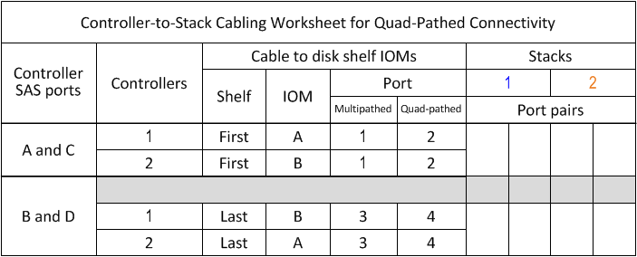
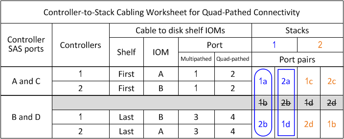

= Modello di foglio di lavoro per il cablaggio controller-to-stack per connettività quad-path - shelf con moduli IOM12/IOM12B
:allow-uri-read: 
:icons: font
:imagesdir: ../media/

[role="lead"]
Completando il modello del foglio di lavoro, è possibile definire le coppie di porte SAS del controller che è possibile utilizzare per collegare i controller a stack di shelf di dischi con i moduli IOM12/IOM12B per ottenere una connettività a quattro percorsi in una configurazione a coppia ha o a singolo controller. È inoltre possibile utilizzare il foglio di lavoro completo per esaminare il cablaggio delle connessioni a quattro percorsi per la configurazione.

.Sul suo compito
* Questa procedura e il modello di foglio di lavoro sono applicabili al cablaggio della connettività quad-path per una configurazione quad-path ha o quad-path con uno o più stack.
+
Vengono forniti esempi di fogli di lavoro completi per le configurazioni quad-path ha e quad-path.

+
Per gli esempi dei fogli di lavoro viene utilizzata una configurazione con due HBA SAS a quattro porte e due stack di shelf di dischi con moduli IOM12/IOM12B.

* Il modello di foglio di lavoro consente di aggiungere fino a due stack; se necessario, è necessario aggiungere altre colonne.
* La connettività quad-path per le connessioni controller-to-stack è costituita da due set di cavi multipath: Il primo set di cavi viene definito "`mpercorso completo`"; il secondo set di cavi viene definito "`percorso quadruplo`".
+
Il secondo gruppo di cavi viene definito "`quad-path`" perché il completamento di questo set di cavi offre la connettività quad-path da un controller a uno stack in una configurazione a coppia ha o a controller singolo.

* Le porte IOM 1 e 3 dello shelf di dischi vengono sempre utilizzate per il cablaggio multipercorso e le porte IOM 2 e 4 vengono sempre utilizzate per il cablaggio a quattro percorsi, come indicato dalle intestazioni delle colonne del foglio di lavoro.
* Negli esempi dei fogli di lavoro, le coppie di porte sono designate per il cablaggio multipath o il cablaggio quad-path allo stack applicabile.
+
Ogni coppia di porte designata per il cablaggio multipath è circondata da un ovale del colore associato allo stack a cui è collegato. Ogni coppia di porte designata per il cablaggio a quattro percorsi è circondata da un rettangolo che corrisponde al colore associato allo stack a cui è collegato. La pila 1 è associata al colore blu; la pila 2 è associata al colore arancione.

* Se necessario, fare riferimento a. link:install-cabling-rules.html["Regole e concetti relativi al cablaggio SAS"] per informazioni sulla convenzione di numerazione degli slot del controller, sulla connettività shelf-to-shelf e sulla connettività controller-to-shelf (incluso l'utilizzo di coppie di porte).
* Se necessario, dopo aver completato il foglio di lavoro, fare riferimento a. link:install-cabling-worksheets-how-to-read-quadpath.html["Come leggere un foglio di lavoro per collegare le connessioni controller-to-stack per la connettività quad-path"].

.Fasi
. Nelle caselle sopra le caselle grigie, elencare tutte le porte SAS A del sistema, quindi tutte le porte SAS C del sistema in sequenza di slot (0, 1, 2, 3 e così via).
+
Ad esempio: 1a, 2a, 1c, 2c

. Nelle caselle grigie, elencare tutte le porte SAS B del sistema, quindi tutte le porte SAS D del sistema in sequenza di slot (0, 1, 2, 3 e così via).
+
Ad esempio: 1b, 2b, 1d, 2d

. Nelle caselle sotto le caselle grigie, riscrivere l'elenco delle porte D e B in modo che la prima porta dell'elenco venga spostata alla fine dell'elenco.
+
Ad esempio: 2b, 1d, 2d, 1b

. Identificare i due set di coppie di porte da collegare allo stack 1 disegnando un ovale attorno al primo set di coppie di porte e un rettangolo attorno al secondo set di coppie di porte.
+
Entrambi i set di cavi sono necessari per ottenere una connettività quad-path da ciascun controller allo stack 1 nella configurazione a coppia ha o a controller singolo.

+
Nell'esempio seguente viene utilizzata la coppia di porte 1a/2b per il cablaggio multipercorso e la coppia di porte 2a/1d per il cablaggio a percorso quadruplo dello stack 1.

+

. Identificare i due set di coppie di porte da collegare allo stack 2 disegnando un ovale attorno al primo set di coppie di porte e un rettangolo attorno al secondo set di coppie di porte.
+
Entrambi i set di cavi sono necessari per ottenere una connettività quad-path da ciascun controller allo stack 1 nella configurazione a coppia ha o a controller singolo.

+
Nell'esempio seguente viene utilizzata la coppia di porte 1c/2d per il cablaggio multipath e la coppia di porte 2c/1b per il cablaggio quadruplo dello stack 2.

+
image::../media/drw_worksheet_qpha_slots_1_and_2_two_4porthbas_two_stacks_nau.gif[Foglio di lavoro di cablaggio ha quad path che mostra le coppie di porte collegate allo stack 2]

. Se si dispone di una configurazione quad-path (controller singolo), barrare le informazioni per il controller 2; sono necessarie solo le informazioni del controller 1 per collegare le connessioni controller-to-stack.
+
L'esempio seguente mostra che le informazioni per il controller 2 sono barrate.

+
image::../media/drw_worksheet_qp_slots_1_and_2_two_4porthbas_two_stacks_nau.gif[Foglio di lavoro di cablaggio del controller singolo quad path che mostra le coppie di porte collegate allo stack 1 e 2]

