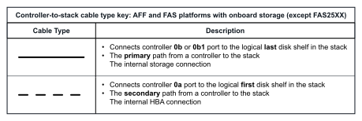
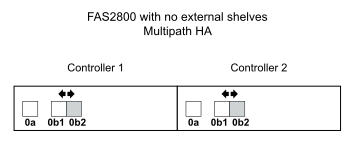
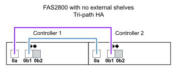
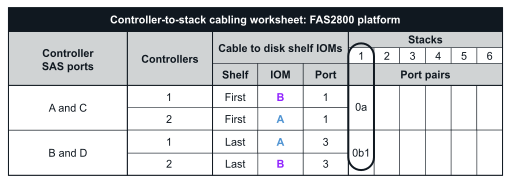
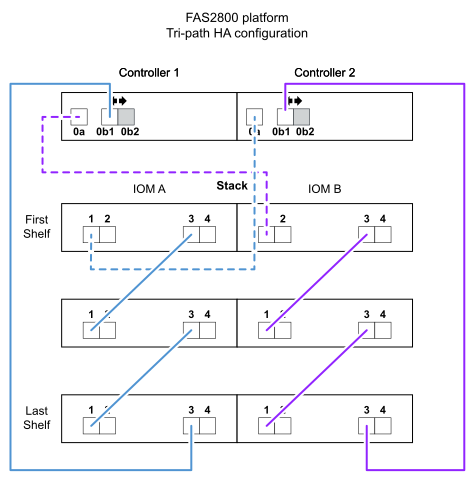
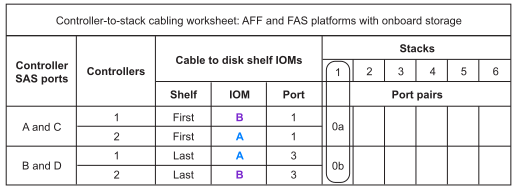
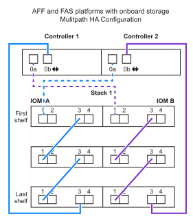

= Schede di cablaggio per shelf DS212C, DS224C o DS460C con piattaforme di storage interno
:allow-uri-read: 
:icons: font
:imagesdir: ../media/

[role="lead"]
Puoi usare i fogli di lavoro completati per il cablaggio dal controller allo stack e gli esempi di cablaggio per collegare le piattaforme con storage interno. Questo vale per gli shelf con moduli IOM12, IOM12B o IOM12C.

* Se necessario, fare riferimento a. link:install-cabling-rules.html["Regole e concetti relativi al cablaggio SAS"] per informazioni sulle configurazioni supportate, la connettività shelf-to-shelf e la connettività controller-to-shelf.
* Gli esempi di cablaggio mostrano i cavi controller-stack come solidi o tratteggiati per distinguere le connessioni delle porte 0b/0b1 del controller dalle connessioni delle porte 0a del controller.
+

* Gli esempi di cablaggio mostrano le connessioni controller-to-stack e shelf-to-shelf in due colori diversi per distinguere la connettività tramite IOM A (dominio A) e IOM B (dominio B).
+
image::../media/drw_fas2600_cable_color_key.png[Chiave colore cavo per piattaforme con memoria integrata]

== Piattaforma FAS2820 in una configurazione ha multipath senza shelf esterni

L'esempio seguente mostra che non è necessario alcun cablaggio per la connettività ha multipath:

== Piattaforma FAS2820 in configurazione ha a tre percorsi senza shelf esterni

Il seguente esempio di cablaggio mostra il cablaggio necessario tra i due controller per ottenere la connettività a tre percorsi:

== Piattaforma FAS2820 in una configurazione ha a tre percorsi con uno stack multi-shelf

Il seguente foglio di lavoro e l'esempio di cablaggio utilizza la coppia di porte 0a/0b1:

== Piattaforme con storage interno in una configurazione ha multipath con uno stack multi-shelf

Il seguente foglio di lavoro e l'esempio di cablaggio utilizza la coppia di porte 0a/0b:

NOTE: Questa sezione non si applica ai sistemi FAS2820.

