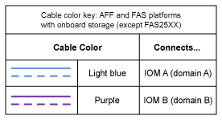

= Schede di lavoro per il cablaggio controller-to-stack ed esempi di cablaggio per piattaforme con storage interno - shelf con moduli IOM12/IOM12B
:allow-uri-read: 
:icons: font
:imagesdir: ../media/

[role="lead"]
È possibile utilizzare i fogli di lavoro completi di cablaggio controller-to-stack ed esempi di cablaggio per collegare le piattaforme con storage interno.

NOTE: Queste informazioni non si applicano alle piattaforme FAS25XX.

* Se necessario, fare riferimento a. link:install-cabling-rules.html["Regole e concetti relativi al cablaggio SAS"] per informazioni sulle configurazioni supportate, la connettività shelf-to-shelf e la connettività controller-to-shelf.
* Gli esempi di cablaggio mostrano i cavi controller-stack come solidi o tratteggiati per distinguere le connessioni delle porte 0b/0b1 del controller dalle connessioni delle porte 0a del controller.
+
image::../media/drw_fas2600_controller_to_stack_cable_type_key_IEOPS-947.svg[Chiave tipo di cavo per piattaforme con memoria integrata]

* Gli esempi di cablaggio mostrano le connessioni controller-to-stack e shelf-to-shelf in due colori diversi per distinguere la connettività tramite IOM A (dominio A) e IOM B (dominio B).
+

== Piattaforma FAS2820 in una configurazione ha multipath senza shelf esterni

L'esempio seguente mostra che non è necessario alcun cablaggio per la connettività ha multipath:

image::../media/drw_fas2800_noshelf_mpha_IEOPS-954.svg[FAS2820 ha multipath senza shelf esterni]

== Piattaforma FAS2820 in configurazione ha a tre percorsi senza shelf esterni

Il seguente esempio di cablaggio mostra il cablaggio necessario tra i due controller per ottenere la connettività a tre percorsi:

image::../media/drw_fas2800_noshelf_tpha_IEOPS-955.svg[Esempio di cablaggio ha Tri path Fas2800 senza shelf esterni]

== Piattaforma FAS2820 in una configurazione ha a tre percorsi con uno stack multi-shelf

Il seguente foglio di lavoro e l'esempio di cablaggio utilizza la coppia di porte 0a/0b1:

image::../media/drw_fas2800_worksheet_IEOPS-948.svg[Foglio di lavoro del cablaggio ha tri path FAS2820 che mostra le coppie di porte per lo stack 1]

image::../media/drw_fas2800_withshelves_tpha_IEOPS-949.svg[Esempio di cablaggio ha tri path FAS2820 in uno stack]

== Piattaforme con storage interno in una configurazione ha multipath con uno stack multi-shelf

Il seguente foglio di lavoro e l'esempio di cablaggio utilizza la coppia di porte 0a/0b:

NOTE: Questa sezione non si applica ai sistemi FAS2820 o FAS25XX.

image::../media/drw_fas2600_mpha_worksheet_IEOPS-1255.svg[Foglio di lavoro con cablaggio ha multipath per le piattaforme con storage interno e uno stack]

image::../media/drw_fas2600_mpha_IEOPS-1256.svg[Esempio di cablaggio ha multipath per le piattaforme con storage interno]

== Configurazione multipath della serie FAS2600 con uno stack multi-shelf

I seguenti fogli di lavoro ed esempi di cablaggio utilizzano la coppia di porte 0a/0b.

In questo esempio, il controller viene installato nello slot A dello chassis. Quando un controller si trova nello slot A dello chassis, la relativa porta di storage interna (0b) si trova nel dominio A (IOM A); pertanto, la porta 0b deve connettersi al dominio A (IOM A) nello stack.

image::../media/drw_fas2600_mp_slot_a_worksheet.png[Foglio di lavoro FAS2600 che mostra la coppia di porte per una configurazione multipath]

image::../media/drw_fas2600_mp_slot_a.png[Esempio di cablaggio multipercorso FAS2600 con controller nello slot 1 dello chassis]

In questo esempio, il controller è installato nello slot B dello chassis. Quando un controller si trova nello slot B dello chassis, la porta di storage interna (0b) si trova nel dominio B (IOM B); pertanto, la porta 0b deve connettersi al dominio B (IOM B) nello stack.

image::../media/drw_fas2600_mp_slot_b_worksheet.png[Foglio di lavoro FAS2600 che mostra la coppia di porte per una configurazione multipath]

image::../media/drw_fas2600_mp_slot_b.png[Esempio di cablaggio multipercorso FAS2600 con controller nello slot 2 dello chassis]
