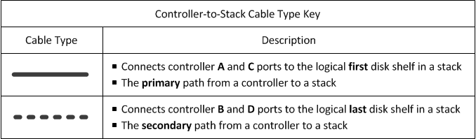
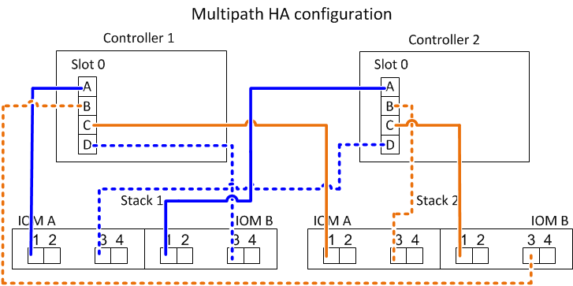

= Schede di lavoro per il cablaggio controller-to-stack ed esempi di cablaggio per configurazioni ha multipath - shelf con moduli IOM12/IOM12B
:allow-uri-read: 
:icons: font
:imagesdir: ../media/

[role="lead"]
È possibile utilizzare i fogli di lavoro del cablaggio controller-to-stack e gli esempi di cablaggio per collegare la coppia ha come configurazione ha multipath.

NOTE: Queste informazioni si applicano alle piattaforme senza storage interno.

* Se necessario, fare riferimento a. link:install-cabling-rules.html["Regole e concetti relativi al cablaggio SAS"] per informazioni sulle configurazioni supportate, la convenzione di numerazione degli slot del controller, la connettività shelf-to-shelf e la connettività controller-to-shelf (incluso l'utilizzo di coppie di porte).
* Se necessario, fare riferimento a. link:install-cabling-worksheets-how-to-read-multipath.html["Come leggere un foglio di lavoro per collegare le connessioni controller-to-stack per la connettività multipath"].
* Gli esempi di cablaggio mostrano i cavi controller-to-stack come solidi o tratteggiati per distinguere le connessioni delle porte controller A e C dalle connessioni delle porte controller B e D.
+

* I cavi degli esempi di cablaggio e le relative coppie di porte nelle schede di lavoro sono codificati a colori per distinguere la connettività con ogni stack nella coppia ha.
+
image::../media/drw_controller_to_stack_cable_color_key_non2600_4stackcolors.gif[Chiave colorata del cavo di configurazione ha multipath]

* I fogli di lavoro e gli esempi di cablaggio mostrano le coppie di porte di cablaggio nell'ordine in cui sono elencate nel foglio di lavoro.

== Schede di lavoro per il cablaggio controller-to-stack ed esempi di cablaggio per configurazioni ha multipath con HBA SAS a quattro porte

È possibile utilizzare i fogli di lavoro completi del cablaggio controller-to-stack ed esempi di cablaggio per collegare configurazioni ha multipath comuni che dispongono di HBA SAS a quattro porte. Questi controller non dispongono di porte SAS integrate.

=== Ha multipath con un HBA SAS a quattro porte e uno stack a shelf singolo

Il seguente foglio di lavoro e l'esempio di cablaggio utilizza la coppia di porte 1a/1d:

image::../media/drw_worksheet_mpha_slot_1_one_4porthba_one_singleshelf_stack.gif[Foglio di lavoro con cablaggio ha multipath per un HBA SAS a quattro porte e uno stack di shelf singolo]

image::../media/drw_mpha_slot_1_one_4porthba_one_singleshelf_stack.gif[Esempio di cablaggio ha multipath per un HBA SAS a quattro porte e uno stack di shelf singolo]

=== Ha multipath con un HBA SAS a quattro porte e due stack a shelf singolo

Il seguente foglio di lavoro e l'esempio di cablaggio utilizzano le coppie di porte 1a/1d e 1c/1b:

image::../media/drw_worksheet_mpha_slot_1_one_4porthba_two_singleshelf_stacks.gif[Foglio di lavoro con cablaggio ha multipath per un HBA SAS a quattro porte e due stack di shelf singoli]

image::../media/drw_mpha_slot_1_one_4porthba_two_singleshelf_stacks.gif[Esempio di cablaggio ha multipath per un HBA SAS a quattro porte e due stack di shelf singoli]

=== Ha multipath con due HBA SAS a quattro porte e due stack multi-shelf

Per questa configurazione sono disponibili quattro coppie di porte: 1a/2b, 2a/1d, 1c/2d e 2c/1b. È possibile collegare le coppie di porte nell'ordine in cui sono identificate (elencate nel foglio di lavoro) oppure collegare le coppie di porte (saltare le coppie di porte).

NOTE: Se si dispone di più coppie di porte di quelle necessarie per collegare gli stack nel sistema, la procedura migliore consiste nel saltare le coppie di porte per ottimizzare le porte SAS del sistema. Ottimizzando le porte SAS, si ottimizzano le prestazioni del sistema.

Il seguente foglio di lavoro e l'esempio di cablaggio mostrano le coppie di porte utilizzate nell'ordine in cui sono elencate nel foglio di lavoro: 1a/2b, 2a/1d, 1c/2d e 2c/1b.

image::../media/drw_worksheet_mpha_slots_1_and_2_two_4porthbas_two_stacks.gif[Foglio di lavoro per il cablaggio ha multipath per due HBA SAS a quattro porte e due stack multi-shelf]

image::../media/drw_mpha_slots_1_and_2_4porthbas_4_stacks.gif[Esempio di cablaggio ha multipath per due HBA SAS a quattro porte e due stack multi-shelf]

Il seguente foglio di lavoro e l'esempio di cablaggio mostra che le coppie di porte vengono saltate per utilizzarle una all'altra nell'elenco: 1a/2b e 1c/2d.

NOTE: Se in seguito viene aggiunto un terzo stack, si utilizza la coppia di porte ignorata.

image::../media/drw_worksheet_mpha_slots_1_and_2_two_4porthbas_two_stacks_skipped.gif[Foglio di lavoro per il cablaggio ha multipath per due HBA SAS a quattro porte e due stack multi-shelf con coppie di porte ignorate]

image::../media/drw_mpha_slots_1_and_2_two_4porthbas_two_stacks_skipped.gif[Esempio di cablaggio ha multipath per due HBA SAS a quattro porte e due stack multi-shelf che utilizzano coppie di porte ignorate]

== Schede di lavoro per il cablaggio controller-to-stack ed esempi di cablaggio per configurazioni ha multipath con quattro porte SAS integrate

È possibile utilizzare i fogli di lavoro completi del cablaggio controller-to-stack ed esempi di cablaggio per collegare configurazioni ha multipath comuni che dispongono di quattro porte SAS integrate.

=== Ha multipath con quattro porte SAS integrate e uno stack a shelf singolo

Il seguente foglio di lavoro e l'esempio di cablaggio utilizza la coppia di porte 0a/0d:

image::../media/drw_worksheet_mpha_slot_0_4ports_one_singleshelf_stack.gif[Foglio di lavoro di cablaggio ha multipath per quattro porte integrate e uno stack di shelf singolo]

image::../media/drw_mpha_slot_0_4ports_one_singleshelf_stack.gif[Esempio di cablaggio ha multipath per quattro porte integrate e uno stack di shelf singolo]

=== Ha multipath con quattro porte SAS integrate e due stack a shelf singolo

Il seguente foglio di lavoro e l'esempio di cablaggio utilizzano coppie di porte 0a/0d e 0c/0b:

image::../media/drw_worksheet_mpha_slot_0_4ports_two_singleshelf_stacks.gif[Foglio di lavoro con cablaggio ha multipath per quattro porte integrate e due stack di shelf singoli]

=== Ha multipath con quattro porte SAS integrate, un HBA SAS a quattro porte e due stack multi-shelf

Per questa configurazione sono disponibili quattro coppie di porte: 0a/1b, 1a/0d, 0c/1d e 1c/0b. È possibile collegare le coppie di porte nell'ordine in cui sono identificate (elencate nel foglio di lavoro) oppure collegare le coppie di porte (saltare le coppie di porte).

NOTE: Se si dispone di più coppie di porte di quelle necessarie per collegare gli stack nel sistema, la procedura migliore consiste nel saltare le coppie di porte per ottimizzare le porte SAS del sistema. Ottimizzando le porte SAS, si ottimizzano le prestazioni del sistema.

Il seguente foglio di lavoro e l'esempio di cablaggio mostrano le coppie di porte utilizzate nell'ordine in cui sono elencate nel foglio di lavoro: 0a/1b, 1a/0d, 0c/1d e 1c/0b.

image::../media/drw_worksheet_mpha_slots_0_and_1_8ports_4stacks.gif[Foglio di lavoro con cablaggio ha multipath per quattro porte SAS integrate, un HBA SAS a quattro porte e due stack di shelf multipli]

image::../media/drw_mpha_slots_0_and_1_8ports_4_stacks.gif[Cablaggio ha multipath ad esempio per quattro porte SAS integrate un HBA SAS a quattro porte e due stack di shelf multipli]

Il seguente esempio di foglio di lavoro e cablaggio mostra le coppie di porte saltate per utilizzarle una all'altra nell'elenco: 0a/1b e 0c/1d.

NOTE: Se in seguito viene aggiunto un terzo stack, si utilizza la coppia di porte ignorata.

image::../media/drw_worksheet_mpha_slots_0_and_1_8ports_two_stacks_skipped.gif[Foglio di lavoro di cablaggio ha multipath per quattro porte integrate un HBA SAS a quattro porte e due stack di shelf multipli che utilizzano coppie di porte ignorate]

image::../media/drw_mpha_slots_0_and_1_8ports_two_stacks_skipped.gif[Cablaggio ha multipath esempio per quattro porte integrate un HBA SAS a quattro porte e due stack di shelf multipli che utilizzano coppie di porte ignorate]
