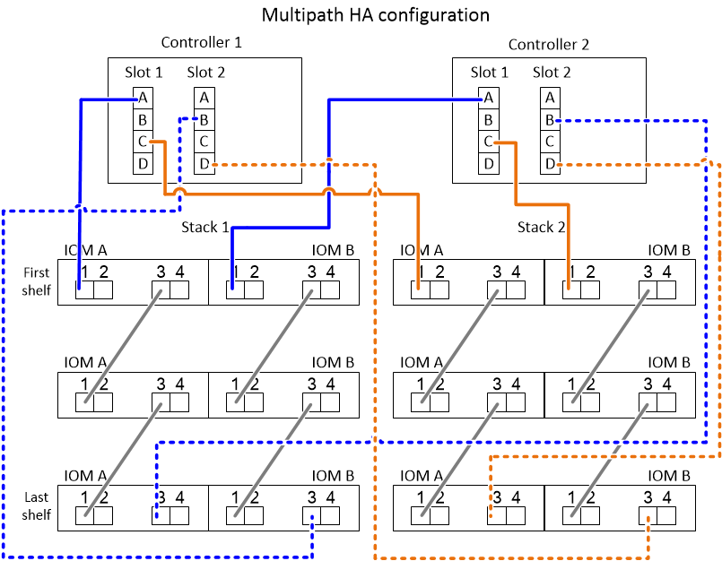

= Come leggere un foglio di lavoro per collegare le connessioni controller-to-stack per la connettività multipath - shelf con moduli IOM12/IOM12B
:allow-uri-read: 
:icons: font
:imagesdir: ../media/

[role="lead"]
È possibile utilizzare questo esempio per fornire istruzioni su come leggere e applicare un foglio di lavoro completo ai collegamenti controller-to-stack via cavo per shelf di dischi con moduli IOM12/IOM12B per la connettività multipath.

.Prima di iniziare
Se si dispone di una piattaforma con storage interno, utilizzare il seguente foglio di lavoro:

link:install-cabling-worksheets-examples-fas2600.html["Schede di lavoro per il cablaggio controller-to-stack ed esempi di cablaggio per piattaforme con storage interno"]

.A proposito di questa attività
* Questa procedura fa riferimento al seguente foglio di lavoro e all'esempio di cablaggio per dimostrare come leggere un foglio di lavoro per collegare le connessioni controller-to-stack.
+
La configurazione utilizzata in questo esempio è una configurazione ha multipath con due HBA SAS a quattro porte (otto porte SAS) su ciascun controller e due stack di shelf di dischi con moduli IOM12/IOM12B. Le coppie di porte vengono cablate saltando ogni altra coppia di porte nel foglio di lavoro.

+

NOTE: Se si dispone di più coppie di porte di quelle necessarie per collegare gli stack nel sistema, la procedura migliore consiste nel saltare le coppie di porte per ottimizzare le porte SAS del sistema. Ottimizzando le porte SAS, si ottimizzano le prestazioni del sistema.

* Se si dispone di una configurazione a controller singolo, saltare i passaggi secondari b e d per il cablaggio a un secondo controller.
* Se necessario, fare riferimento a. link:install-cabling-rules.html["Regole e concetti relativi al cablaggio SAS"] per informazioni sulla convenzione di numerazione degli slot del controller, sulla connettività shelf-to-shelf e sulla connettività controller-to-shelf (incluso l'utilizzo di coppie di porte).

Le coppie di porte vengono cablate utilizzando ogni altra coppia di porte nel foglio di lavoro: 1a/2b e 1c/2d.

image::../media/drw_worksheet_mpha_skipped_template.gif[mpha del foglio di lavoro drw ignorato]

.Fasi
. Coppia di porte per cavi 1a/2b su ciascun controller per lo stack 1:
+
.. Porta 1a del controller del cavo per lo stack 1, porta 1 IOM A del primo shelf.
.. Porta 1a del controller del cavo 2 allo stack 1, porta 1 IOM B del primo shelf.
.. Cavo controller 1 porta 2b per lo stack 1, ultima porta IOM B 3.
.. Porta 2b del controller del cavo per lo stack 1, porta IOM A dell'ultimo shelf 3.

. Coppia di porte per cavi 1c/2d su ciascun controller per lo stack 2:
+
.. Porta 1c del controller del cavo per lo stack 2, porta 1 IOM A del primo shelf.
.. Porta 1c del controller del cavo per lo stack 2, porta 1 IOM B del primo shelf.
.. Cavo controller 1 porta 2d per lo stack 2, ultima porta IOM B dello shelf 3.
.. Cavo controller 2 porta 2d per lo stack 2, ultima porta IOM A 3.

