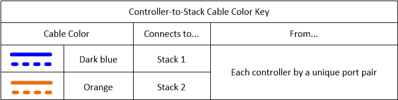

= Esempio di cablaggio e foglio di lavoro controller-to-stack per una configurazione ha quad-path con due HBA SAS quad-port - shelf con moduli IOM12/IOM12B
:allow-uri-read: 
:icons: font
:imagesdir: ../media/

[role="lead"]
È possibile utilizzare il foglio di lavoro completo di cablaggio controller-to-stack e l'esempio di cablaggio per collegare una configurazione ha quad-path con due HBA SAS quad-port.

* Se necessario, fare riferimento a. link:install-cabling-rules.html["Regole di cablaggio SAS"] per informazioni sulle configurazioni supportate, la convenzione di numerazione degli slot del controller, la connettività shelf-to-shelf e la connettività controller-to-shelf (incluso l'utilizzo di coppie di porte).
* Se necessario, fare riferimento a. link:install-cabling-worksheets-how-to-read-quadpath.html["Come leggere un foglio di lavoro per collegare le connessioni controller-to-stack per la connettività quad-path"].
* L'esempio di cablaggio mostra i cavi controller-to-stack come pieni o tratteggiati per distinguere le connessioni delle porte controller A e C dalle connessioni delle porte controller B e D.
+
image::../media/drw_controller_to_stack_cable_type_key.gif[Chiave del tipo di cavo per il cablaggio da controller a stack]

* I cavi degli esempi di cablaggio e le relative coppie di porte nelle schede di lavoro sono codificati a colori per distinguere la connettività con ogni stack nella coppia ha.
+

* L'esempio di cablaggio distingue visivamente i due set di cavi multipath necessari per ottenere una connettività quad-path per ciascun controller a ogni stack in una configurazione a coppia ha o a singolo controller.
+
Il primo set di cavi multipath viene definito "`multipath`". Il secondo gruppo di cavi multipath viene definito "`quad-path`". Il secondo gruppo di cavi viene definito "`quad-path`" perché il completamento di questo gruppo di cavi offre la connettività quad-path.

+
image::../media/drw_controller_to_stack_quad_pathed_connectivity_key.gif[Tasto a colori per la connettività quad pathed]

* L'esempio del foglio di lavoro mostra le coppie di porte designate per il cablaggio a più percorsi o il cablaggio a quattro percorsi verso lo stack applicabile.
+
Ogni coppia di porte designata per il cablaggio multipath è circondata da un ovale del colore associato allo stack a cui è collegato. Ogni coppia di porte designata per il cablaggio a quattro percorsi è circondata da un rettangolo che corrisponde al colore associato allo stack a cui è collegato.

== Ha quad-path con due HBA SAS a quattro porte e due stack multi-shelf

Il seguente esempio di foglio di lavoro e cablaggio utilizza coppie di porte 1a/2b (multipath) e 2a/1d (quad-path) per lo stack 1 e coppie di porte 1c/2d (multipath) e 2c/1b (quad-path) per lo stack 2.

image::../media/drw_worksheet_qpha_slots_1_and_2_two_4porthbas_two_stacks_nau.gif[Foglio di lavoro di cablaggio per ha quad path]

image::../media/drw_qpha_slots_1_and_2_two_4porthbas_two_stacks_nau.gif[Ha quad path con due HBA SAS a quattro porte e due stack multi-shelf]
