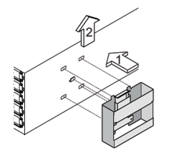

= Aggiunta a caldo di shelf IOM12/IOM12B a una pila di shelf IOM6
:allow-uri-read: 
:icons: font
:imagesdir: ../media/

[role="lead"]
Quando è necessario storage aggiuntivo, è possibile aggiungere a caldo shelf IOM12/IOM12B (shelf SAS con moduli IOM12/IOM12B) a uno stack di shelf IOM6 (shelf SAS con moduli IOM6), il che significa che è possibile combinare uno stack.

== Requisiti per un hot-add

La configurazione (sistema) della coppia ha, del controller singolo o dello stretch MetroCluster deve soddisfare determinati requisiti prima di aggiungere a caldo gli shelf IOM12/IOM12B a uno stack di shelf IOM6.

NOTE: Per le configurazioni MetroCluster collegate tramite bridge, vedere <<Requisiti per un'aggiunta a caldo nelle configurazioni MetroCluster collegate a ponte>>.

* Il sistema e la versione di ONTAP devono supportare una combinazione di shelf IOM6 e shelf IOM12/IOM12B nello stesso stack (uno stack misto).
+
È possibile verificare il supporto utilizzando uno dei seguenti metodi:

+
** Inserire il ``run local sysconfig`` al prompt admin di uno dei controller.
+
Se il campo SAS2/SAS3 Mixed Stack Support (supporto stack misto SAS2/SAS3) non viene visualizzato nell'output o ha il valore "None" (nessuno), il sistema non supporta stack misti.

+
Se nel campo SAS2/SAS3 Mixed Stack Support viene visualizzato "All" (tutti), il sistema supporta stack misti.

+
Se nel campo SAS2/SAS3 Mixed Stack Support viene visualizzato il messaggio "bridge-attached", il sistema supporta stack misti solo se gli shelf di storage sono collegati tramite un ATTO FibreBridge.

** Accedere a Hardware Universe e accedere alle informazioni sulla piattaforma.
+
https://hwu.netapp.com["NetApp Hardware Universe"^]

* Se si aggiunge uno shelf a una configurazione MetroCluster, la configurazione deve soddisfare tutti i requisiti indicati nelle guide di installazione e configurazione di MetroCluster.
+
http://docs.netapp.com/ontap-9/topic/com.netapp.doc.dot-mcc-inst-cnfg-ip/home.html["Guida all'installazione e alla configurazione di MetroCluster IP"^]

+
http://docs.netapp.com/ontap-9/topic/com.netapp.doc.dot-mcc-inst-cnfg-stretch/home.html["Guida all'installazione e alla configurazione di ONTAP 9 Stretch MetroCluster"^]

+
http://docs.netapp.com/ontap-9/topic/com.netapp.doc.dot-mcc-inst-cnfg-fabric/home.html["Guida all'installazione e alla configurazione di ONTAP 9 Fabric-Attached MetroCluster"^]

* Lo stack di shelf IOM6, a cui si aggiunge a caldo uno shelf IOM12/IOM12B, deve essere cablato con cavi di rame SAS (per tutte le connessioni shelf-to-shelf e controller-to-stack).
+
I cavi ottici SAS non sono supportati in uno stack misto.

+

NOTE: Se lo shelf stack IOM6 è cablato con cavi ottici SAS, non è possibile aggiungere a caldo uno shelf IOM12/IOM12B. Contatta il tuo commerciale NetApp.

* Il sistema deve avere un numero inferiore al numero massimo di dischi supportati, almeno del numero di dischi che possono essere installati negli shelf IOM12/IOM12B che si stanno aggiungendo a caldo.
+
Non è possibile superare il numero massimo di dischi supportati per il sistema dopo l'aggiunta a caldo di shelf IOM12/IOM12B.

+
https://hwu.netapp.com["NetApp Hardware Universe"^]

* Il sistema non può visualizzare messaggi di errore relativi al cablaggio SAS.
+
È necessario correggere eventuali errori di cablaggio utilizzando le azioni correttive fornite dai messaggi di errore.

+
https://mysupport.netapp.com/site/tools["Download NetApp: Config Advisor"^]

* È necessario aver ordinato e ricevuto gli shelf IOM12/IOM12B e il numero e i tipi appropriati di cavi in rame SAS.
+
Gli shelf IOM12/IOM12B utilizzano connettori HD mini-SAS. Gli shelf IOM6 utilizzano connettori QSFP.

== Requisiti per un'aggiunta a caldo nelle configurazioni MetroCluster collegate a ponte

Se si aggiungono a caldo shelf IOM12/IOM12B a uno stack di shelf IOM6 collegati mediante una coppia di bridge ATTO FibreBridge in una configurazione MetroCluster, il sistema deve soddisfare determinati requisiti.

* Se le porte SAS bridge sono disponibili nella configurazione corrente, aggiungere gli shelf IOM12/IOM12B come stack separato.
+
Utilizzare tutte le porte bridge prima di combinare i moduli IOM12/IOM12B e IOM6 in uno stack.

* Il sistema e la versione di ONTAP devono supportare una combinazione di shelf IOM6 e shelf IOM12/IOM12B nello stesso stack (uno stack misto).
+
È possibile verificare il supporto utilizzando uno dei seguenti metodi:

+
** Inserire il ``run local sysconfig`` al prompt admin di uno dei controller.
+
Se il campo SAS2/SAS3 Mixed Stack Support (supporto stack misto SAS2/SAS3) non viene visualizzato nell'output o il valore è NONE (nessuno), il sistema non supporta stack misti.

+
Se nel campo SAS2/SAS3 Mixed Stack Support (supporto stack misto SAS2/SAS3) viene visualizzato un altro elemento, ad esempio All (tutti) o Bridge-Attached (collegati tramite bridge), il sistema supporta stack misti.

** Accedere a Hardware Universe e accedere alle informazioni sulla piattaforma.
+
https://hwu.netapp.com["NetApp Hardware Universe"^]

* La configurazione deve soddisfare tutti i requisiti indicati nelle guide di installazione e configurazione di MetroCluster.
+
https://docs.netapp.com/us-en/ontap-metrocluster/install-stretch/index.html["Installazione e configurazione di una configurazione Stretch MetroCluster"^]

+
https://docs.netapp.com/us-en/ontap-metrocluster/install-fc/index.html["Installazione e configurazione di una configurazione Fabric-Attached MetroCluster"^]

* Lo stack di shelf IOM6, a cui si aggiunge a caldo uno shelf IOM12/IOM12B, deve essere cablato con cavi di rame SAS (per tutte le connessioni shelf-to-shelf e controller-to-stack).
+
I cavi ottici SAS non sono supportati in uno stack misto.

+

NOTE: Se lo shelf stack IOM6 è cablato con cavi ottici SAS, non è possibile aggiungere a caldo uno shelf IOM12/IOM12B. Contatta il tuo commerciale NetApp.

* La configurazione deve avere un numero inferiore al numero massimo di dischi supportati per una porta bridge.
* È necessario aver ordinato e ricevuto gli shelf IOM12/IOM12B e il numero e i tipi appropriati di cavi in rame SAS.
+
Gli shelf IOM12/IOM12B utilizzano connettori HD mini-SAS. Gli shelf IOM6 utilizzano connettori QSFP.

* Il bridge deve disporre della versione firmware 3.16/4.16 e successiva.

== Considerazioni per un hot-add

Prima di aggiungere a caldo gli shelf IOM12/IOM12B a uno stack di shelf IOM6, è necessario acquisire familiarità con gli aspetti e le Best practice di questa procedura.

=== Considerazioni generali

* Si consiglia vivamente di utilizzare gli shelf IOM12/IOM12B che si stanno aggiungendo a caldo con la versione firmware 0260 o successiva, prima di cablarli al sistema.
+
La disponibilità di una versione supportata del firmware dello shelf protegge dai problemi di accesso allo stack di storage se lo shelf aggiunto a caldo non è stato collegato correttamente allo stack.

+
Dopo aver scaricato il firmware dello shelf IOM12/IOM12B sugli shelf, verificare che la versione del firmware sia 0260 o successiva immettendo il `storage shelf show -module` alla console di uno dei controller.

* Il consolidamento dello stack senza interruzioni non è supportato.
+
Non è possibile utilizzare questa procedura per aggiungere a caldo shelf di dischi che sono stati rimossi a caldo da un altro stack nello stesso sistema quando il sistema è acceso e fornisce dati (i/o è in corso).

* È possibile utilizzare questa procedura per aggiungere a caldo shelf di dischi rimossi a caldo nello stesso sistema MetroCluster se lo shelf interessato ha aggregati mirrorati.
* Quando si aggiungono a caldo shelf con moduli IOM12/IOM12B a uno stack di shelf con moduli IOM6, le prestazioni dell'intero stack funzionano a 6 Gbps (funziona alla velocità comune più bassa).
+
Se gli shelf che si stanno aggiungendo a caldo sono shelf che sono stati aggiornati dai moduli IOM3 o IOM6 ai moduli IOM12/IOM12B, lo stack funziona a 12 Gbps; tuttavia, le funzionalità del disco e del backplane dello shelf possono limitare le prestazioni dei dischi a 3 Gbps o 6 Gbps.

* Dopo aver cablato uno shelf aggiunto a caldo, ONTAP riconosce lo shelf:
+
** La proprietà del disco viene assegnata se è attivata l'assegnazione automatica del disco.
** Il firmware dello shelf (IOM) e del disco devono essere aggiornati automaticamente, se necessario.
+

NOTE: Gli aggiornamenti del firmware possono richiedere fino a 30 minuti.

=== Considerazioni sulle Best practice

* *Best practice:* la Best practice consiste nel disporre delle versioni correnti del firmware dello shelf (IOM) e del firmware del disco sul sistema prima di aggiungere a caldo uno shelf.
+
https://mysupport.netapp.com/site/downloads/firmware/disk-shelf-firmware["Download NetApp: Firmware shelf di dischi"^]

+
https://mysupport.netapp.com/site/downloads/firmware/disk-drive-firmware["Download NetApp: Firmware del disco"^]

NOTE: Non riportare il firmware a una versione che non supporta lo shelf e i relativi componenti.

* *Best practice:* la Best practice consiste nell'installare la versione corrente del Disk Qualification Package (DQP) prima di aggiungere a caldo uno shelf.
+
L'installazione della versione corrente di DQP consente al sistema di riconoscere e utilizzare dischi appena qualificati. In questo modo si evitano messaggi di eventi di sistema relativi alla presenza di informazioni non aggiornate sui dischi e alla prevenzione della partizione dei dischi perché i dischi non vengono riconosciuti. Inoltre, il DQP notifica la presenza di firmware del disco non aggiornato.

+
https://mysupport.netapp.com/site/downloads/firmware/disk-drive-firmware/download/DISKQUAL/ALL/qual_devices.zip["Download NetApp: Pacchetto di qualificazione dei dischi"^]

* *Best practice:* la Best practice consiste nell'eseguire Active IQ Config Advisor prima e dopo l'aggiunta a caldo di uno shelf.
+
L'esecuzione di Active IQ Config Advisor prima dell'aggiunta a caldo di uno shelf fornisce un'istantanea della connettività SAS esistente, verifica le versioni firmware dello shelf (IOM) e consente di verificare un ID shelf già in uso nel sistema. L'esecuzione di Active IQ Config Advisor dopo l'aggiunta a caldo di uno shelf consente di verificare che gli shelf siano cablati correttamente e che gli shelf ID siano univoci all'interno del sistema.

+
https://mysupport.netapp.com/site/tools["Download NetApp: Config Advisor"^]

* *Best practice:* la Best practice consiste nell'eseguire sul sistema un protocollo IBACP (in-band ACP).
+
** Per i sistemi in cui IBACP è in esecuzione, IBACP viene attivato automaticamente sugli shelf IOM12/IOM12B aggiunti a caldo.
** Per i sistemi in cui è abilitato l'ACP out-of-band, le funzionalità ACP non sono disponibili sugli shelf IOM12/IOM12B.
+
Eseguire la migrazione a IBACP e rimuovere il cablaggio ACP out-of-band.

** Se il sistema non esegue IBACP e il sistema soddisfa i requisiti IBACP, è possibile migrare il sistema a IBACP prima di aggiungere a caldo uno shelf IOM12.
+
https://kb.netapp.com/Advice_and_Troubleshooting/Data_Storage_Systems/FAS_Systems/In-Band_ACP_Setup_and_Support["Istruzioni per la migrazione a IBACP"^]

+

NOTE: Le istruzioni di migrazione forniscono i requisiti di sistema per IBACP.

== Prepararsi ad assegnare manualmente la proprietà del disco per un'aggiunta a caldo

Se si assegna manualmente la proprietà del disco per gli shelf IOM12/IOM12B che si stanno aggiungendo a caldo, è necessario disattivare l'assegnazione automatica del disco, se attivata.

.Prima di iniziare
È necessario aver soddisfatto i requisiti di sistema.

<<Requisiti per un hot-add>>

<<Requisiti per un'aggiunta a caldo nelle configurazioni MetroCluster collegate a ponte>>

.A proposito di questa attività
Se si dispone di una coppia ha, è necessario assegnare manualmente la proprietà del disco se i dischi nello shelf saranno di proprietà di entrambi i moduli controller.

.Fasi
. Verificare se l'assegnazione automatica dei dischi è abilitata: `storage disk option show`
+
Se si dispone di una coppia ha, è possibile immettere il comando su entrambi i moduli controller.

+
Se l'assegnazione automatica dei dischi è attivata, viene visualizzato l'output `on` Nella colonna "`Auto Assign`" (assegnazione automatica) (per ciascun modulo controller).

. Se l'assegnazione automatica dei dischi è attivata, disattivarla: `storage disk option modify -node _node_name_ -autoassign off`
+
Se si dispone di una configurazione MetroCluster a due nodi o coppia ha, è necessario disattivare l'assegnazione automatica del disco su entrambi i moduli controller.

== Installare gli shelf per un hot-add

Per ogni shelf che si sta aggiungendo a caldo, si installa lo shelf in un rack, si collegano i cavi di alimentazione, si accende lo shelf e si imposta l'ID dello shelf.

. Installare il kit per il montaggio in rack (per installazioni in rack a due o quattro montanti) fornito con lo shelf di dischi utilizzando il volantino di installazione fornito con il kit.
+
[NOTE]
====
Se si installano più shelf di dischi, installarli dal basso verso la parte superiore del rack per ottenere la massima stabilità.

====
+
[CAUTION]
====
Non montare lo shelf di dischi in un rack di tipo teleco con montaggio a flangia; il peso dello shelf di dischi può causare il collasso nel rack sotto il proprio peso.

====
. Installare e fissare lo shelf di dischi sulle staffe di supporto e sul rack utilizzando l'opuscolo di installazione fornito con il kit.
+
Per rendere uno shelf di dischi più leggero e facile da manovrare, rimuovere gli alimentatori e i moduli i/o (IOM).

+
Per gli shelf di dischi DS460C, anche se i dischi sono confezionati separatamente, il che rende lo shelf più leggero, uno shelf DS460C vuoto pesa ancora circa 132 kg; pertanto, prestare attenzione quando si sposta uno shelf.

+

CAUTION: Si consiglia di utilizzare un sollevatore meccanico o quattro persone che utilizzano le maniglie di sollevamento per spostare in sicurezza un ripiano DS460C vuoto.

+
La spedizione DS460C è stata fornita con quattro maniglie di sollevamento rimovibili (due per ciascun lato). Per utilizzare le maniglie di sollevamento, installarle inserendo le linguette delle maniglie negli slot sul lato dello scaffale e spingendole verso l'alto fino a quando non scattano in posizione. Quindi, quando si fa scorrere lo shelf di dischi sulle guide, si scollega un set di maniglie alla volta utilizzando il dispositivo di chiusura con pollice. La figura seguente mostra come collegare una maniglia di sollevamento.

+

. Reinstallare eventuali alimentatori e IOM rimossi prima di installare lo shelf di dischi nel rack.
. Se si sta installando uno shelf di dischi DS460C, installare le unità nei cassetti delle unità; in caso contrario, passare alla fase successiva.
+
[NOTE]
====
Indossare sempre un braccialetto antistatico collegato a terra su una superficie non verniciata dello chassis del contenitore di storage per evitare scariche elettrostatiche.

Se non è disponibile un braccialetto, toccare una superficie non verniciata sullo chassis del contenitore di storage prima di maneggiare il disco.

====
+
Se è stato acquistato uno shelf parzialmente popolato, ovvero che lo shelf ha meno di 60 dischi supportati, per ciascun cassetto, installare i dischi come segue:

+
** Installare le prime quattro unità negli slot anteriori (0, 3, 6 e 9).
+

NOTE: *Rischio di malfunzionamento dell'apparecchiatura:* per consentire un corretto flusso d'aria ed evitare il surriscaldamento, installare sempre le prime quattro unità negli slot anteriori (0, 3, 6 e 9).

** Per i dischi rimanenti, distribuirli in modo uniforme in ciascun cassetto.

La seguente illustrazione mostra come i dischi sono numerati da 0 a 11 in ogni cassetto all'interno dello shelf.

image::../media/dwg_trafford_drawer_with_hdds_callouts.gif[Numerazione delle unità]

. Aprire il cassetto superiore dello shelf.
. Rimuovere un'unità dalla busta ESD.
. Sollevare la maniglia della camma sull'unità in verticale.
. Allineare i due pulsanti rialzati su ciascun lato del supporto dell'unità con lo spazio corrispondente nel canale dell'unità sul cassetto dell'unità.
+
image::../media/28_dwg_e2860_de460c_drive_cru.gif[Posizione dei pulsanti rialzati sulla trasmissione]

+
[cols="10,90"]
|===

| image:../media/legend_icon_01.png["Numero di didascalia 1"] | Pulsante sollevato sul lato destro del supporto dell'unità 
|===
. Abbassare l'unità, quindi ruotare la maniglia della camma verso il basso fino a quando non scatta in posizione sotto il dispositivo di chiusura arancione.
. Ripetere i passaggi precedenti per ciascuna unità del cassetto.
+
Assicurarsi che gli slot 0, 3, 6 e 9 di ciascun cassetto contengano dischi.

. Spingere con cautela il cassetto dell'unità all'interno del contenitore.
+
|===

 a| 
image:../media/2860_dwg_e2860_de460c_gentle_close.gif["Chiudere delicatamente il cassetto"]

 a| 

CAUTION: *Possibile perdita di accesso ai dati:* non chiudere mai il cassetto. Spingere lentamente il cassetto per evitare di strattonare il cassetto e danneggiare lo storage array.

|===
. Chiudere il cassetto dell'unità spingendo entrambe le leve verso il centro.
. Ripetere questa procedura per ciascun cassetto dello shelf di dischi.
. Fissare il pannello anteriore.
+
.. Se si stanno aggiungendo più shelf di dischi, ripetere i passaggi precedenti per ogni shelf di dischi che si sta installando.
.. Collegare gli alimentatori per ogni shelf di dischi:

. Collegare i cavi di alimentazione prima agli shelf di dischi, fissandoli in posizione con il fermo del cavo di alimentazione, quindi collegare i cavi di alimentazione a diverse fonti di alimentazione per garantire la resilienza.
. Accendere gli alimentatori per ogni shelf di dischi e attendere che i dischi si attivino.
+
.. Impostare l'ID dello shelf per ogni shelf che si sta aggiungendo a caldo a un ID univoco nella configurazione a coppia ha o a controller singolo.
+
Un ID shelf valido va da 00 a 99. Si consiglia di impostare gli ID dello shelf in modo che gli shelf IOM6 utilizzino numeri inferiori (1 - 9) e gli shelf IOM12/IOM12B utilizzino numeri superiori (10 e superiori).

+
Se si dispone di un modello di piattaforma con storage integrato, gli ID degli shelf devono essere univoci sullo shelf interno e sugli shelf collegati esternamente. Si consiglia di impostare lo shelf interno su 0. Nelle configurazioni MetroCluster IP, si applicano solo i nomi degli shelf esterni, pertanto i nomi degli shelf non devono essere univoci.

. Se necessario, verificare gli shelf ID già in uso eseguendo Active IQ Config Advisor.
+
https://mysupport.netapp.com/site/tools["Download NetApp: Config Advisor"^]

+
È inoltre possibile eseguire `storage shelf show -fields shelf-id` Per visualizzare un elenco di shelf ID già in uso (e duplicati, se presenti) nel sistema.

. Accedere al pulsante ID dello shelf dietro il cappuccio terminale sinistro.
. Modificare il primo numero dell'ID dello shelf tenendo premuto il tasto arancione fino a quando il primo numero sul display digitale non lampeggia, operazione che può richiedere fino a tre secondi.
. Premere il pulsante per avanzare il numero fino a raggiungere il numero desiderato.
. Ripetere i passaggi secondari c e d per il secondo numero.
. Per uscire dalla modalità di programmazione, tenere premuto il pulsante fino a quando il secondo numero non smette di lampeggiare, che può richiedere fino a tre secondi.
. Spegnere e riaccendere lo shelf per rendere effettivo l'ID dello shelf.
+
Per completare il ciclo di alimentazione, è necessario spegnere entrambi gli interruttori, attendere 10 secondi, quindi riaccenderli.

. Ripetere i passaggi secondari da b a g per ogni shelf che si sta aggiungendo a caldo.

== Ripiani per cavi per aggiungere a caldo

Il modo in cui collegare uno shelf IOM12/IOM12B a uno stack di shelf IOM6 dipende dal fatto che lo shelf IOM12/IOM12B sia lo shelf IOM12/IOM12B iniziale, il che significa che non esistono altri shelf IOM12/IOM12B nello stack, Oppure se si tratta di uno shelf IOM12/IOM12B aggiuntivo per uno stack misto esistente, il che significa che uno o più shelf IOM12/IOM12B sono già presenti nello stack. Dipende anche dal fatto che lo stack disponga di connettività ha multipath, ha triPath, multipath, ha single-path o single path.

.Prima di iniziare
* È necessario aver soddisfatto i requisiti di sistema.
+
<<Requisiti per un hot-add>>

* È necessario aver completato la procedura di preparazione, se applicabile.
+
<<Prepararsi ad assegnare manualmente la proprietà del disco per un'aggiunta a caldo>>

* È necessario installare gli shelf, accenderli e impostare gli ID dello shelf.
+
<<Installare gli shelf per un hot-add>>

.A proposito di questa attività
* È sempre possibile aggiungere a caldo gli shelf IOM12/IOM12B all'ultimo shelf logico di uno stack per mantenere una transizione a velocità singola all'interno dello stack.
+
Aggiungendo a caldo gli shelf IOM12/IOM12B all'ultimo shelf logico di uno stack, gli shelf IOM6 rimangono raggruppati insieme e gli shelf IOM12/IOM12B rimangono raggruppati insieme in modo che vi sia una singola transizione di velocità tra i due gruppi di shelf.

+
Ad esempio:

+
** In una coppia ha, una singola transizione di velocità all'interno di uno stack avente due shelf IOM6 e due shelf IOM12/IOM12B è rappresentata come:
+
 Controller <-> IOM6 <-> IOM6 <---> IOM12/IOM12B <-> IOM12/IOM12B <-> Controller
** In una coppia ha con storage interno (IOM12E/IOM12G), una singola transizione di velocità all'interno di uno stack avente due shelf IOM12/IOM12B e due shelf IOM6 è rappresentata come:
+
 IOM12E 0b/IOM12G 0b1 <-> IOM12/IOM12B <-> IOM12/IOM12B <---> IOM6 <-> IOM6 <-> IOM12E 0a/IOM12G 0a
+
La porta di storage interna 0b/0b1 è la porta dello storage interno (espansore) e poiché si collega allo shelf IOM12/IOM12B aggiunto a caldo (l'ultimo shelf nello stack), il gruppo di shelf IOM12/IOM12B viene mantenuto insieme e viene mantenuta una singola transizione attraverso lo stack e lo storage IOM12E/IOM12G interno.

* In uno stack misto è supportata solo una transizione a velocità singola. Non è possibile effettuare transizioni di velocità aggiuntive. Ad esempio, non è possibile avere due transizioni di velocità all'interno di uno stack, come illustrato di seguito:
+
 Controller <-> IOM6 <-> IOM6 <---> IOM12/IOM12B <-> IOM12/IOM12B <---> IOM6 <-> Controller
* È possibile aggiungere a caldo shelf IOM6 a uno stack misto. Tuttavia, è necessario aggiungerli a caldo ai lati dello stack con gli shelf IOM6 (gruppo esistente di shelf IOM6) per mantenere la transizione a velocità singola nello stack.
* È possibile collegare gli shelf IOM12/IOM12B collegando prima le porte SAS sul percorso IOM A, quindi ripetere la procedura di cablaggio per il percorso IOM B, come applicabile alla connettività dello stack.
+

NOTE: In una configurazione MetroCluster, non è possibile utilizzare il percorso IOM B.

* Lo shelf IOM12/IOM12B iniziale (lo shelf che si collega all'ultimo shelf IOM6 logico) si collega sempre alle porte circolari dello shelf IOM6 (non alle porte quadrate).
* I connettori dei cavi SAS sono dotati di chiave; se orientati correttamente in una porta SAS, il connettore scatta in posizione.
+
Per gli scaffali, inserire un connettore per cavo SAS con la linguetta rivolta verso il basso (nella parte inferiore del connettore). Per i controller, l'orientamento delle porte SAS può variare a seconda del modello di piattaforma; pertanto, l'orientamento corretto del connettore del cavo SAS varia.

* È possibile fare riferimento alla seguente illustrazione per il cablaggio degli shelf IOM12/IOM12B su uno shelf stack IOM6 in una configurazione che non utilizza bridge FC-SAS.
+
Questa illustrazione è specifica di uno stack con connettività ha multipath; tuttavia, il concetto di cablaggio può essere applicato a stack con configurazioni ha multipath, ha a tre percorsi, ha a percorso singolo, a percorso singolo e MetroCluster stretch.

+
image::../media/drw_sas2_sas3_mixed_stack.png[Cablaggio stack misto multipath]

* È possibile fare riferimento alla seguente illustrazione per il cablaggio di shelf IOM12/IOM12B a uno stack di shelf IOM6 in una configurazione MetroCluster con collegamento a ponte. image:../media/hot_adding_iom12_shelves_to_iom6_stack_in_bridge_attached_config.png["Cablaggio stack misto in configurazione bridge-attached"]

.Fasi
. Identificare fisicamente l'ultimo shelf logico nello stack.
+
A seconda del modello di piattaforma e della connettività dello stack (ha multipath, ha tri-path, multipath, ha single path o single path), L'ultimo shelf logico è lo shelf con connessioni controller-to-stack dalle porte SAS B e D del controller, oppure lo shelf non ha connessioni a nessun controller (perché la connettività controller-to-stack è al top logico dello stack, attraverso le porte SAS del controller A e C).

. Se lo shelf IOM12/IOM12B che si sta aggiungendo a caldo è lo shelf IOM12/IOM12B iniziale che viene aggiunto allo stack IOM6, il che significa che non esistono altri shelf IOM12/IOM12B nello shelf stack IOM6, completare i passaggi secondari applicabili.
+

NOTE: Assicurarsi di attendere almeno 70 secondi tra lo scollegamento e il ricollegamento di un cavo e quando si sostituisce un cavo con un altro.

+
In caso contrario, passare alla fase 3.

+
[cols="2*"]
|===
| Se la connettività dello stack IOM6 è... | Quindi... 

 a| 
Ha multipath, ha tri-path, multipath o ha single-path con connettività del controller all'ultimo shelf logico (incluse le configurazioni Stretch MetroCluster)
 a| 
.. Scollegare il cavo controller-to-stack dall'ultima porta IOM A circolare dello shelf IOM6 al controller o al bridge.
+
Prendere nota della porta del controller.

+
Mettere da parte il cavo. Non è più necessario.

+
In caso contrario, passare alla sottofase e.

.. Collegare il collegamento shelf-to-shelf tra l'ultima porta IOM A circolare dello shelf IOM6 (dal passaggio a) alla nuova porta IOM A dello shelf IOM12/IOM12B 1.
+
Utilizzare un cavo SAS QSFP-to-Mini-SAS HD in rame.

.. Se si aggiunge a caldo un altro shelf IOM12/IOM12B, collegare il collegamento shelf-to-shelf tra la porta IOM A 3 dello shelf IOM12/IOM12B collegato e la porta IOM A 1 dello shelf IOM12/IOM12B successiva.
+
Utilizzare un cavo SAS HD-mini-SAS in rame-mini-SAS.

+
In caso contrario, passare alla fase successiva.

.. Ristabilire la connessione controller-to-stack cablando la stessa porta sul controller o sul bridge (nella fase a) alla nuova porta IOM A dello shelf IOM12/IOM12B 3.
+
Utilizzare un cavo SAS HD da QSFP a Mini SAS in rame o un cavo Mini SAS HD-Mini SAS HD-SAS, a seconda del tipo di porta sul controller.

.. Ripetere i passaggi secondari da a a d per IOM B.
+
In caso contrario, passare alla fase 4.

 a| 
Connettività con collegamento a ponte in una configurazione MetroCluster
 a| 
.. Scollegare il cavo bridge-to-stack inferiore dall'ultima porta IOM A circolare dello shelf IOM6 al bridge.
+
Prendere nota della porta bridge.

+
Mettere da parte il cavo. Non è più necessario.

+
In caso contrario, passare alla sottofase e.

.. Collegare il collegamento shelf-to-shelf tra l'ultima porta IOM A circolare dello shelf IOM6 (dal passaggio a) alla nuova porta IOM A dello shelf IOM12/IOM12B 1.
+
Utilizzare un cavo SAS QSFP-to-Mini-SAS HD in rame.

.. Se si aggiunge a caldo un altro shelf IOM12/IOM12B, collegare il collegamento shelf-to-shelf tra la porta IOM A 3 dello shelf IOM12/IOM12B collegato e la porta IOM A 1 dello shelf IOM12/IOM12B successiva.
+
Utilizzare un cavo SAS HD-mini-SAS in rame-mini-SAS.

+
In caso contrario, passare alla fase successiva.

.. Ripetere i passaggi secondari b e c per collegare i collegamenti shelf-to-shelf per IOM B.
.. Ristabilire la connessione bridge-to-stack inferiore cablando la stessa porta sul bridge (nella fase a) alla nuova porta IOM A 3 dello shelf IOM12/IOM12B.
+
Utilizzare un cavo SAS HD da QSFP a Mini SAS in rame o un cavo Mini SAS HD-Mini SAS HD-SAS, a seconda del tipo di porta sul controller.

.. Passare alla fase 4.

 a| 
Ha a percorso singolo o a percorso singolo senza connettività del controller all'ultimo shelf logico
 a| 
.. Cablare il collegamento shelf-to-shelf tra l'ultima porta IOM A circolare dello shelf IOM e la nuova porta IOM A dello shelf IOM IOM M12/IOM 12B 1.
+
Utilizzare un cavo SAS QSFP-to-Mini-SAS HD in rame.

.. Ripetere il passaggio precedente per IOM B.
.. Se si sta aggiungendo a caldo un altro shelf IOM12/IOM12B, ripetere i passaggi secondari a e b.
+
In caso contrario, passare alla fase 4.

|===
. Se lo shelf IOM12/IOM12B che si sta aggiungendo a caldo è uno shelf IOM12/IOM12B aggiuntivo a uno stack misto esistente, il che significa che uno o più shelf IOM12/IOM12B sono già presenti nello stack, completare i passaggi secondari applicabili.
+

NOTE: Assicurarsi di attendere almeno 70 secondi tra lo scollegamento e il ricollegamento di un cavo e se si sta sostituendo un cavo più lungo.

+
[cols="2*"]
|===
| Se la connettività dello stack misto è... | Quindi... 

 a| 
Ha multipath, ha tri-path, multipath o ha single-path con connettività controller all'ultimo shelf logico o connettività bridge-attached in una configurazione MetroCluster
 a| 
.. Spostare il cavo controller-to-stack dall'ultima porta IOM A dello shelf IOM12/IOM12B alla stessa porta del nuovo shelf IOM12/IOM12B.
.. Se si sta aggiungendo a caldo uno shelf IOM12/IOM12B, collegare il collegamento shelf-to-shelf tra la vecchia porta IOM A 3 dello shelf IOM12/IOM12B alla nuova porta IOM A 1 dello shelf IOM12/IOM12B.
+
Utilizzare un cavo SAS HD-mini-SAS in rame-mini-SAS.

+
In caso contrario, passare alla fase successiva.

.. Se si aggiungono a caldo più shelf IOM12/IOM12B, collegare il collegamento shelf-to-shelf tra l'ultima porta IOM A dello shelf IOM12/IOM12B precedente 3 e la porta IOM A 1 dello shelf IOM12/IOM12B successiva, quindi ripetere questa operazione per gli shelf IOM12/IOM12B aggiuntivi.
+
Utilizzare cavi SAS HD-mini-SAS HD-mini-SAS in rame aggiuntivi.

+
In caso contrario, passare alla fase successiva.

.. Ripetere i passaggi secondari da a a c per IOM B.
+
In caso contrario, passare alla fase 4.

 a| 
Connettività con collegamento a ponte in una configurazione MetroCluster
 a| 
.. Spostare il cavo bridge-to-stack inferiore dal vecchio shelf IOM12/IOM12B alla stessa porta del nuovo shelf IOM12/IOM12B.
.. Collegare il collegamento shelf-to-shelf tra la vecchia porta IOM A dello shelf IOM12/IOM12B 3 e la successiva porta IOM A dello shelf IOM12/IOM12B 1, quindi ripetere questa operazione per tutti gli shelf IOM12/IOM12B aggiuntivi.
+
Utilizzare un cavo SAS HD-mini-SAS in rame-mini-SAS.

.. Collegare il collegamento shelf-to-shelf tra la vecchia porta IOM B dello shelf IOM12/IOM12B 3 e la successiva porta IOM B dello shelf IOM12/IOM12B 1, quindi ripetere questa operazione per tutti gli shelf IOM12/IOM12B aggiuntivi.
.. Passare alla fase 4.

 a| 
Ha a percorso singolo o a percorso singolo senza connettività del controller all'ultimo shelf logico
 a| 
.. Collegare il collegamento shelf-to-shelf tra l'ultima porta IOM A dello shelf IOM12/IOM12B 3 e la nuova porta IOM A dello shelf IOM12/IOM12B 1.
+
Utilizzare un cavo SAS HD-mini-SAS in rame-mini-SAS.

.. Ripetere il passaggio precedente per IOM B.
.. Se si sta aggiungendo a caldo un altro shelf IOM12/IOM12B, ripetere i passaggi secondari a e b.
+
In caso contrario, passare alla fase 4.

|===
. Verificare che le connessioni SAS siano cablate correttamente.
+
Se vengono generati errori di cablaggio, seguire le azioni correttive fornite.

+
https://mysupport.netapp.com/site/tools["Download NetApp: Config Advisor"^]

. Se l'assegnazione automatica del disco è stata disattivata durante la preparazione di questa procedura, è necessario assegnare manualmente la proprietà del disco e riattivare l'assegnazione automatica del disco, se necessario.
+
In caso contrario, la procedura viene completata.

+
<<Completare l'aggiunta a caldo>>

+

NOTE: Tutte le configurazioni MetroCluster richiedono l'assegnazione manuale del disco.

== Completare l'aggiunta a caldo

Se l'assegnazione automatica del disco è stata disattivata come parte della preparazione per l'aggiunta a caldo degli shelf IOM12/IOM12B allo stack di shelf IOM6, è necessario assegnare manualmente la proprietà del disco e, se necessario, riabilitare l'assegnazione automatica del disco.

.Prima di iniziare
È necessario aver già collegato lo shelf come indicato per il sistema.

<<Ripiani per cavi per aggiungere a caldo>>

.Fasi
. Visualizzare tutti i dischi non posseduti: `storage disk show -container-type unassigned`
+
Se si dispone di una coppia ha, è possibile immettere il comando su entrambi i moduli controller.

. Assegnare ciascun disco: `storage disk assign -disk _disk_name_ -owner _owner_name_`
+
Se si dispone di una coppia ha, è possibile immettere il comando su entrambi i moduli controller.

+
È possibile utilizzare il carattere jolly per assegnare più di un disco alla volta.

. Se necessario, riabilitare l'assegnazione automatica del disco: `storage disk option modify -node _node_name_ -autoassign on`
+
Se si dispone di una coppia ha, è necessario riabilitare l'assegnazione automatica del disco su entrambi i moduli controller.

