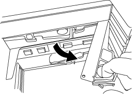

= Sostituire a caldo o sostituire un modulo IOM12/IOM12B - shelf con moduli IOM12/IOM12B
:allow-uri-read: 
:icons: font
:imagesdir: ../media/

[role="lead"]
La configurazione del sistema determina se è possibile eseguire una sostituzione a caldo IOM dello shelf senza interruzioni o una sostituzione IOM dello shelf in caso di guasto di un IOM dello shelf.

.Prima di iniziare
Tutti gli altri componenti del sistema, compreso l'altro modulo IOM12/IOM12B, devono funzionare correttamente.

.A proposito di questa attività
* Questa procedura si applica agli shelf con moduli IOM12 e shelf con moduli IOM12B.
+

NOTE: Questa procedura si applica a sostituzioni o sostituzioni IOM di shelf simili. Ciò significa che è possibile sostituire solo un modulo IOM12 con un altro modulo IOM12 o un modulo IOM12B con un altro modulo IOM12B. (Lo shelf può avere due moduli IOM12 o due moduli IOM12B).

* I moduli IOM12 e i moduli IOM12B si distinguono per il loro aspetto:
+
I moduli IOM12 si distinguono per l'etichetta "IOM12":

+
image::../media/drw_iom12.gif[drw iom12]

+
I moduli IOM12B sono caratterizzati da una striscia blu e da un'etichetta "IOM12B":

+
image::../media/iom12b.png[iom12b]

* Per le configurazioni multipath (ha multipath o multipath), ha trio-path e quad-path (ha quad-path o quad-path), è possibile sostituire a caldo un IOM shelf (senza interruzioni, sostituire un IOM shelf in un sistema acceso e che serve dati - i/o è in corso).
* Per le configurazioni ha a percorso singolo della serie FAS2600 e FAS2700, è necessario eseguire un'operazione di takeover e giveback per sostituire un IOM shelf in un sistema acceso e in grado di fornire dati. I/o in corso.
* Per le configurazioni a percorso singolo della serie FAS2600, è necessario arrestare il sistema per sostituire un IOM shelf.
+

NOTE: Se si tenta di sostituire a caldo un IOM di shelf su uno shelf di dischi con una connessione a percorso singolo, si perde l'accesso ai dischi nello shelf e agli eventuali shelf di dischi sottostanti. È anche possibile ridurre l'intero sistema.

* La procedura consigliata consiste nell'avere le versioni correnti del firmware dello shelf di dischi (IOM) e del firmware del disco sul sistema prima di aggiungere nuovi shelf di dischi, componenti FRU dello shelf o cavi SAS.
+
Le versioni correnti del firmware sono disponibili sul sito del supporto NetApp.

+
https://mysupport.netapp.com/site/downloads/firmware/disk-shelf-firmware["Download NetApp: Firmware shelf di dischi"^]

+
https://mysupport.netapp.com/site/downloads/firmware/disk-drive-firmware["Download NetApp: Firmware del disco"^]

* Il firmware dello shelf di dischi (IOM) viene aggiornato automaticamente (senza interruzioni) su un nuovo IOM dello shelf con una versione del firmware non aggiornata.
+
I controlli del firmware IOM sullo shelf avvengono ogni dieci minuti. L'aggiornamento del firmware IOM può richiedere fino a 30 minuti.

* Se necessario, è possibile attivare i LED di posizione (blu) dello shelf di dischi per individuare fisicamente lo shelf di dischi interessato: `storage shelf location-led modify -shelf-name _shelf_name_ -led-status on`
+
Uno shelf di dischi dispone di tre LED di posizione: Uno sul display operatore e uno su ciascun IOM dello shelf. I LED di posizione rimangono accesi per 30 minuti. È possibile disattivarli immettendo lo stesso comando, ma utilizzando l'opzione Off.

* Se necessario, fare riferimento alla sezione Monitoring disk shelf LED per informazioni sul significato e la posizione dei LED dello shelf di dischi sul display operatore e sui componenti FRU.

.Fasi
. Mettere a terra l'utente.
. Disimballare il nuovo IOM dello shelf e posizionare il nuovo IOM su una superficie piana vicino allo shelf del disco.
+
Conservare tutti i materiali di imballaggio per l'utilizzo quando si restituisce l'IOM dello shelf guasto.

. Identificare fisicamente l'IOM dello shelf guasto dal messaggio di avviso della console di sistema e il LED di attenzione illuminato (ambra) sullo shelf IOM guasto.
. Eseguire una delle seguenti operazioni in base al tipo di configurazione in uso:
+
[cols="2*"]
|===
| Se si dispone di un... | Quindi... 

 a| 
Configurazione ha multipath, ha tri-path, multipath, ha quad-path o quad-path
 a| 
Passare alla fase successiva.

 a| 
Configurazione ha a percorso singolo serie FAS2600 e serie FAS2700
 a| 
.. Determinare il nodo di destinazione (il nodo a cui appartiene lo shelf IOM guasto).
+
IOM A appartiene al controller 1. IOM B appartiene al controller 2.

.. Assumere il controllo del nodo di destinazione: `storage failover takeover -bynode _partner HA node_`

 a| 
Configurazione a percorso singolo della serie FAS2600
 a| 
.. Arrestare il sistema dalla console di sistema: `halt`
.. Verificare che il sistema sia stato arrestato controllando la console del sistema di storage.

|===
. Scollegare il cablaggio dall'IOM dello shelf che si desidera rimuovere.
+
Prendere nota delle porte IOM dello shelf a cui ciascun cavo è collegato.

. Premere il dispositivo di chiusura arancione sulla maniglia della IOM Cam dello scaffale fino a rilasciarla, quindi aprire completamente la maniglia della CAM per rilasciare lo shelf IOM dal piano intermedio.
+
image::../media/drw_iom_latch.png[fermo iom drw]

+

. Utilizzare la maniglia della camma per far scorrere l'IOM dello shelf fuori dallo shelf del disco.
+
Quando si maneggia un IOM per shelf, utilizzare sempre due mani per sostenere il peso.

. Attendere almeno 70 secondi dopo aver rimosso l'IOM dello shelf prima di installare il nuovo IOM dello shelf.
+
Attendere almeno 70 secondi consente al conducente di registrare correttamente l'ID dello shelf.

. Con due mani, con la maniglia a camma del nuovo ripiano IOM in posizione aperta, sostenere e allineare i bordi del nuovo ripiano IOM con l'apertura nello shelf del disco, quindi spingere con decisione il nuovo ripiano IOM fino a quando non raggiunge il piano intermedio.
+

NOTE: Non esercitare una forza eccessiva quando si inserisce l'IOM dello shelf nello shelf per evitare di danneggiare i connettori.

. Chiudere la maniglia della camma in modo che il dispositivo di chiusura scatti nella posizione di blocco e che lo scaffale IOM sia completamente inserito.
. Ricollegare il cablaggio.
+
I connettori dei cavi SAS sono dotati di chiavi; quando sono orientati correttamente in una porta IOM, il connettore scatta in posizione e il LED LNK della porta IOM si illumina di verde. Inserire un connettore per cavo SAS in una porta IOM con la linguetta rivolta verso il basso (nella parte inferiore del connettore).

. Eseguire una delle seguenti operazioni in base al tipo di configurazione in uso:
+
[cols="2*"]
|===
| Se si dispone di un... | Quindi... 

 a| 
Configurazione ha multipath, ha tri-path, multipath, ha quad-path o quad-path
 a| 
Passare alla fase successiva.

 a| 
Configurazione ha a percorso singolo serie FAS2600 e serie FAS2700
 a| 
Restituire il nodo di destinazione: `storage failover giveback -fromnode partner_HA_node`

 a| 
Configurazione a percorso singolo della serie FAS2600
 a| 
Riavviare il sistema.

|===
. Verificare che i collegamenti delle porte IOM dello shelf siano stati stabiliti.
+
Per ciascuna porta del modulo cablata, il LED LNK (verde) si illumina quando una o più delle quattro corsie SAS hanno stabilito un collegamento (con un adattatore o un altro shelf di dischi).

. Restituire la parte guasta a NetApp, come descritto nelle istruzioni RMA fornite con il kit.
+
Contattare il supporto tecnico all'indirizzo https://mysupport.netapp.com/site/global/dashboard["Supporto NetApp"], 888-463-8277 (Nord America), 00-800-44-638277 (Europa) o +800-800-80-800 (Asia/Pacifico) se si necessita del numero RMA o di ulteriore assistenza per la procedura di sostituzione.

