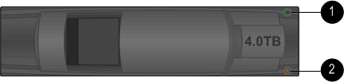

= LED shelf di dischi per monitor - shelf con moduli IOM12/IOM12B
:allow-uri-read: 
:icons: font
:imagesdir: ../media/

[role="lead"]
È possibile monitorare lo stato dello shelf di dischi conoscendo la posizione e le condizioni di stato dei LED sui componenti dello shelf di dischi.

== LED del pannello del display dell'operatore

I LED sul pannello di controllo anteriore dello shelf di dischi indicano se lo shelf di dischi funziona normalmente o se si verificano problemi con l'hardware.

La seguente tabella descrive i tre LED sul pannello del display dell'operatore utilizzati negli shelf di dischi DS460C, DS224C e DS212C:

[cols="4*"]
|===
| Icona LED | Nome del LED | Stato | Descrizione 

 a| 
image::../media/drw_sas_power_icon.svg[icona di alimentazione sas drw]
 a| 
Potenza
 a| 
Verde fisso
 a| 
Uno o più alimentatori alimentano lo shelf di dischi.

.2+|  .2+| Attenzione  a| 
Ambra fisso
 a| 
Si è verificato un errore con la funzione di una delle FRU: Shelf di dischi, dischi, moduli IOM12/IOM12B o alimentatori.

Controllare i messaggi di evento per determinare l'azione correttiva da intraprendere.

 a| 
Ambra lampeggiante
 a| 
L'ID dello shelf è in sospeso.

Spegnere e riaccendere lo shelf di dischi per modificare l'ID dello shelf.

 a| 
image::../media/drw_sas3_location_icon.svg[icona posizione drw sas3]
 a| 
Posizione
 a| 
Blu fisso
 a| 
L'amministratore di sistema ha attivato questa funzione LED per facilitare l'individuazione fisica dello shelf di dischi che richiede assistenza.

Il LED di posizione sul display dell'operatore ed entrambi i moduli IOM12/IOM12B si illuminano quando questa funzione LED è attivata. I LED di posizione si spengono automaticamente dopo 30 minuti.

|===
A seconda del modello di shelf di dischi in uso, il display dell'operatore ha un aspetto diverso; tuttavia, i tre LED sono disposti allo stesso modo.

La seguente illustrazione mostra un pannello operatore dello shelf di dischi DS224C con il cappuccio terminale su:

image::../media/drw_opd.gif[Display operatore con tappo terminale]

== LED del modulo IOM12/IOM12B

I LED sul modulo IOM12/IOM12B indicano se il modulo funziona correttamente, se è pronto per il traffico i/o e se ci sono problemi con l'hardware.

La seguente tabella descrive i LED del modulo IOM12/IOM12B associati alla funzione del modulo e alla funzione di ciascuna porta SAS del modulo.

Il modulo IOM12/IOM12B viene utilizzato negli shelf di dischi DS460C, DS224C e DS212C.

[cols="4*"]
|===
| Icona LED | Nome del LED | Stato | Descrizione 

 a| 

 a| 
Attenzione
 a| 
Ambra fisso
 a| 
Funzione del modulo IOM12/IOM12B: Si è verificato un errore nella funzione del modulo IOM12/IOM12B.

Funzione porta SAS: Meno di tutte e quattro le corsie SAS hanno stabilito un collegamento (con un adattatore o un altro shelf di dischi).

Controllare i messaggi di evento per determinare l'azione correttiva da intraprendere.

 a| 
LNK
 a| 
Collegamento alla porta
 a| 
Verde fisso
 a| 
Una o più delle quattro corsie SAS hanno stabilito un collegamento (con un adattatore o un altro shelf di dischi).

 a| 
image::../media/drw_sas3_location_icon.svg[icona posizione drw sas3]
 a| 
Posizione
 a| 
Blu fisso
 a| 
L'amministratore di sistema ha attivato questa funzione LED per facilitare il posizionamento fisico dello shelf di dischi con il modulo IOM12/IOM12B guasto.

Il LED di posizione sul display dell'operatore ed entrambi i moduli IOM12/IOM12B si illuminano quando questa funzione LED è attivata. I LED di posizione si spengono automaticamente dopo 30 minuti.

|===
La seguente illustrazione si intende per un modulo IOM12:

image::../media/drw_iom12.gif[IOM12 moduli]

I moduli IOM12B sono caratterizzati da una striscia blu e da un'etichetta "IOM12B":

image::../media/iom12b.png[IOM12B moduli]

== LED dell'alimentatore

I LED sull'alimentatore indicano se l'alimentatore funziona normalmente o se si verificano problemi hardware.

La seguente tabella descrive i due LED degli alimentatori utilizzati negli shelf di dischi DS460C, DS224C e DS212C:

[cols="4*"]
|===
| Icona LED | Nome del LED | Stato | Descrizione 

.2+| image:../media/drw_sas_power_icon.svg["larghezza=20 px"] .2+| Potenza  a| 
Verde fisso
 a| 
L'alimentatore funziona correttamente.

 a| 
Spento
 a| 
Si è verificato un errore nell'alimentatore, l'interruttore CA è spento, il cavo di alimentazione CA non è installato correttamente o l'alimentazione non è stata fornita correttamente.

Controllare i messaggi di evento per determinare l'azione correttiva da intraprendere.

 a| 

 a| 
Attenzione
 a| 
Ambra fisso
 a| 
Si è verificato un errore relativo al funzionamento dell'alimentatore.

Controllare i messaggi di evento per determinare l'azione correttiva da intraprendere.

|===
A seconda del modello di shelf di dischi, gli alimentatori possono essere diversi, a seconda della posizione dei due LED.

La seguente illustrazione si applica a un alimentatore utilizzato in uno shelf di dischi DS460C.

Le due icone dei LED agiscono come le etichette e i LED, il che significa che le icone stesse si illuminano--non ci sono LED adiacenti.

image::../media/28_dwg_e2860_de460c_psu.gif[Icone LED]

La seguente illustrazione si applica a un alimentatore utilizzato in uno shelf di dischi DS224C o DS212C:

image::../media/drw_powersupply_913w_vsd.gif[Icone LED]

== LED delle ventole sugli shelf di dischi DS460C

I LED delle ventole DS460C indicano se la ventola funziona normalmente o se si verificano problemi hardware.

La seguente tabella descrive i LED sulle ventole utilizzate negli shelf di dischi DS460C:

[cols="4*"]
|===
| Elemento | Nome del LED | Stato | Descrizione 

 a| 
image:../media/legend_icon_01.png["Numero di didascalia 1"]
 a| 
Attenzione
 a| 
Ambra fisso
 a| 
Si è verificato un errore nella funzione della ventola.

Controllare i messaggi di evento per determinare l'azione correttiva da intraprendere.

|===
image::../media/28_dwg_e2860_de460c_single_fan_canister_with_led_callout.gif[Posizione del LED attenzione]

== LED del disco

I LED di un disco indicano se funziona normalmente o se si verificano problemi con l'hardware.

=== LED delle unità disco per shelf di dischi DS224C e DS212C

La seguente tabella descrive i due LED sui dischi utilizzati negli shelf di dischi DS224C e DS212C:

[cols="4*"]
|===
| Didascalia | Nome del LED | Stato | Descrizione 

.2+| image:../media/legend_icon_01.png["Numero di didascalia 1"] .2+| Attività  a| 
Verde fisso
 a| 
Il disco è alimentato.

 a| 
Verde lampeggiante
 a| 
Il disco è alimentato e sono in corso operazioni i/O.

 a| 
image:../media/legend_icon_02.png["Numero di didascalia 2"]
 a| 
Attenzione
 a| 
Ambra fisso
 a| 
Si è verificato un errore con la funzione del disco.

Controllare i messaggi di evento per determinare l'azione correttiva da intraprendere.

|===
A seconda del modello di shelf di dischi in uso, i dischi sono disposti verticalmente o orizzontalmente nello shelf di dischi, a seconda della posizione dei due LED.

La seguente illustrazione si applica a un disco utilizzato in uno shelf di dischi DS224C.

Gli shelf di dischi DS224C utilizzano dischi da 2.5 pollici disposti verticalmente nello shelf di dischi.

image::../media/drw_diskdrive_ds224c.gif[Disposizione verticale del carrello di trasmissione]

La seguente illustrazione si applica a un disco utilizzato in uno shelf di dischi DS212C.

Gli shelf di dischi DS212C utilizzano dischi da 3.5" o dischi da 2.5" in supporti disposti orizzontalmente nello shelf di dischi.

=== LED delle unità disco per shelf di dischi DS460C

L'illustrazione e la tabella seguenti descrivono i LED di attività del disco sul cassetto dell'unità e i relativi stati operativi:

image::../media/2860_dwg_drive_drawer_leds.gif[LED di attività dell'unità]

[cols="4*"]
|===
| Posizione | LED | Indicatore di stato | Descrizione 

.3+| 1 .3+| Attenzione: Attenzione del cassetto per ciascun cassetto  a| 
Ambra fisso
 a| 
Un componente all'interno del cassetto dell'unità richiede l'attenzione dell'operatore.

 a| 
Spento
 a| 
Nessun disco o altro componente nel cassetto richiede attenzione e nessun disco nel cassetto ha un'operazione di localizzazione attiva.

 a| 
Ambra lampeggiante
 a| 
Un'operazione di individuazione del disco è attiva per qualsiasi disco all'interno del cassetto.

.3+| 2-13 .3+| Attività: Attività del disco per i dischi da 0 a 11 nel cassetto del disco  a| 
Verde
 a| 
L'alimentazione viene attivata e il disco funziona normalmente.

 a| 
Verde lampeggiante
 a| 
Il disco è alimentato e le operazioni di i/o sono in corso.

 a| 
Spento
 a| 
L'alimentazione viene spenta.

|===
Quando il cassetto dell'unità è aperto, davanti a ciascun disco viene visualizzato un LED di attenzione.

image::../media/2860_dwg_amber_on_drive.gif[LED di attenzione dell'unità]

[cols="10,90"]
|===

 a| 
image:../media/legend_icon_01.png["Numero di didascalia 1"]
| LED attenzione acceso 
|===