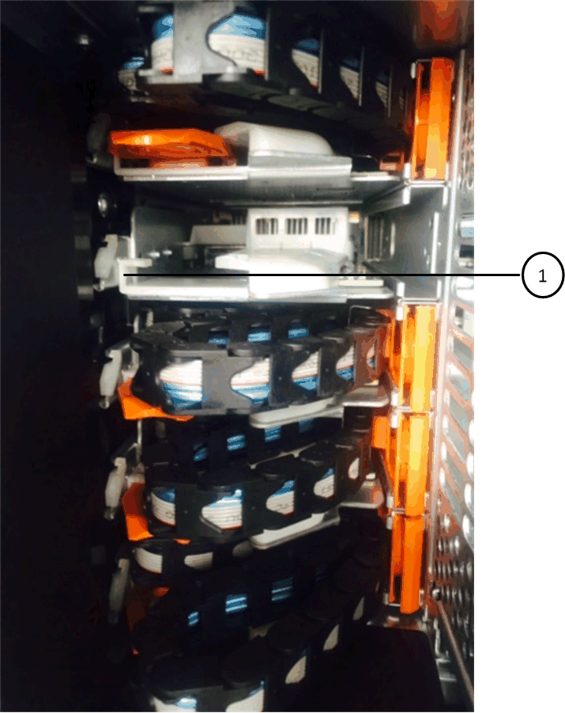

= Sostituire un cassetto dischi in uno shelf di dischi DS460C con moduli IOM12/IOM12B
:allow-uri-read: 
:icons: font
:imagesdir: ../media/

[role="lead"]
Per sostituire un cassetto unità in uno scaffale, è possibile arrestare l'intero sistema di storage (coppia HA), il che consente di mantenere gli aggregati di dati sullo scaffale. In alternativa, è possibile mantenere la coppia HA attiva e funzionante, il che richiede di spostare tutti i dati dagli aggregati di dati sulle unità disco dello scaffale e quindi di portarli offline, eliminandoli. Se lo scaffale contiene un aggregato radice, è necessario arrestare la coppia HA.

.Prima di iniziare
Per questa procedura sono necessari i seguenti elementi:

* Protezione antistatica
+

NOTE: *Possibili danni all'hardware:* per evitare danni da scariche elettrostatiche allo shelf di dischi, utilizzare una protezione antistatica adeguata quando si maneggiano i componenti dello shelf di dischi.

* Cassetto dell'unità sostitutivo
* Catene di ricambio per cavi sinistra e destra
* Torcia

.A proposito di questa attività
* Questa procedura si applica agli shelf dotati di cassetti per unità DCM e/o cassetti per unità DCM2. (Gli shelf avranno anche due moduli IOM12 o due moduli IOM12B).
+
In caso di guasto di un cassetto unità DCM o DCM2, si riceve un cassetto unità DCM o DCM2 per sostituirlo.

[NOTE]
====
Se si sostituisce un cassetto del disco guasto, lo shelf dispone di una combinazione di moduli IOM12 e di un numero qualsiasi di cassetti del disco DCM2, È necessario aggiornare IOM12 FW alla versione 0300 o successiva perché i moduli IOM12 richiedono una versione di FW che supporti i cassetti unità DCM2.

L'aggiornamento IOM12 FW può essere eseguito prima o dopo la sostituzione di un cassetto unità. Questa procedura consente di aggiornare il firmware come parte della preparazione per la procedura di sostituzione del cassetto.

====
* I cassetti delle unità DCM e i cassetti delle unità DCM2 si distinguono per il loro aspetto:
+
I cassetti delle unità DCM hanno l'aspetto seguente:

+
image::../media/28_dwg_e2860_de460c_front_no_callouts.gif[Vista frontale dello shelf di un'unità DCM]

+
I cassetti delle unità DCM2 si distinguono per una striscia blu e per l'etichetta "DCM2":

+
image::../media/dcm2.png[Vista anteriore di uno shelf di dischi DCM2]

== Preparare la sostituzione di un cassetto dell'unità

Prima di sostituire un cassetto per dischi, è necessario aggiornare IOM12 FW se necessario e arrestare la coppia ha, che consente di mantenere aggregati di dati sullo shelf, oppure è possibile mantenere la coppia ha in funzione, ciò richiede lo spostamento di tutti i dati dagli aggregati di dati che risiedono sui dischi, la offline e l'eliminazione degli aggregati di dati. Tuttavia, se lo shelf contiene un aggregato root, è necessario arrestare la coppia ha. Infine, è necessario spegnere lo shelf.

.Fasi
. Determinare se, quando si sostituisce il cassetto del disco guasto, lo shelf presenta una combinazione di moduli IOM12 e un numero qualsiasi di cassetti del disco DCM2.
. Se lo shelf dispone di una combinazione di moduli IOM12 e di un numero qualsiasi di cassetti unità DCM2, è necessario aggiornare IOM12 FW alla versione 0300 o successiva; in caso contrario, passare alla fase successiva.
+
Le versioni correnti del firmware sono disponibili sul sito del supporto NetApp.

+
https://mysupport.netapp.com/site/downloads/firmware/disk-shelf-firmware["Download NetApp: Firmware shelf di dischi"]

. Se lo shelf contiene l'aggregato root da uno dei controller della coppia ha o se si è scelto di arrestare la coppia ha (invece di mantenere la coppia ha in funzione), completare i seguenti passaggi secondari; in caso contrario, passare al punto successivo.
+

NOTE: Gli aggregati di dati possono rimanere sullo shelf quando si arresta la coppia ha.

+
.. Arrestare entrambi i controller nella coppia ha.
.. Verificare che la coppia ha sia interrotta controllando la console del sistema di storage.
.. Spegnere lo shelf.
.. Vai alla sezione, <<Rimuovere le catene portacavi>>.

. Se si sceglie di mantenere attiva e attiva la coppia ha, completare i seguenti passaggi secondari:
+

NOTE: Se si tenta di sostituire un cassetto con aggregati sullo shelf di dischi, si potrebbe causare un'interruzione del sistema con un panico multidisk.

+
.. Spostare tutti i dati dagli aggregati di dati presenti su tutte le unità disco presenti sullo scaffale.
+
I dati includono, a titolo esemplificativo ma non esaustivo, volumi e LUN.

.. Dismettere ed eliminare gli aggregati per consentire ai dischi di diventare parti di ricambio:
+
I comandi possono essere inseriti dalla shell dei cluster di uno dei controller.

+
`storage aggregate offline -aggregate _aggregate_name_`

+
`storage aggregate delete -aggregate _aggregate_name_`

.. Verificare che i dischi non abbiano aggregati (sono parti di ricambio):
+
... Immettere il seguente comando dalla shell del cluster di uno dei controller: `storage disk show -shelf _shelf_number_`
... Controllare l'output per verificare che le unità disco siano spare.
+
Vengono visualizzate le unità disco che sono parti di ricambio `spare` in `Container Type` colonna.

+

NOTE: Se nello shelf sono presenti dischi guasti, `broken` viene visualizzato in `Container Type` colonna.

.. Spegnere lo shelf.

== Rimuovere le catene portacavi

Le catene di cavi sinistra e destra per ciascun cassetto del disco nello shelf del disco DS460C consentono ai cassetti di scorrere verso l'interno e verso l'esterno. Prima di poter rimuovere un cassetto dell'unità, è necessario rimuovere entrambe le catene di cavi.

.Prima di iniziare
* Hai completato il <<Preparare la sostituzione di un cassetto dell'unità>> Passaggi per arrestare la coppia ha o spostare tutti i dati dagli aggregati di dati che risiedono sui dischi, disaggregare ed eliminare gli aggregati di dati per consentire ai dischi di diventare parti di ricambio.
* Hai spento lo shelf.
* Sono stati ottenuti i seguenti elementi:
+
** Protezione antistatica
+

NOTE: *Possibili danni all'hardware:* per evitare danni causati da scariche elettrostatiche allo scaffale, utilizzare una protezione antistatica adeguata quando si maneggiano i componenti dello scaffale.

** Torcia

.A proposito di questa attività
Ciascun cassetto dispone di catene di cavi destra e sinistra. Le estremità metalliche delle catene per cavi scorrono nelle corrispondenti staffe verticali e orizzontali all'interno del contenitore, come indicato di seguito:

* Le staffe verticali sinistra e destra collegano la catena di cavi alla scheda di interconnessione centrale del contenitore.
* Le staffe orizzontali sinistra e destra collegano la catena di cavi al singolo cassetto.

.Fasi
. Protezione antistatica.
. Dalla parte posteriore dello shelf del disco, rimuovere il modulo della ventola di destra, come indicato di seguito:
+
.. Premere la linguetta arancione per rilasciare la maniglia del modulo ventola.
+
La figura mostra la maniglia del modulo della ventola estesa e rilasciata dalla linguetta arancione a sinistra.

+
image::../media/28_dwg_e2860_de460c_fan_canister_handle_with_callout.gif[Maniglia del modulo ventola estesa]

+
[cols="10,90"]
|===

 a| 
image:../media/icon_round_1.png["Numero di didascalia 1"]
| Maniglia del modulo della ventola 
|===
.. Utilizzando la maniglia, estrarre il modulo della ventola dallo shelf del disco e metterlo da parte.

. Determinare manualmente quale delle cinque catene di cavi scollegare.
+
La figura mostra il lato destro dello shelf del disco con il modulo della ventola rimosso. Una volta rimosso il modulo della ventola, è possibile vedere le cinque catene di cavi e i connettori verticali e orizzontali per ciascun cassetto. Vengono fornite le didascalie per il cassetto unità 1.

+
image::../media/2860_dwg_full_back_view_chain_connectors.gif[Vista delle cinque catene portacavi e dei connettori verticali e orizzontali per ciascun cassetto]

+
[cols="10,90"]
|===

 a| 
image:../media/icon_round_1.png["Numero di didascalia 1"]
| Catena di cavi 

 a| 
image:../media/icon_round_2.png["Numero di didascalia 2"]
 a| 
Connettore verticale (collegato alla scheda intermedia)

 a| 
image:../media/icon_round_3.png["Numero di didascalia 3"]
 a| 
Connettore orizzontale (collegato al cassetto dell'unità)

|===
+
La catena di cavi superiore è collegata al cassetto dell'unità 1. La catena dei cavi inferiore è collegata al cassetto dell'unità 5.

. Spostare con un dito la catena di cavi sul lato destro verso sinistra.
. Per scollegare una delle catene di cavi di destra dalla staffa verticale corrispondente, procedere come segue.
+
.. Utilizzando una torcia, individuare l'anello arancione all'estremità della catena di cavi collegata alla staffa verticale del contenitore.
+
image::../media/2860_dwg_vertical_ring_for_chain.gif[Anello arancione sull'estremità della catena del cavo]

+
[cols="10,90"]
|===

 a| 
image:../media/icon_round_1.png["Numero di didascalia 1"]
| Anello arancione sulla staffa verticale 
|===
.. Scollegare il connettore verticale (collegato alla scheda intermedia) premendo delicatamente al centro dell'anello arancione ed estraendo il lato sinistro del cavo dal contenitore.
.. Per scollegare la catena di cavi, tirare con cautela il dito verso di sé di circa 2.5 cm (1 poll.), ma lasciare il connettore della catena di cavi all'interno della staffa verticale.

. Per scollegare l'altra estremità della catena di cavi, procedere come segue:
+
.. Utilizzando una torcia, individuare l'anello arancione all'estremità della catena di cavi collegata alla staffa orizzontale del contenitore.
+
La figura mostra il connettore orizzontale a destra e la catena dei cavi scollegata e parzialmente estratta sul lato sinistro.

+
image::../media/2860_dwg_horiz_ring_for_chain.gif[Catena portacavi e anello arancione]

+
[cols="10,90"]
|===

 a| 
image:../media/icon_round_1.png["Numero di didascalia 1"]
| Anello arancione sulla staffa orizzontale 

 a| 
image:../media/icon_round_2.png["Numero di didascalia 2"]
 a| 
Catena di cavi

|===
.. Inserire delicatamente il dito nell'anello arancione.
+
La figura mostra l'anello arancione sulla staffa orizzontale che viene spinto verso il basso in modo che il resto della catena di cavi possa essere estratto dal contenitore.

.. Tirare il dito verso di sé per scollegare la catena di cavi.

. Estrarre con cautela l'intera catena di cavi dallo shelf del disco.
. Dal retro dello shelf del disco, rimuovere il modulo della ventola di sinistra.
. Per scollegare la catena del cavo sinistro dalla staffa verticale, procedere come segue:
+
.. Utilizzando una torcia, individuare l'anello arancione all'estremità della catena di cavi collegata alla staffa verticale.
.. Inserire il dito nell'anello arancione.
.. Per scollegare la catena di cavi, tirare il dito verso di sé di circa 2.5 cm, ma lasciare il connettore della catena di cavi all'interno della staffa verticale.

. Scollegare la catena del cavo sinistro dalla staffa orizzontale ed estrarre l'intera catena dal ripiano del disco.

== Rimuovere un cassetto dell'unità

Dopo aver rimosso le catene di destra e sinistra, è possibile rimuovere il cassetto dell'unità dallo shelf dell'unità. La rimozione di un cassetto dell'unità comporta l'estrazione della parte del cassetto, la rimozione delle unità e la rimozione del cassetto dell'unità.

.Prima di iniziare
* Sono state rimosse le catene di cavi destra e sinistra del cassetto dell'unità.
* Sono stati sostituiti i moduli delle ventole di destra e di sinistra.

.Fasi
. Rimuovere il pannello frontale dallo shelf del disco.
. Sganciare il cassetto dell'unità estraendo entrambe le leve.
. Utilizzando le leve estese, estrarre con cautela il cassetto dell'unità fino a quando non si arresta. Non rimuovere completamente il cassetto dal ripiano del disco.
. Rimuovere le unità dal cassetto:
+
.. Tirare delicatamente indietro il dispositivo di chiusura arancione visibile al centro della parte anteriore di ciascun disco. L'immagine seguente mostra il fermo di rilascio arancione per ciascuna unità.
+
image::../media/28_dwg_e2860_drive_latches_top_view.gif[Fermi di rilascio dell'unità]

.. Sollevare la maniglia dell'unità in verticale.
.. Utilizzare la maniglia per sollevare l'unità dal cassetto dell'unità.
+
image::../media/92_dwg_de6600_install_or_remove_drive.gif[Installazione o rimozione di un'unità]

.. Posizionare l'unità su una superficie piana, priva di scariche elettrostatiche e lontano da dispositivi magnetici.
+

NOTE: *Possibile perdita di accesso ai dati:* i campi magnetici possono distruggere tutti i dati presenti sull'unità e causare danni irreparabili ai circuiti dell'unità. Per evitare la perdita di accesso ai dati e danni ai dischi, tenere i dischi sempre lontani da dispositivi magnetici.

. Per rimuovere il cassetto dell'unità, procedere come segue:
+
.. Individuare la leva di rilascio in plastica su ciascun lato del cassetto dell'unità.
+
image::../media/92_pht_de6600_drive_drawer_release_lever.gif[Leva di sblocco del cassetto]

+
[cols="10,90"]
|===

 a| 
image:../media/icon_round_1.png["Numero di didascalia 1"]
| Leva di rilascio del cassetto dell'unità 
|===
.. Aprire entrambe le leve di rilascio tirando i fermi verso di sé.
.. Tenendo entrambe le leve di rilascio, tirare il cassetto dell'unità verso di sé.
.. Rimuovere il cassetto del disco dallo shelf del disco.

== Installare un cassetto dell'unità

L'installazione di un cassetto per dischi in uno shelf implica lo scorrimento del cassetto nello slot vuoto, l'installazione delle unità e la sostituzione del pannello anteriore.

.Prima di iniziare
* Sono stati ottenuti i seguenti elementi:
+
** Cassetto dell'unità sostitutivo
** Torcia

.Fasi
. Dalla parte anteriore dello shelf del disco, far passare una torcia nello slot vuoto del cassetto e individuare il cilindretto di blocco dello slot.
+
Il gruppo di blocco è una funzione di sicurezza che impedisce l'apertura di più cassetti per disco alla volta.

+
image::../media/92_pht_de6600_lock_out_tumbler_detail.gif[Posizione del cilindro di bloccaggio e della guida del cassetto]

+
[cols="10,90"]
|===

 a| 
image:../media/icon_round_1.png["Numero di didascalia 1"]
| Tumbler di lock-out 

 a| 
image:../media/icon_round_2.png["Numero di didascalia 2"]
 a| 
Guida del cassetto

|===
. Posizionare il cassetto dell'unità sostitutivo davanti allo slot vuoto e leggermente a destra rispetto al centro.
+
Posizionando leggermente il cassetto a destra del centro, si garantisce che il nottolino di blocco e la guida del cassetto siano inseriti correttamente.

. Far scorrere il cassetto dell'unità nello slot e assicurarsi che la guida del cassetto scorra sotto il nottolino di blocco.
+

NOTE: *Rischio di danni all'apparecchiatura:* si verificano danni se la guida del cassetto non scorre sotto il dispositivo di blocco.

. Spingere con cautela il cassetto dell'unità fino a quando il fermo non si aggancia completamente.
+

NOTE: *Rischio di danni all'apparecchiatura:* interrompere la spinta del cassetto dell'unità se si avverte una resistenza eccessiva o un inceppamento. Utilizzare le leve di rilascio nella parte anteriore del cassetto per far scorrere il cassetto all'indietro. Quindi, reinserire il cassetto nell'alloggiamento e assicurarsi che scorra liberamente all'interno e all'esterno.

. Per reinstallare le unità nel cassetto, procedere come segue:
+
.. Sbloccare il cassetto dell'unità estraendo entrambe le leve nella parte anteriore del cassetto.
.. Utilizzando le leve estese, estrarre con cautela il cassetto dell'unità fino a quando non si arresta. Non rimuovere completamente il cassetto dal ripiano del disco.
.. Sul disco che si sta installando, sollevare la maniglia in verticale.
.. Allineare i due pulsanti rialzati su ciascun lato dell'unità con le tacche del cassetto.
+
La figura mostra la vista laterale destra di un'unità, che mostra la posizione dei pulsanti sollevati.

+
image::../media/28_dwg_e2860_de460c_drive_cru.gif[Posizione dei pulsanti rialzati sulla trasmissione]

+
[cols="10,90"]
|===

 a| 
image:../media/icon_round_1.png["Numero di didascalia 1"]
| Pulsante sollevato sul lato destro del disco. 
|===
.. Abbassare l'unità, quindi ruotare la maniglia verso il basso fino a farla scattare in posizione.
+
Se si dispone di uno shelf parzialmente popolato, vale a dire che il cassetto in cui si reinstallano i dischi ha meno di 12 dischi supportati, installare i primi quattro dischi negli slot anteriori (0, 3, 6 e 9).

+

NOTE: *Rischio di malfunzionamento dell'apparecchiatura:* per consentire un corretto flusso d'aria ed evitare il surriscaldamento, installare sempre le prime quattro unità negli slot anteriori (0, 3, 6 e 9).

+
image::../media/92_dwg_de6600_install_or_remove_drive.gif[Installazione o rimozione di un'unità]

.. Ripetere questi passaggi secondari per reinstallare tutti i dischi.

. Far scorrere nuovamente il cassetto nello shelf dell'unità spingendolo dal centro e chiudendo entrambe le leve.
+

NOTE: *Rischio di malfunzionamento dell'apparecchiatura:* assicurarsi di chiudere completamente il cassetto dell'unità premendo entrambe le leve. Chiudere completamente il cassetto dell'unità per consentire un flusso d'aria adeguato ed evitare il surriscaldamento.

. Fissare il pannello frontale alla parte anteriore dello shelf del disco.

== Collegare le catene di cavi

L'ultima fase dell'installazione di un cassetto dell'unità consiste nel fissare le catene di cavi sinistra e destra sostitutive allo shelf dell'unità. Quando si collega una catena di cavi, invertire l'ordine utilizzato per scollegare la catena di cavi. Inserire il connettore orizzontale della catena nella staffa orizzontale del contenitore prima di inserire il connettore verticale della catena nella staffa verticale del contenitore.

.Prima di iniziare
* Sono stati sostituiti il cassetto dell'unità e tutte le unità.
* Sono presenti due catene di cavi sostitutive, contrassegnate come SINISTRA e DESTRA (sul connettore orizzontale accanto al cassetto dell'unità).

image::../media/28_dwg_e2860_de460c_cable_chain_left.gif[Catena portacavi di ricambio lato sinistro]

[cols="4*"]
|===
| Didascalia | Catena di cavi | Connettore | Si connette a. 

 a| 
image:../media/icon_round_1.png["Numero di didascalia 1"]
| Sinistra  a| 
Verticale
 a| 
Scheda intermedia

 a| 
image:../media/icon_round_2.png["Numero di didascalia 2"]
 a| 
Sinistra
 a| 
Orizzontale
 a| 
Cassetto dell'unità

|===
image:../media/28_dwg_e2860_de460c_cable_chain_right.gif["Catena del cavo di ricambio lato destro"]

[cols="4*"]
|===
| Didascalia | Catena di cavi | Connettore | Si connette a. 

 a| 
image:../media/icon_round_1.png["Numero di didascalia 1"]
| Giusto  a| 
Orizzontale
 a| 
Cassetto dell'unità

 a| 
image:../media/icon_round_2.png["Numero di didascalia 2"]
 a| 
Giusto
 a| 
Verticale
 a| 
Scheda intermedia

|===
.Fasi
. Seguire questa procedura per collegare la catena del cavo sinistro:
+
.. Individuare i connettori orizzontali e verticali sulla catena sinistra e le staffe orizzontali e verticali corrispondenti all'interno del contenitore.
.. Allineare entrambi i connettori delle catene con le staffe corrispondenti.
.. Far scorrere il connettore orizzontale della catena sotto la guida della staffa orizzontale e spingerlo fino in fondo.
+
La figura mostra la guida sul lato sinistro per il secondo cassetto del disco nel contenitore.

+

+
[cols="10,90"]
|===

 a| 
image:../media/icon_round_1.png["Numero di didascalia 1"]
| Binario di guida 
|===
+
[NOTE]
====
*Rischio di malfunzionamento dell'apparecchiatura:* assicurarsi di far scorrere il connettore sotto la guida della staffa. Se il connettore si trova sulla parte superiore della guida, potrebbero verificarsi problemi quando il sistema è in funzione.

====
.. Far scorrere il connettore verticale sulla catena sinistra nella staffa verticale.
.. Dopo aver ricollegato entrambe le estremità della catena, tirare con cautela la catena per verificare che entrambi i connettori siano bloccati.
+
[NOTE]
====
*Rischio di malfunzionamento dell'apparecchiatura:* se i connettori non sono bloccati, la catena dei cavi potrebbe allentarsi durante il funzionamento del cassetto.

====

. Reinstallare il modulo della ventola sinistra.
. Per ricollegare la catena di cavi corretta, procedere come segue:
+
.. Individuare i connettori orizzontali e verticali sulla catena dei cavi e le relative staffe orizzontali e verticali all'interno del contenitore.
.. Allineare entrambi i connettori delle catene con le staffe corrispondenti.
.. Far scorrere il connettore orizzontale della catena sotto la guida della staffa orizzontale e spingerlo fino in fondo.
+
[NOTE]
====
*Rischio di malfunzionamento dell'apparecchiatura:* assicurarsi di far scorrere il connettore sotto la guida della staffa. Se il connettore si trova sulla parte superiore della guida, potrebbero verificarsi problemi quando il sistema è in funzione.

====
.. Far scorrere il connettore verticale sulla catena destra nella staffa verticale.
.. Dopo aver ricollegato entrambe le estremità della catena, tirare con cautela la catena per verificare che entrambi i connettori siano bloccati.
+
[NOTE]
====
*Rischio di malfunzionamento dell'apparecchiatura:* se i connettori non sono bloccati, la catena dei cavi potrebbe allentarsi durante il funzionamento del cassetto.

====

. Reinstallare il modulo ventola destro.
. Riapplicare l'alimentazione:
+
.. Accendere entrambi gli interruttori di alimentazione sullo shelf di dischi.
.. Verificare che entrambe le ventole si accendano e che il LED ambra sul retro delle ventole sia spento.

. Se la coppia ha è stata interrotta, avviare ONTAP su entrambi i controller; in caso contrario, passare alla fase successiva.
. Se i dati sono stati spostati fuori dallo shelf ed eliminati gli aggregati di dati, è ora possibile utilizzare i dischi spare nello shelf per la creazione o l'espansione dell'aggregato.
+
https://docs.netapp.com/us-en/ontap/disks-aggregates/aggregate-creation-workflow-concept.html["Workflow di creazione di aggregati"]

+
https://docs.netapp.com/us-en/ontap/disks-aggregates/aggregate-expansion-workflow-concept.html["Workflow di espansione degli aggregati"]

