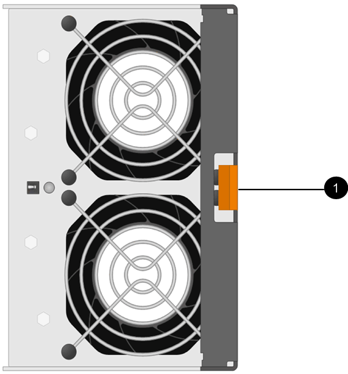

= Sostituire un modulo ventola in uno shelf di dischi DS460C - shelf con moduli IOM12/IOM12B
:allow-uri-read: 
:icons: font
:imagesdir: ../media/

[role="lead"]
Ogni shelf di dischi DS460C include due moduli ventole. In caso di guasto di un modulo ventola, è necessario sostituirlo il prima possibile per assicurarsi che lo shelf abbia un raffreddamento adeguato. Quando si rimuove il modulo ventola guasto, non è necessario spegnere lo shelf di dischi.

.A proposito di questa attività
Assicurarsi di rimuovere e sostituire il modulo della ventola entro 30 minuti per evitare il surriscaldamento del sistema.

.Fasi
. Protezione antistatica.
. Disimballare il nuovo modulo della ventola e posizionarlo su una superficie piana vicino allo scaffale.
+
Conservare tutto il materiale di imballaggio da utilizzare quando si restituisce la ventola guasta.

. Dal retro dello shelf di dischi, osservare i LED di attenzione per individuare il modulo della ventola da rimuovere.
+
È necessario sostituire il modulo della ventola con il LED attenzione acceso.

+
image::../media/28_dwg_e2860_de460c_single_fan_canister_with_led_callout.gif[28 dwg e2860 de460c canister a ventola singola con led]

+
|===

| Elemento | Nome del LED | Stato | Descrizione 

 a| 
image:../media/legend_icon_01.png[""]
| Attenzione  a| 
Ambra fisso
 a| 
La ventola è guasta

|===
. Premere la linguetta arancione per rilasciare la maniglia del modulo ventola.
+

+
|===

 a| 
image:../media/legend_icon_01.png[""]
| Linguetta che si preme per rilasciare la maniglia del modulo della ventola 
|===
. Utilizzare la maniglia del modulo della ventola per estrarre il modulo dalla mensola.
+
image::../media/28_dwg_e2860_de460c_fan_canister_handle_with_callout.gif[28 dwg e2860 de460c maniglia del contenitore della ventola con richiamo]

+
|===

 a| 
image:../media/legend_icon_01.png[""]
| Maniglia per estrarre il modulo della ventola 
|===
. Far scorrere il modulo della ventola di ricambio fino in fondo nello scaffale, spostando la maniglia del modulo della ventola di lato fino a quando non si blocca con la linguetta arancione.
. Controllare il LED di attenzione ambra sul nuovo modulo della ventola.
+

NOTE: Dopo aver sostituito il modulo della ventola, il LED attenzione rimane acceso (ambra fisso) mentre il firmware verifica che il modulo della ventola sia stato installato correttamente. Il LED si spegne al termine del processo.

. Restituire la parte guasta a NetApp, come descritto nelle istruzioni RMA fornite con il kit.
+
Contattare il supporto tecnico all'indirizzo https://mysupport.netapp.com/site/global/dashboard["Supporto NetApp"], 888-463-8277 (Nord America), 00-800-44-638277 (Europa) o +800-800-80-800 (Asia/Pacifico) se è necessario il numero RMA.

